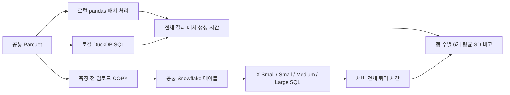
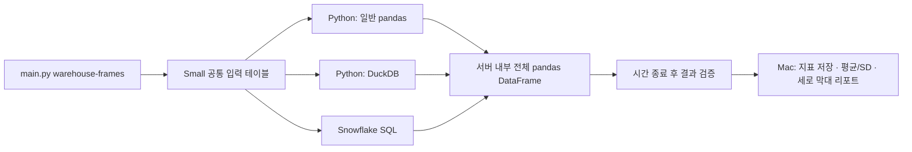
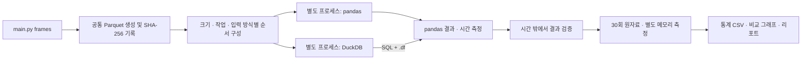
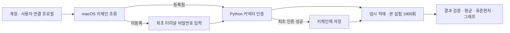
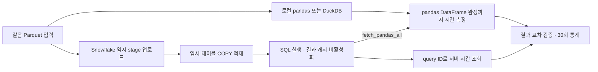

# Database Performance Comparison

ClickHouse, DuckDB, SQLite, PostgreSQL을 동일한 결정론적 데이터와 쿼리로 순차 비교한다.

## 로컬 pandas·DuckDB와 Snowflake 크기별 6개 경로 비교

사용자가 요청한 새 비교는 로컬에서 Parquet를 읽는 pandas·DuckDB와, 같은 데이터를
미리 적재한 Snowflake 테이블의 X-Small·Small·Medium·Large SQL 실행이다.
**본 실험 3,600회 완료·검수 완료** (측정: 2026-09-09 13:59:18–17:29:04 KST, 사후 검수: 2026-09-10 KST).
[최신 리포트·행 수별 세로 막대 5개](results/warehouse-sweep/run-20260909T045918099704Z/report.md) · [10억 행 그림](results/warehouse-sweep/run-20260909T045918099704Z/mean-sd-1000000000.png) · [검수 근거](results/warehouse-sweep/run-20260909T045918099704Z/qa.json).
10억 행에서 Snowflake Large는 네 작업 모두 가장 짧은 평균을 기록했다. 평균 ± 표본 SD는
결측치 처리 **5.327 ± 0.157초**, 필터 **1.275 ± 0.101초**, 지역 집계 **0.433 ± 0.019초**, 조인 후 집계 **0.946 ± 0.045초**다.
10만~1,000만 행에서는 단순 가공의 pandas와 집계의 DuckDB가 앞섰다. 가까운 평균과 큰 편차는 리포트에서 별도로 설명한다.
120조건·각 30회, 720개 묶음 예열 체크섬, 2,400개 고유 원격 측정 쿼리, 원자료·통계·입력 해시와 PNG 5개를 검수했다.
[파일럿 리포트](results/warehouse-sweep/pilot-20260909T044933710556Z/report.md)는 기능 검증용이다.

| 경로 | 실행 위치 | 입력 | 주 시간 지표 |
|---|---|---|---|
| pandas | 로컬 Mac | 공통 Parquet | 읽기·배치 변환·전체 결과 배치 생성 |
| DuckDB | 로컬 Mac | 같은 Parquet | 직접 SQL·전체 결과의 pandas 배치 변환 |
| Snowflake X-Small | FRAME_SWEEP_XSMALL | 공통 적재 테이블 | 서버 전체 쿼리 시간 |
| Snowflake Small | FRAME_SWEEP_SMALL | 같은 테이블 | 서버 전체 쿼리 시간 |
| Snowflake Medium | FRAME_SWEEP_MEDIUM | 같은 테이블 | 서버 전체 쿼리 시간 |
| Snowflake Large | FRAME_SWEEP_LARGE | 같은 테이블 | 서버 전체 쿼리 시간 |

- 행 수: **10만·100만·1,000만·1억·10억**. 작업: 결측치 처리/파생 컬럼, 필터/파생 컬럼, 지역 집계, 조인 후 집계.
- 5개 크기 × 4개 작업 × 6개 경로 × 30회 = **3,600회**, 120개 조건. 6개 묶음에서 경로와 크기·작업 순서를 무작위화하고 한 번에 한 경로만 측정한다.
- 모든 크기에 같은 배치 기준을 적용한다. 로컬 결과 배치는 순차 생성·해제하며 전체 결과를 RAM에 누적하지 않는다. pandas는 부분 집계를 합친다. Arrow/DuckDB 4스레드, 최대 배치 25만 행, DuckDB 내부 메모리 한도 8GB다.
- Snowflake 주 지표는 `QUERY_HISTORY.total_elapsed_time`으로 실행·컴파일·대기를 포함한다. 최초 업로드/COPY와 전체 결과의 Mac 다운로드는 제외하며, client execute 왕복과 서버 구성요소를 별도로 기록한다. **로컬 출력은 pandas 배치이고 원격 출력은 서버 결과이므로 동일한 하드웨어·출력 형식의 순수 엔진 비교는 아니다.**
- 전용 warehouse 네 개는 본 실험 명세에서도 모두 Standard Gen2, 단일 클러스터, 자동 중지 60초다. 결과 재사용 캐시를 끄고 각 작업을 예열한다. 경로 묶음이 끝나면 해당 전용 warehouse를 중지한다. 캐시 상태가 완전히 같다고 가정하지 않는다.
- 원본 seed·정수 연산·필요 컬럼·필터 의미를 맞춘다. 각 묶음의 예열에서 전체 출력 행 수와 두 모듈러 체크섬을 공통 기준에 대조하고, 시간 측정 반복에서는 출력 행 수를 검증한다. 모든 반복의 전체 체크섬 검증이라고 주장하지 않는다.
- 실행 프로세스/연결 준비·예열·체크섬은 측정 밖이다. 입력 Parquet 읽기는 로컬 시간에 포함한다. Snowflake 쿼리의 스캔과 계산을 임의로 분리하지 않는다.

```bash
uv run --no-sync python main.py warehouse-sweep --pilot
uv run --no-sync python main.py warehouse-sweep
```

등록된 macOS Keychain의 `benchmark` 인증을 재사용한다. 10억 행 원본은 약 19.08GB이며
같은 행을 보존한 적재용 Parquet 100개로 나누어 업로드한다. 1억 행은 10개 파일이다.
분할 파일 수·행 수·연속 ID·원본/파일별 SHA-256을 검증한다. 생성·분할·업로드는 준비 단계다.

완료 산출물은 `results/warehouse-sweep/run-<UTC timestamp>/`의 `report.md`,
크기별 `mean-sd-<행 수>.png` **5개**(작업별 세로 막대 6개·평균 ± 표본 SD),
`summary.csv`, `measurements.jsonl`, `snowflake-components.csv`, `qa.json`이다.
작은 데이터에서의 고정 비용과 행 수 증가에 따른 warehouse 효과를 함께 해석한다.
기존 Small 내부 전체 DataFrame 실험과 이전 로컬/원격 다운로드 실험은 별도 결과로 보존한다.



## 같은 Snowflake Small에서 pandas · DuckDB · SQL 실행

`warehouse-frames`는 세 엔진을 `FRAME_BENCH_SMALL`에서 실행한다. 일반 pandas와 DuckDB는
Python 임시 저장 프로시저에서, SQL은 같은 warehouse의 SQL 엔진에서 처리한다.
이미 등록한 macOS Keychain 비밀번호를 재사용한다.

**이전 Small 본 실험 1,080회 완료·검수 완료** (2026-09-09 11:06:41–11:38:56 KST).
[결과 리포트·평균 ± 표본 SD 세로 막대](results/snowflake-small/run-20260909T020641284282Z/report.md).
1,000만 행 지역 집계는 Snowflake SQL **141.80 ± 10.56ms**, DuckDB **1,561.20 ± 79.93ms**,
조인 후 집계는 각각 **215.49 ± 13.24ms**, **2,299.71 ± 116.66ms**였다.
Python으로 원본을 읽는 비용을 포함한 경로 비교이며, 단순 가공의 작은 평균 차이는 변동성과 함께 해석한다.
36개 조건·각 30회, 모든 fingerprint, 1,260개 서버 쿼리 기록, 원자료 통계와 PNG 3개를 검증했다.

요청된 10억 행 후속 비교는 위의 로컬 2개·Snowflake 4개 크기 실험으로 완료했다. 이 Small 내부 완료 결과는 최대 1,000만 행이다.

```bash
uv sync --locked --extra snowflake
uv run --no-sync python main.py warehouse-frames --pilot
uv run --no-sync python main.py warehouse-frames
```

기본은 10만·100만·1,000만 행 × 4개 작업 × 3개 엔진 × 30회 = 1,080회다.
공통 테이블 읽기부터 **서버 내부의 전체 pandas DataFrame 완성까지** 측정하며,
Mac에는 시간·검증 요약만 반환한다. 업로드와 프로시저 시작·CALL 왕복은 제외한다.
같은 warehouse가 동일한 CPU·RAM 배분을 의미하지는 않는다.

결과는 `results/snowflake-small/run-<UTC timestamp>/`의 `report.md`, 크기별 세로 막대 PNG,
`summary.csv`, 원자료 `measurements.jsonl`, `calls.json`, `qa.json`에 저장한다.
이전 로컬/X-Small 실험은 측정 경계가 다르므로 수치를 직접 합치지 않는다.
전용 warehouse는 Small·단일 클러스터·자동 중지 60초로 구성되어 있어야 한다.



## Python pandas vs DuckDB 전처리 실험

기존 DB 실험과 별도로 로컬 Python에서 실행한다. `main.py frames`가 진입점이며
`uv.lock`에 패키지 버전을 고정한다. Docker는 필요하지 않다.

```bash
uv sync --locked
uv run python main.py frames --pilot
uv run python main.py frames
```

기본 설정은 **10만·100만·1,000만 행 × 4개 작업 × 2개 입력 방식 × 2개 엔진 × 30회**로,
총 1,440개 시간 측정이다. 파일럿은 1천·1만·10만 행에서 각각 2회만 측정한다.

**이전 로컬/X-Small 비교: 2026-09-09 본 실험 1,800회 완료.**
[세 엔진 결과·평균 ± 표본 SD·그래프·해석](results/pandas-duckdb/run-20260909T004556934215Z/report.md).
60개 조합의 30회 기록과 원자료 통계를 검증했다. 1,000만 행 Parquet 조인·집계는 DuckDB 43.687 ± 1.258ms,
pandas 355.653 ± 16.088ms였고, 원격 Snowflake는 252.399 ± 157.108ms였다.
로컬·원격의 입력 위치와 자원이 다르며, Snowflake는 결과 수신까지 포함한다.

이전 2026-09-07 로컬 본 실험 1,440회: [측정 결과와 해석](results/pandas-duckdb/run-20260907T022808832856Z/report.md).
메모리 입력의 결측치·파생 컬럼은 pandas가 3개 크기 모두 빨랐고, 집계·조인 후 집계는 DuckDB가 빨랐다.
외부 부하와 시스템 swap 활동을 포함한 로컬 환경의 탐색적 결과다.

| 작업 | 의미 | 최종 결과 |
|---|---|---|
| `filter_project` | 지역·금액 필터, 컬럼 선택, 금액×수량 | 입력의 약 19.8% |
| `clean_derive` | 5% 결측 할인율을 0으로 채우고 할인 금액 계산 | 입력과 동일한 행 수 |
| `groupby` | 지역별 금액·수량·건수 집계 | 최대 50행 |
| `join_groupby` | 계정 10만 행 dimension과 조인, 지역·등급 집계 | 최대 200행 |

- `parquet`: Parquet 읽기부터 최종 pandas DataFrame 생성까지. pandas에도 컬럼 선택·필터 pushdown 적용.
- `memory`: 동일 원본 컬럼을 pandas DataFrame으로 사전 로딩. pandas 변환과 DuckDB 등록 입력 SQL을 비교하며 로딩·등록 시간 제외.
- 양쪽 모두 결과 DataFrame을 실제 생성하며 DuckDB `.df()` 시간도 포함.
- 크기는 수치형 8개 컬럼 기준이다. 1,000만 행의 원본 논리 크기는 약 610MiB이며, RAM을 초과하는 대형 데이터 실험은 아니다.
- 기본 스레드 한도는 DuckDB/Arrow 각각 4개, DuckDB 내부 메모리 한도는 8GB. pandas 연산의 실제 병렬도는 다를 수 있다.

```bash
# 크기와 실행 조건 변경 (runs는 blocks의 배수)
uv run python main.py frames --sizes 100000 1000000 10000000 --runs 30 --blocks 6 --threads 4
uv run pytest -q
uv run ruff check benchmarks tests
```

30회는 5회씩 6개 묶음으로 실행한다. 묶음마다 순서를 섞고, 각 엔진은 별도 프로세스에서
1회 워밍업 후 측정한다. OS 파일 캐시는 비우지 않는다. 전체 결과 fingerprint를 매번 확인하고
두 엔진·두 입력 방식의 결과와 대조한다. 직접 값 비교는 경계값 단위 테스트에서 수행한다.

결과는 `results/pandas-duckdb/run-<UTC timestamp>/`에 새로 저장한다.

- `report.md`, `timing-parquet.png`, `timing-memory.png`, `speedup.png`: 읽기용 표·그래프
- `measurements.csv`, `measurements.jsonl`: 1,440개 원시 측정
- `summary.csv`, `summary.json`: 평균, 표본 SD, 중앙값, 최소/최대, 사분위수, IQR, MAD, p90/p95/p99, CV, 평균 95% 구간, 처리량
- `comparison.csv`: pandas/DuckDB 평균 배율, 대응 묶음 bootstrap 구간
- `memory.csv`: 조합별 별도 1회 프로세스 최대 RSS와 결과 DataFrame 크기
- `manifest.json`, `execution-order.json`: 설정, 버전, 소스 해시, 실행 순서, 시스템 부하
- `datasets.json`, `validation.json`: 입력 SHA-256, 결과 행 수·타입·해시

평균 신뢰구간은 묶음 평균의 Student t, 배율 구간은 대응 묶음 bootstrap을 사용한다.
6개 묶음의 탐색적 추정이며 30회가 모두 독립이라고 가정하지 않는다. 이상치는 제거하지 않는다.
메모리 피크는 import·사전 로딩을 포함한 별도 1회 측정이며 30회 메모리 평균이 아니다.
생성 Parquet는 `data/frame-benchmark/`에 캐시하고 Git에서 제외한다.



구성: `frame_workloads.py`는 입력·변환, `frame_worker.py`는 격리 측정,
`frame_benchmark.py`는 순서·검증·저장, `frame_statistics.py`는 통계,
`frame_charts.py`는 그래프와 결과 문서를 담당한다.

## 실행 조건

### Snowflake를 함께 비교하기

연결 설정을 지정하면 **pandas·DuckDB를 새로 측정하고 Snowflake 360회도 추가**한다.
기본은 로컬 1,440회 + Snowflake 360회 = 1,800회이며, 기존 결과 폴더는 덮어쓰지 않는다.
2026-09-09 세 엔진 파일럿 120회와 본 실험 1,800회를 완료했다.
본 실험은 [run-20260909T004556934215Z](results/pandas-duckdb/run-20260909T004556934215Z/report.md)에 저장했다.
서버 지표 360개 누락·조회 오류 없음, 평균·표본 SD 재계산 일치 및 12개 기준 결과 fingerprint를 확인했다.
macOS 키체인 방식을 사용하면 최초 등록 후 새 실행에서도 저장된 비밀번호를 자동으로 사용한다.
로컬 테스트의 대체 응답을 실제 Snowflake 결과로 저장하지 않는다.

```bash
uv sync --locked --extra snowflake
# 연결 후 작은 데이터부터 실측
uv run --extra snowflake python main.py frames --snowflake-connection benchmark --pilot
# 10만·100만·1,000만 행, 작업별 30회
uv run --extra snowflake python main.py frames --snowflake-connection benchmark
```

`config/snowflake-connections.example.toml`을 참고해 로컬 `connections.toml`에 `benchmark` 연결을 작성한다.
이 컴퓨터에서 커넥터가 사용하는 경로는 `~/.snowflake/connections.toml`이다.
`~/.snowflake` 폴더가 없는 Mac에서는 `~/Library/Application Support/snowflake/connections.toml`이 기본 경로일 수 있다.
설정 파일에는 사용할 account·user·role·기존 warehouse·database·schema를 지정한다.
예시는 브라우저 SSO 인증이며, 계정 정책에 맞게 로컬에서 인증 방식을 설정한다. 실제 인증정보는 저장소에 넣지 않는다.

브라우저 로그인 세션만으로 Python 커넥터가 연결되지는 않는다.
macOS 비밀번호 로그인 계정은 다음 명령으로 최초 키체인 등록과 본 실험을 함께 시작한다.
처음에는 대화형 터미널에서 비밀번호를 비표시로 입력하고, Snowflake 인증에 성공한 뒤에만 저장한다.
이미 등록되어 있으면 터미널 입력 없이 키체인에서 불러온다. 등록되지 않은 비대화형 실행은
입력 대기 대신 최초 등록 방법을 안내하고 실패한다.

```bash
uv sync --locked --extra snowflake
uv run --no-sync python main.py frames --snowflake-connection benchmark --snowflake-keychain
```

키체인 항목은 `db-performance-comparison.snowflake/<account>` 서비스와 프로필의 `user`로
구분한다. 별도 모듈 `frame_keychain.py`가 Snowflake 커넥터와 같은 프로필 해석기를 사용하며,
네이티브 macOS Keychain만 선택한다. 다른 파일 저장소로 대체하지 않는다.
프로필·CLI 인자·manifest·로그에는 비밀번호를 기록하지 않는다. 시스템 키체인 접근 승인이나
Snowflake MFA는 계정·macOS 정책에 따라 별도로 필요할 수 있다.

비밀번호를 바꾼 경우 `--snowflake-keychain --snowflake-password-prompt`를 함께 지정해 다시 입력한다.
새 비밀번호로 인증되기 전에는 기존 키체인 항목을 덮어쓰지 않는다.
저장하지 않는 일회성 입력은 기존 `--snowflake-password-prompt`만 지정한다.
두 경로 모두 커넥터의 `snowflake` 인증을 사용하고 별도의 SSO/MFA 토큰 캐시를 요청하지 않는다.



키체인 저장·조회 API: [Python keyring](https://keyring.readthedocs.io/en/latest/).

현재 lockfile은 Snowflake Connector 4.7.3과 pandas 2.3.3을 사용한다. 커넥터의 pandas 호환 조건 때문에
이전 실험의 pandas 3.0.5와 버전이 다르므로 **세 엔진을 함께 재측정한 결과**로 판단해야 한다.

| 측정 경로 | 측정에 포함 | 별도 기록/제외 |
|---|---|---|
| pandas·DuckDB / parquet | 로컬 파일 읽기·변환·pandas 결과 생성 | 데이터 생성 |
| pandas·DuckDB / memory | 사전 로딩된 DataFrame 변환·결과 생성 | 파일 로딩 |
| Snowflake / warehouse | 적재된 원격 테이블 SQL·결과 다운로드·pandas 생성·정수 타입 정규화 | 연결·PUT 업로드·COPY 적재 |

Snowflake를 로컬 `memory` 또는 `parquet`와 동일한 시작 조건으로 취급하지 않는다.
`three-engine-comparison.csv`와 `timing-three-engines.png`는 로컬 Parquet 경로와 원격 적재 테이블 경로의
**애플리케이션 전체 대기 시간**을 나란히 보여 준다. 서버 연산만의 성능 순위나 동일 하드웨어 비교가 아니다.

- 같은 Parquet 파일을 세션 전용 임시 stage/table에 적재하고 행 수를 검증한다. 종료 시 세션을 닫는다.
- `USE_CACHED_RESULT=FALSE`, 작업별 워밍업 후 5회씩 6개 묶음. 원격 세션은 유지하고 다른 엔진과 순차 실행한다.
- 서버 지표는 `QUERY_HISTORY`에서 query ID별 서버 실행·컴파일·큐 시간·스캔 바이트로 조회한다.
  전체 대기 시간에는 서버 실행도 포함되며, 차이를 순수 네트워크 시간으로 해석하지 않는다.
- `snowflake-setup.json`: 업로드·적재 시간. `snowflake-components.csv`: 클라이언트·서버 시간 구성요소의 통계.
  서버 기록 조회가 실패하거나 지연되면 해당 값은 비워 두며, 실패 상세와 실제 관측 수를 기록한다.
- Snowflake 서버 메모리는 로컬 RSS로 알 수 없으므로 비워 둔다. `cpu_ms`는 로컬 클라이언트 CPU다.
- warehouse를 생성·확대·강제 중지하지 않는다. 실험용 기존 warehouse의 사용 권한과 임시 stage 생성·데이터 적재 권한이 필요하다.
  유료 연산과 저장소 사용이 발생할 수 있고, 세션 종료는 warehouse 중지가 아니므로 `auto_suspend`와 크레딧 예산은 계정에서 정한다.



공식 문서: [연결 설정](https://docs.snowflake.com/en/developer-guide/python-connector/python-connector-connect),
[pandas 결과 수신](https://docs.snowflake.com/en/developer-guide/python-connector/python-connector-pandas),
[결과 캐시](https://docs.snowflake.com/en/user-guide/querying-persisted-results),
[서버 쿼리 기록](https://docs.snowflake.com/en/sql-reference/functions/query_history).

### 기존 Docker DB 실험 조건

- 기본 목표: 1,000,000,000행, 20개 컬럼
- 기본 반복: 쿼리별 30회
- 실행 순서: DB 하나 시작 → 데이터 확인/적재 → 4개 쿼리 1회 검증 → 30회 측정 → 종료 → 다음 DB
- 결과: `results/<engine>/summary.json`

## 사전 준비

Docker Desktop 데몬이 실행 중이어야 한다. Python 오케스트레이터는 표준 라이브러리만 사용하며, 컨테이너 내부에서 DB 클라이언트를 설치한다.

## 파일럿 실행

10,000행으로 전체 파이프라인을 빠르게 검증한다.

```bash
uv run python main.py --pilot
```

특정 엔진만 실행하려면 다음처럼 사용한다.

```bash
uv run python main.py --pilot --engine duckdb
```

## 본 실험

```bash
uv run python main.py --rows 1000000000 --runs 30 --purge-data-after-engine --ignore-capacity-check
```

최적화 프로파일은 다음처럼 실행한다. 결과는 `results/optimized/<engine>/`에 별도로 저장된다.

```bash
uv run python main.py --profile optimized --rows 1000000000 --runs 30 --purge-data-after-engine --ignore-capacity-check
```

엔진별로 별도 실행할 때도 동일하게 10억 행·쿼리별 30회 조건을 사용하며, volume은 엔진 종료 후 삭제한다.

```bash
uv run python main.py --engine postgres --rows 1000000000 --runs 30 --purge-data-after-engine --ignore-capacity-check
uv run python main.py --engine sqlite --rows 1000000000 --runs 30 --purge-data-after-engine --ignore-capacity-check
```

용량 계산은 대략 `행 수 × 20개 컬럼 × 8바이트 × 2.5배 오버헤드`다. 따라서 10억 행은 DB 하나당 약 372.5GiB로 보수적으로 추정된다. 실제 엔진별 저장 크기는 압축·페이지·WAL·로그에 따라 다르므로 `storage.json`에 volume 삭제 직전 실제 크기를 기록한다.

```bash
uv run python main.py --rows 1000000000 --runs 30 --purge-data-after-engine --ignore-capacity-check
```

## 결과 파일

- `results/benchmark-report.md`: 현재까지의 유효 결과·미완료 상태·검증 이슈를 정리한 Markdown 기술 리포트
- `validation.json`: 각 쿼리의 최초 실행 결과, 행 수, checksum
- `measurements.jsonl`: 30회 개별 측정값
- `summary.json`: 평균, 최솟값, 최댓값, 표준편차, p50, p95
- `optimization.json` (`optimized`만): 인덱스 생성 시간 또는 물리 정렬 메타데이터

측정 시간은 결과 fetch 완료까지의 단일 클라이언트 경과 시간이다. 검증 1회 이후 반복하므로 warm-cache 결과로 해석한다.

## 주의사항

DuckDB와 SQLite는 서버 프로세스가 아니라 컨테이너 내부의 임베디드 엔진이다. 따라서 이 결과는 동시 접속 서버 성능이 아니라 단일 프로세스 분석 쿼리 성능 비교다. DuckDB optimized는 대형 ART 인덱스 대신 물리 정렬과 zone map을 사용한다. Docker Desktop의 호스트 파일 캐시와 VM 리소스 설정은 실험 메타데이터와 함께 기록해야 한다.
