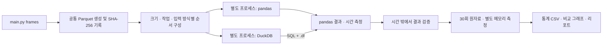

# Database Performance Comparison

ClickHouse, DuckDB, SQLite, PostgreSQL을 동일한 결정론적 데이터와 쿼리로 순차 비교한다.

## Python pandas vs DuckDB 전처리 실험

기존 DB 실험과 별도로 로컬 Python에서 실행한다. `main.py frames`가 진입점이며
`uv.lock`에 패키지 버전을 고정한다. Docker는 필요하지 않다.

```bash
uv sync --locked
uv run python main.py frames --pilot
uv run python main.py frames
```

기본 설정은 **10만·100만·1,000만 행 × 4개 작업 × 2개 입력 방식 × 2개 엔진 × 30회**로,
총 1,440개 시간 측정이다. 파일럿은 1천·1만·10만 행에서 각각 2회만 측정한다.

2026-09-07 본 실험 1,440회 완료: [측정 결과와 해석](results/pandas-duckdb/run-20260907T022808832856Z/report.md).
메모리 입력의 결측치·파생 컬럼은 pandas가 3개 크기 모두 빨랐고, 집계·조인 후 집계는 DuckDB가 빨랐다.
외부 부하와 시스템 swap 활동을 포함한 로컬 환경의 탐색적 결과다.

| 작업 | 의미 | 최종 결과 |
|---|---|---|
| `filter_project` | 지역·금액 필터, 컬럼 선택, 금액×수량 | 입력의 약 19.8% |
| `clean_derive` | 5% 결측 할인율을 0으로 채우고 할인 금액 계산 | 입력과 동일한 행 수 |
| `groupby` | 지역별 금액·수량·건수 집계 | 최대 50행 |
| `join_groupby` | 계정 10만 행 dimension과 조인, 지역·등급 집계 | 최대 200행 |

- `parquet`: Parquet 읽기부터 최종 pandas DataFrame 생성까지. pandas에도 컬럼 선택·필터 pushdown 적용.
- `memory`: 동일 원본 컬럼을 pandas DataFrame으로 사전 로딩. pandas 변환과 DuckDB 등록 입력 SQL을 비교하며 로딩·등록 시간 제외.
- 양쪽 모두 결과 DataFrame을 실제 생성하며 DuckDB `.df()` 시간도 포함.
- 크기는 수치형 8개 컬럼 기준이다. 1,000만 행의 원본 논리 크기는 약 610MiB이며, RAM을 초과하는 대형 데이터 실험은 아니다.
- 기본 스레드 한도는 DuckDB/Arrow 각각 4개, DuckDB 내부 메모리 한도는 8GB. pandas 연산의 실제 병렬도는 다를 수 있다.

```bash
# 크기와 실행 조건 변경 (runs는 blocks의 배수)
uv run python main.py frames --sizes 100000 1000000 10000000 --runs 30 --blocks 6 --threads 4
uv run pytest -q
uv run ruff check benchmarks tests
```

30회는 5회씩 6개 묶음으로 실행한다. 묶음마다 순서를 섞고, 각 엔진은 별도 프로세스에서
1회 워밍업 후 측정한다. OS 파일 캐시는 비우지 않는다. 전체 결과 fingerprint를 매번 확인하고
두 엔진·두 입력 방식의 결과와 대조한다. 직접 값 비교는 경계값 단위 테스트에서 수행한다.

결과는 `results/pandas-duckdb/run-<UTC timestamp>/`에 새로 저장한다.

- `report.md`, `timing-parquet.png`, `timing-memory.png`, `speedup.png`: 읽기용 표·그래프
- `measurements.csv`, `measurements.jsonl`: 1,440개 원시 측정
- `summary.csv`, `summary.json`: 평균, 표본 SD, 중앙값, 최소/최대, 사분위수, IQR, MAD, p90/p95/p99, CV, 평균 95% 구간, 처리량
- `comparison.csv`: pandas/DuckDB 평균 배율, 대응 묶음 bootstrap 구간
- `memory.csv`: 조합별 별도 1회 프로세스 최대 RSS와 결과 DataFrame 크기
- `manifest.json`, `execution-order.json`: 설정, 버전, 소스 해시, 실행 순서, 시스템 부하
- `datasets.json`, `validation.json`: 입력 SHA-256, 결과 행 수·타입·해시

평균 신뢰구간은 묶음 평균의 Student t, 배율 구간은 대응 묶음 bootstrap을 사용한다.
6개 묶음의 탐색적 추정이며 30회가 모두 독립이라고 가정하지 않는다. 이상치는 제거하지 않는다.
메모리 피크는 import·사전 로딩을 포함한 별도 1회 측정이며 30회 메모리 평균이 아니다.
생성 Parquet는 `data/frame-benchmark/`에 캐시하고 Git에서 제외한다.



구성: `frame_workloads.py`는 입력·변환, `frame_worker.py`는 격리 측정,
`frame_benchmark.py`는 순서·검증·저장, `frame_statistics.py`는 통계,
`frame_charts.py`는 그래프와 결과 문서를 담당한다.

## 실행 조건

- 기본 목표: 1,000,000,000행, 20개 컬럼
- 기본 반복: 쿼리별 30회
- 실행 순서: DB 하나 시작 → 데이터 확인/적재 → 4개 쿼리 1회 검증 → 30회 측정 → 종료 → 다음 DB
- 결과: `results/<engine>/summary.json`

## 사전 준비

Docker Desktop 데몬이 실행 중이어야 한다. Python 오케스트레이터는 표준 라이브러리만 사용하며, 컨테이너 내부에서 DB 클라이언트를 설치한다.

## 파일럿 실행

10,000행으로 전체 파이프라인을 빠르게 검증한다.

```bash
uv run python main.py --pilot
```

특정 엔진만 실행하려면 다음처럼 사용한다.

```bash
uv run python main.py --pilot --engine duckdb
```

## 본 실험

```bash
uv run python main.py --rows 1000000000 --runs 30 --purge-data-after-engine --ignore-capacity-check
```

최적화 프로파일은 다음처럼 실행한다. 결과는 `results/optimized/<engine>/`에 별도로 저장된다.

```bash
uv run python main.py --profile optimized --rows 1000000000 --runs 30 --purge-data-after-engine --ignore-capacity-check
```

엔진별로 별도 실행할 때도 동일하게 10억 행·쿼리별 30회 조건을 사용하며, volume은 엔진 종료 후 삭제한다.

```bash
uv run python main.py --engine postgres --rows 1000000000 --runs 30 --purge-data-after-engine --ignore-capacity-check
uv run python main.py --engine sqlite --rows 1000000000 --runs 30 --purge-data-after-engine --ignore-capacity-check
```

용량 계산은 대략 `행 수 × 20개 컬럼 × 8바이트 × 2.5배 오버헤드`다. 따라서 10억 행은 DB 하나당 약 372.5GiB로 보수적으로 추정된다. 실제 엔진별 저장 크기는 압축·페이지·WAL·로그에 따라 다르므로 `storage.json`에 volume 삭제 직전 실제 크기를 기록한다.

```bash
uv run python main.py --rows 1000000000 --runs 30 --purge-data-after-engine --ignore-capacity-check
```

## 결과 파일

- `results/benchmark-report.md`: 현재까지의 유효 결과·미완료 상태·검증 이슈를 정리한 Markdown 기술 리포트
- `validation.json`: 각 쿼리의 최초 실행 결과, 행 수, checksum
- `measurements.jsonl`: 30회 개별 측정값
- `summary.json`: 평균, 최솟값, 최댓값, 표준편차, p50, p95
- `optimization.json` (`optimized`만): 인덱스 생성 시간 또는 물리 정렬 메타데이터

측정 시간은 결과 fetch 완료까지의 단일 클라이언트 경과 시간이다. 검증 1회 이후 반복하므로 warm-cache 결과로 해석한다.

## 주의사항

DuckDB와 SQLite는 서버 프로세스가 아니라 컨테이너 내부의 임베디드 엔진이다. 따라서 이 결과는 동시 접속 서버 성능이 아니라 단일 프로세스 분석 쿼리 성능 비교다. DuckDB optimized는 대형 ART 인덱스 대신 물리 정렬과 zone map을 사용한다. Docker Desktop의 호스트 파일 캐시와 VM 리소스 설정은 실험 메타데이터와 함께 기록해야 한다.
