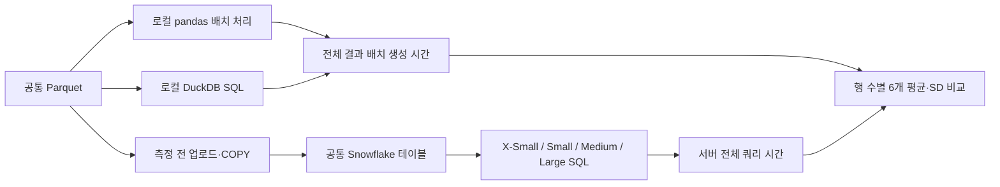
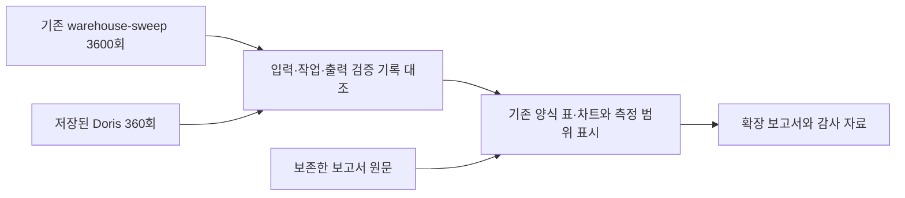
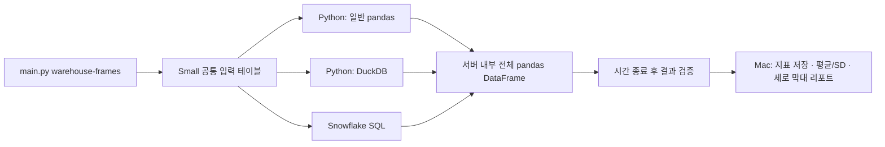
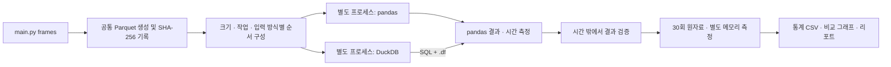
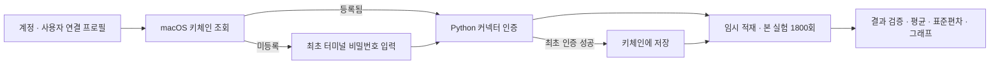
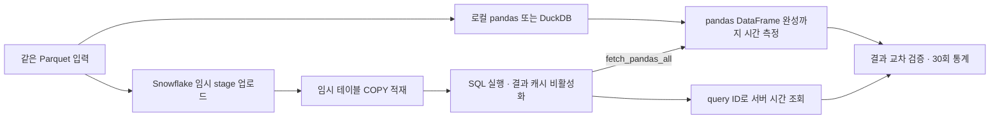
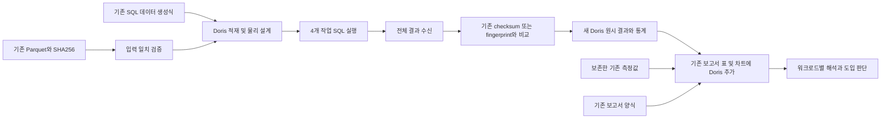

# Database Performance Comparison

ClickHouse, DuckDB, SQLite, PostgreSQL을 동일한 결정론적 데이터와 쿼리로 순차 비교한다.

## 로컬 pandas·DuckDB와 Snowflake 크기별 비교·Doris 참조 결과

사용자가 요청한 새 비교는 로컬에서 Parquet를 읽는 pandas·DuckDB와, 같은 데이터를
미리 적재한 Snowflake 테이블의 X-Small·Small·Medium·Large SQL 실행이다.
**본 실험 3,600회 완료·검수 완료** (측정: 2026-09-09 13:59:18–17:29:04 KST, 사후 검수: 2026-09-10 KST).
[최신 리포트·행 수별 세로 막대 5개](results/warehouse-sweep/run-20260909T045918099704Z/report.md) · [행 수·워크로드별 선택 가이드](results/warehouse-sweep/run-20260909T045918099704Z/report.md#selection-guide) · [10억 행 그림](results/warehouse-sweep/run-20260909T045918099704Z/mean-sd-1000000000.png) · [검수 근거](results/warehouse-sweep/run-20260909T045918099704Z/qa.json).
기존 6개 경로의 10억 행 결과에서 Snowflake Large는 네 작업 모두 가장 짧은 평균을 기록했다. 평균 ± 표본 SD는
결측치 처리 **5.327 ± 0.157초**, 필터 **1.275 ± 0.101초**, 지역 집계 **0.433 ± 0.019초**, 조인 후 집계 **0.946 ± 0.045초**다.
기존 6개 경로의 10만~1,000만 행에서는 단순 가공의 pandas와 집계의 DuckDB가 앞섰다. 가까운 평균과 큰 편차는 리포트에서 별도로 설명한다.
120조건·각 30회, 720개 묶음 예열 체크섬, 2,400개 고유 원격 측정 쿼리, 원자료·통계·입력 해시와 PNG 5개를 검수했다.
[파일럿 리포트](results/warehouse-sweep/pilot-20260909T044933710556Z/report.md)는 기능 검증용이다.

**2026-10-07 KST 보고서 확장:** 10월 6일에 완료한 Doris 전처리 **360회**를 기존 양식의 표·차트에 참조 경로로 추가한다. 새 측정 없이 기존 3,600회와 Doris 원자료·통계를 읽는다. 공통 10만·100만·1,000만 행의 입력 SHA-256·작업 코드와 출력 검증 기록을 대조하며, **1억·10억 행 Doris는 미측정**으로 표시한다. Doris는 전체 결과를 Python DataFrame으로 수신하는 시간이고, 기존 로컬은 결과 배치 생성, Snowflake는 서버 쿼리 시간이므로 7개 경로를 동일 조건의 엔진 속도 순위로 해석하지 않는다.

| 경로 | 실행 위치 | 입력 | 주 시간 지표 |
|---|---|---|---|
| pandas | 로컬 Mac | 공통 Parquet | 읽기·배치 변환·전체 결과 배치 생성 |
| DuckDB | 로컬 Mac | 같은 Parquet | 직접 SQL·전체 결과의 pandas 배치 변환 |
| Snowflake X-Small | FRAME_SWEEP_XSMALL | 공통 적재 테이블 | 서버 전체 쿼리 시간 |
| Snowflake Small | FRAME_SWEEP_SMALL | 같은 테이블 | 서버 전체 쿼리 시간 |
| Snowflake Medium | FRAME_SWEEP_MEDIUM | 같은 테이블 | 서버 전체 쿼리 시간 |
| Snowflake Large | FRAME_SWEEP_LARGE | 같은 테이블 | 서버 전체 쿼리 시간 |
| Doris (저장 결과 참조) | 로컬 Docker, 단일 FE·BE | 사전 적재한 공통 10만~1,000만 행 | SQL 요청·전체 fetch·DataFrame 생성·int64 정규화 |

- 행 수: **10만·100만·1,000만·1억·10억**. 작업: 결측치 처리/파생 컬럼, 필터/파생 컬럼, 지역 집계, 조인 후 집계.
- 5개 크기 × 4개 작업 × 6개 경로 × 30회 = **3,600회**, 120개 조건. 6개 묶음에서 경로와 크기·작업 순서를 무작위화하고 한 번에 한 경로만 측정한다.
- Doris 참조는 3개 크기 × 4개 작업 × 30회 = **기존 360회**다. 9월 9일 본 실험의 무작위 실행 묶음에 참여한 신규 경로로 표현하지 않는다. Doris 측정의 적재·연결·예열·검증은 시간 밖이고, 4 CPU·8GiB 컨테이너 및 실행일·OS/패키지 차이를 별도로 공개한다.
- 기존 로컬 두 경로는 모든 크기에 같은 배치 기준을 적용한다. 로컬 결과 배치는 순차 생성·해제하며 전체 결과를 RAM에 누적하지 않는다. pandas는 부분 집계를 합친다. Arrow/DuckDB 4스레드, 최대 배치 25만 행, DuckDB 내부 메모리 한도 8GB다.
- Snowflake 주 지표는 `QUERY_HISTORY.total_elapsed_time`으로 실행·컴파일·대기를 포함한다. 최초 업로드/COPY와 전체 결과의 Mac 다운로드는 제외하며, client execute 왕복과 서버 구성요소를 별도로 기록한다. **로컬 출력은 pandas 배치이고 원격 출력은 서버 결과이므로 동일한 하드웨어·출력 형식의 순수 엔진 비교는 아니다.**
- 전용 warehouse 네 개는 본 실험 명세에서도 모두 Standard Gen2, 단일 클러스터, 자동 중지 60초다. 결과 재사용 캐시를 끄고 각 작업을 예열한다. 경로 묶음이 끝나면 해당 전용 warehouse를 중지한다. 캐시 상태가 완전히 같다고 가정하지 않는다.
- 원본 seed·정수 연산·필요 컬럼·필터 의미를 맞춘다. 각 묶음의 예열에서 전체 출력 행 수와 두 모듈러 체크섬을 공통 기준에 대조하고, 시간 측정 반복에서는 출력 행 수를 검증한다. 모든 반복의 전체 체크섬 검증이라고 주장하지 않는다.
- 실행 프로세스/연결 준비·예열·체크섬은 측정 밖이다. 입력 Parquet 읽기는 로컬 시간에 포함한다. Snowflake 쿼리의 스캔과 계산을 임의로 분리하지 않는다.

```bash
uv run --no-sync python main.py warehouse-sweep --pilot
uv run --no-sync python main.py warehouse-sweep
```

등록된 macOS Keychain의 `benchmark` 인증을 재사용한다. 10억 행 원본은 약 19.08GB이며
같은 행을 보존한 적재용 Parquet 100개로 나누어 업로드한다. 1억 행은 10개 파일이다.
분할 파일 수·행 수·연속 ID·원본/파일별 SHA-256을 검증한다. 생성·분할·업로드는 준비 단계다.

완료 산출물은 `results/warehouse-sweep/run-<UTC timestamp>/`의 `report.md`,
크기별 `mean-sd-<행 수>.png` **5개**(기존 6개 경로와 Doris 참조·평균 ± 표본 SD, 큰 두 크기는 Doris 미측정 표시),
`summary.csv`, `measurements.jsonl`, `snowflake-components.csv`, `qa.json`이다.
작은 데이터에서의 고정 비용과 행 수 증가에 따른 warehouse 효과를 함께 해석한다.
기존 Small 내부 전체 DataFrame 실험과 이전 로컬/원격 다운로드 실험은 별도 결과로 보존한다.


```mermaid
flowchart LR
    P[공통 Parquet] --> A[로컬 pandas 배치 처리]
    P --> D[로컬 DuckDB SQL]
    P --> L[측정 전 업로드·COPY]
    L --> T[공통 Snowflake 테이블]
    T --> W[X-Small / Small / Medium / Large SQL]
    A --> B[전체 결과 배치 생성 시간]
    D --> B
    W --> Q[서버 전체 쿼리 시간]
    B --> R[행 수별 6개 평균·SD 비교]
    Q --> R
```

저장 결과만으로 확장 보고서를 다시 생성하려면 다음 명령을 사용한다. DB 연결·적재·재측정은 수행하지 않는다. 기존의 선별·작성된 보고서 원문을 별도로 보존해 본문과 기존 표 수치를 유지하고, 같은 입력에서 같은 표·차트·감사 자료를 생성한다.

```bash
uv run --no-sync python main.py warehouse-doris-report
```


```mermaid
flowchart LR
    H[기존 warehouse-sweep 3600회] --> V[입력·작업·출력 검증 기록 대조]
    D[저장된 Doris 360회] --> V
    V --> T[기존 양식 표·차트와 측정 범위 표시]
    B[보존한 보고서 원문] --> T
    T --> R[확장 보고서와 감사 자료]
```

## 같은 Snowflake Small에서 pandas · DuckDB · SQL 실행

`warehouse-frames`는 세 엔진을 `FRAME_BENCH_SMALL`에서 실행한다. 일반 pandas와 DuckDB는
Python 임시 저장 프로시저에서, SQL은 같은 warehouse의 SQL 엔진에서 처리한다.
이미 등록한 macOS Keychain 비밀번호를 재사용한다.

**이전 Small 본 실험 1,080회 완료·검수 완료** (2026-09-09 11:06:41–11:38:56 KST).
[결과 리포트·평균 ± 표본 SD 세로 막대](results/snowflake-small/run-20260909T020641284282Z/report.md).
1,000만 행 지역 집계는 Snowflake SQL **141.80 ± 10.56ms**, DuckDB **1,561.20 ± 79.93ms**,
조인 후 집계는 각각 **215.49 ± 13.24ms**, **2,299.71 ± 116.66ms**였다.
Python으로 원본을 읽는 비용을 포함한 경로 비교이며, 단순 가공의 작은 평균 차이는 변동성과 함께 해석한다.
36개 조건·각 30회, 모든 fingerprint, 1,260개 서버 쿼리 기록, 원자료 통계와 PNG 3개를 검증했다.

요청된 10억 행 후속 비교는 위의 로컬 2개·Snowflake 4개 크기 실험으로 완료했다. 이 Small 내부 완료 결과는 최대 1,000만 행이다.

```bash
uv sync --locked --extra snowflake
uv run --no-sync python main.py warehouse-frames --pilot
uv run --no-sync python main.py warehouse-frames
```

기본은 10만·100만·1,000만 행 × 4개 작업 × 3개 엔진 × 30회 = 1,080회다.
공통 테이블 읽기부터 **서버 내부의 전체 pandas DataFrame 완성까지** 측정하며,
Mac에는 시간·검증 요약만 반환한다. 업로드와 프로시저 시작·CALL 왕복은 제외한다.
같은 warehouse가 동일한 CPU·RAM 배분을 의미하지는 않는다.

결과는 `results/snowflake-small/run-<UTC timestamp>/`의 `report.md`, 크기별 세로 막대 PNG,
`summary.csv`, 원자료 `measurements.jsonl`, `calls.json`, `qa.json`에 저장한다.
이전 로컬/X-Small 실험은 측정 경계가 다르므로 수치를 직접 합치지 않는다.
전용 warehouse는 Small·단일 클러스터·자동 중지 60초로 구성되어 있어야 한다.


```mermaid
flowchart LR
    A[main.py warehouse-frames] --> B[Small 공통 입력 테이블]
    B --> C[Python: 일반 pandas]
    B --> D[Python: DuckDB]
    B --> E[Snowflake SQL]
    C --> F[서버 내부 전체 pandas DataFrame]
    D --> F
    E --> F
    F --> G[시간 종료 후 결과 검증]
    G --> H[Mac: 지표 저장 · 평균/SD · 세로 막대 리포트]
```

## Python pandas vs DuckDB 전처리 실험

기존 DB 실험과 별도로 로컬 Python에서 실행한다. `main.py frames`가 진입점이며
`uv.lock`에 패키지 버전을 고정한다. Docker는 필요하지 않다.

```bash
uv sync --locked
uv run python main.py frames --pilot
uv run python main.py frames
```

기본 설정은 **10만·100만·1,000만 행 × 4개 작업 × 2개 입력 방식 × 2개 엔진 × 30회**로,
총 1,440개 시간 측정이다. 파일럿은 1천·1만·10만 행에서 각각 2회만 측정한다.

**이전 로컬/X-Small 비교: 2026-09-09 본 실험 1,800회 완료.**
[세 엔진 결과·평균 ± 표본 SD·그래프·해석](results/pandas-duckdb/run-20260909T004556934215Z/report.md).
60개 조합의 30회 기록과 원자료 통계를 검증했다. 1,000만 행 Parquet 조인·집계는 DuckDB 43.687 ± 1.258ms,
pandas 355.653 ± 16.088ms였고, 원격 Snowflake는 252.399 ± 157.108ms였다.
로컬·원격의 입력 위치와 자원이 다르며, Snowflake는 결과 수신까지 포함한다.

이전 2026-09-07 로컬 본 실험 1,440회: [측정 결과와 해석](results/pandas-duckdb/run-20260907T022808832856Z/report.md).
메모리 입력의 결측치·파생 컬럼은 pandas가 3개 크기 모두 빨랐고, 집계·조인 후 집계는 DuckDB가 빨랐다.
외부 부하와 시스템 swap 활동을 포함한 로컬 환경의 탐색적 결과다.

| 작업 | 의미 | 최종 결과 |
|---|---|---|
| `filter_project` | 지역·금액 필터, 컬럼 선택, 금액×수량 | 입력의 약 19.8% |
| `clean_derive` | 5% 결측 할인율을 0으로 채우고 할인 금액 계산 | 입력과 동일한 행 수 |
| `groupby` | 지역별 금액·수량·건수 집계 | 최대 50행 |
| `join_groupby` | 계정 10만 행 dimension과 조인, 지역·등급 집계 | 최대 200행 |

- `parquet`: Parquet 읽기부터 최종 pandas DataFrame 생성까지. pandas에도 컬럼 선택·필터 pushdown 적용.
- `memory`: 동일 원본 컬럼을 pandas DataFrame으로 사전 로딩. pandas 변환과 DuckDB 등록 입력 SQL을 비교하며 로딩·등록 시간 제외.
- 양쪽 모두 결과 DataFrame을 실제 생성하며 DuckDB `.df()` 시간도 포함.
- 크기는 수치형 8개 컬럼 기준이다. 1,000만 행의 원본 논리 크기는 약 610MiB이며, RAM을 초과하는 대형 데이터 실험은 아니다.
- 기본 스레드 한도는 DuckDB/Arrow 각각 4개, DuckDB 내부 메모리 한도는 8GB. pandas 연산의 실제 병렬도는 다를 수 있다.

```bash
# 크기와 실행 조건 변경 (runs는 blocks의 배수)
uv run python main.py frames --sizes 100000 1000000 10000000 --runs 30 --blocks 6 --threads 4
uv run pytest -q
uv run ruff check benchmarks tests
```

30회는 5회씩 6개 묶음으로 실행한다. 묶음마다 순서를 섞고, 각 엔진은 별도 프로세스에서
1회 워밍업 후 측정한다. OS 파일 캐시는 비우지 않는다. 전체 결과 fingerprint를 매번 확인하고
두 엔진·두 입력 방식의 결과와 대조한다. 직접 값 비교는 경계값 단위 테스트에서 수행한다.

결과는 `results/pandas-duckdb/run-<UTC timestamp>/`에 새로 저장한다.

- `report.md`, `timing-parquet.png`, `timing-memory.png`, `speedup.png`: 읽기용 표·그래프
- `measurements.csv`, `measurements.jsonl`: 1,440개 원시 측정
- `summary.csv`, `summary.json`: 평균, 표본 SD, 중앙값, 최소/최대, 사분위수, IQR, MAD, p90/p95/p99, CV, 평균 95% 구간, 처리량
- `comparison.csv`: pandas/DuckDB 평균 배율, 대응 묶음 bootstrap 구간
- `memory.csv`: 조합별 별도 1회 프로세스 최대 RSS와 결과 DataFrame 크기
- `manifest.json`, `execution-order.json`: 설정, 버전, 소스 해시, 실행 순서, 시스템 부하
- `datasets.json`, `validation.json`: 입력 SHA-256, 결과 행 수·타입·해시

평균 신뢰구간은 묶음 평균의 Student t, 배율 구간은 대응 묶음 bootstrap을 사용한다.
6개 묶음의 탐색적 추정이며 30회가 모두 독립이라고 가정하지 않는다. 이상치는 제거하지 않는다.
메모리 피크는 import·사전 로딩을 포함한 별도 1회 측정이며 30회 메모리 평균이 아니다.
생성 Parquet는 `data/frame-benchmark/`에 캐시하고 Git에서 제외한다.


```mermaid
flowchart LR
    A[main.py frames] --> B[공통 Parquet 생성 및 SHA-256 기록]
    B --> C[크기 · 작업 · 입력 방식별 순서 구성]
    C --> D[별도 프로세스: pandas]
    C --> E[별도 프로세스: DuckDB]
    D --> F[pandas 결과 · 시간 측정]
    E -->|SQL + .df| F
    F --> G[시간 밖에서 결과 검증]
    G --> H[30회 원자료 · 별도 메모리 측정]
    H --> I[통계 CSV · 비교 그래프 · 리포트]
```

구성: `frame_workloads.py`는 입력·변환, `frame_worker.py`는 격리 측정,
`frame_benchmark.py`는 순서·검증·저장, `frame_statistics.py`는 통계,
`frame_charts.py`는 그래프와 결과 문서를 담당한다.

## 실행 조건

### Snowflake를 함께 비교하기

연결 설정을 지정하면 **pandas·DuckDB를 새로 측정하고 Snowflake 360회도 추가**한다.
기본은 로컬 1,440회 + Snowflake 360회 = 1,800회이며, 기존 결과 폴더는 덮어쓰지 않는다.
2026-09-09 세 엔진 파일럿 120회와 본 실험 1,800회를 완료했다.
본 실험은 [run-20260909T004556934215Z](results/pandas-duckdb/run-20260909T004556934215Z/report.md)에 저장했다.
서버 지표 360개 누락·조회 오류 없음, 평균·표본 SD 재계산 일치 및 12개 기준 결과 fingerprint를 확인했다.
macOS 키체인 방식을 사용하면 최초 등록 후 새 실행에서도 저장된 비밀번호를 자동으로 사용한다.
로컬 테스트의 대체 응답을 실제 Snowflake 결과로 저장하지 않는다.

```bash
uv sync --locked --extra snowflake
# 연결 후 작은 데이터부터 실측
uv run --extra snowflake python main.py frames --snowflake-connection benchmark --pilot
# 10만·100만·1,000만 행, 작업별 30회
uv run --extra snowflake python main.py frames --snowflake-connection benchmark
```

`config/snowflake-connections.example.toml`을 참고해 로컬 `connections.toml`에 `benchmark` 연결을 작성한다.
이 컴퓨터에서 커넥터가 사용하는 경로는 `~/.snowflake/connections.toml`이다.
`~/.snowflake` 폴더가 없는 Mac에서는 `~/Library/Application Support/snowflake/connections.toml`이 기본 경로일 수 있다.
설정 파일에는 사용할 account·user·role·기존 warehouse·database·schema를 지정한다.
예시는 브라우저 SSO 인증이며, 계정 정책에 맞게 로컬에서 인증 방식을 설정한다. 실제 인증정보는 저장소에 넣지 않는다.

브라우저 로그인 세션만으로 Python 커넥터가 연결되지는 않는다.
macOS 비밀번호 로그인 계정은 다음 명령으로 최초 키체인 등록과 본 실험을 함께 시작한다.
처음에는 대화형 터미널에서 비밀번호를 비표시로 입력하고, Snowflake 인증에 성공한 뒤에만 저장한다.
이미 등록되어 있으면 터미널 입력 없이 키체인에서 불러온다. 등록되지 않은 비대화형 실행은
입력 대기 대신 최초 등록 방법을 안내하고 실패한다.

```bash
uv sync --locked --extra snowflake
uv run --no-sync python main.py frames --snowflake-connection benchmark --snowflake-keychain
```

키체인 항목은 `db-performance-comparison.snowflake/<account>` 서비스와 프로필의 `user`로
구분한다. 별도 모듈 `frame_keychain.py`가 Snowflake 커넥터와 같은 프로필 해석기를 사용하며,
네이티브 macOS Keychain만 선택한다. 다른 파일 저장소로 대체하지 않는다.
프로필·CLI 인자·manifest·로그에는 비밀번호를 기록하지 않는다. 시스템 키체인 접근 승인이나
Snowflake MFA는 계정·macOS 정책에 따라 별도로 필요할 수 있다.

비밀번호를 바꾼 경우 `--snowflake-keychain --snowflake-password-prompt`를 함께 지정해 다시 입력한다.
새 비밀번호로 인증되기 전에는 기존 키체인 항목을 덮어쓰지 않는다.
저장하지 않는 일회성 입력은 기존 `--snowflake-password-prompt`만 지정한다.
두 경로 모두 커넥터의 `snowflake` 인증을 사용하고 별도의 SSO/MFA 토큰 캐시를 요청하지 않는다.


```mermaid
flowchart LR
    A[계정 · 사용자 연결 프로필] --> B[macOS 키체인 조회]
    B -->|등록됨| D[Python 커넥터 인증]
    B -->|미등록| C[최초 터미널 비밀번호 입력]
    C --> D
    D -->|최초 인증 성공| E[키체인에 저장]
    D --> F[임시 적재 · 본 실험 1800회]
    E --> F
    F --> G[결과 검증 · 평균 · 표준편차 · 그래프]
```

키체인 저장·조회 API: [Python keyring](https://keyring.readthedocs.io/en/latest/).

현재 lockfile은 Snowflake Connector 4.7.3과 pandas 2.3.3을 사용한다. 커넥터의 pandas 호환 조건 때문에
이전 실험의 pandas 3.0.5와 버전이 다르므로 **세 엔진을 함께 재측정한 결과**로 판단해야 한다.

| 측정 경로 | 측정에 포함 | 별도 기록/제외 |
|---|---|---|
| pandas·DuckDB / parquet | 로컬 파일 읽기·변환·pandas 결과 생성 | 데이터 생성 |
| pandas·DuckDB / memory | 사전 로딩된 DataFrame 변환·결과 생성 | 파일 로딩 |
| Snowflake / warehouse | 적재된 원격 테이블 SQL·결과 다운로드·pandas 생성·정수 타입 정규화 | 연결·PUT 업로드·COPY 적재 |

Snowflake를 로컬 `memory` 또는 `parquet`와 동일한 시작 조건으로 취급하지 않는다.
`three-engine-comparison.csv`와 `timing-three-engines.png`는 로컬 Parquet 경로와 원격 적재 테이블 경로의
**애플리케이션 전체 대기 시간**을 나란히 보여 준다. 서버 연산만의 성능 순위나 동일 하드웨어 비교가 아니다.

- 같은 Parquet 파일을 세션 전용 임시 stage/table에 적재하고 행 수를 검증한다. 종료 시 세션을 닫는다.
- `USE_CACHED_RESULT=FALSE`, 작업별 워밍업 후 5회씩 6개 묶음. 원격 세션은 유지하고 다른 엔진과 순차 실행한다.
- 서버 지표는 `QUERY_HISTORY`에서 query ID별 서버 실행·컴파일·큐 시간·스캔 바이트로 조회한다.
  전체 대기 시간에는 서버 실행도 포함되며, 차이를 순수 네트워크 시간으로 해석하지 않는다.
- `snowflake-setup.json`: 업로드·적재 시간. `snowflake-components.csv`: 클라이언트·서버 시간 구성요소의 통계.
  서버 기록 조회가 실패하거나 지연되면 해당 값은 비워 두며, 실패 상세와 실제 관측 수를 기록한다.
- Snowflake 서버 메모리는 로컬 RSS로 알 수 없으므로 비워 둔다. `cpu_ms`는 로컬 클라이언트 CPU다.
- warehouse를 생성·확대·강제 중지하지 않는다. 실험용 기존 warehouse의 사용 권한과 임시 stage 생성·데이터 적재 권한이 필요하다.
  유료 연산과 저장소 사용이 발생할 수 있고, 세션 종료는 warehouse 중지가 아니므로 `auto_suspend`와 크레딧 예산은 계정에서 정한다.


```mermaid
flowchart LR
    A[같은 Parquet 입력] --> B[로컬 pandas 또는 DuckDB]
    A --> C[Snowflake 임시 stage 업로드]
    C --> D[임시 테이블 COPY 적재]
    D --> E[SQL 실행 · 결과 캐시 비활성화]
    B --> F[pandas DataFrame 완성까지 시간 측정]
    E -->|fetch_pandas_all| F
    E --> G[query ID로 서버 시간 조회]
    F --> H[결과 교차 검증 · 30회 통계]
    G --> H
```

공식 문서: [연결 설정](https://docs.snowflake.com/en/developer-guide/python-connector/python-connector-connect),
[pandas 결과 수신](https://docs.snowflake.com/en/developer-guide/python-connector/python-connector-pandas),
[결과 캐시](https://docs.snowflake.com/en/user-guide/querying-persisted-results),
[서버 쿼리 기록](https://docs.snowflake.com/en/sql-reference/functions/query_history).

### 기존 Docker DB 실험 조건

- 기본 목표: 1,000,000,000행, 20개 컬럼
- 기본 반복: 쿼리별 30회
- 실행 순서: DB 하나 시작 → 데이터 확인/적재 → 4개 쿼리 1회 검증 → 30회 측정 → 종료 → 다음 DB
- 결과: `results/<engine>/summary.json`

## 사전 준비

Docker Desktop 데몬이 실행 중이어야 한다. Python 오케스트레이터는 표준 라이브러리만 사용하며, 컨테이너 내부에서 DB 클라이언트를 설치한다.

## 파일럿 실행

10,000행으로 전체 파이프라인을 빠르게 검증한다.

```bash
uv run python main.py --pilot
```

특정 엔진만 실행하려면 다음처럼 사용한다.

```bash
uv run python main.py --pilot --engine duckdb
```

## 본 실험

```bash
uv run python main.py --rows 1000000000 --runs 30 --purge-data-after-engine --ignore-capacity-check
```

최적화 프로파일은 다음처럼 실행한다. 결과는 `results/optimized/<engine>/`에 별도로 저장된다.

```bash
uv run python main.py --profile optimized --rows 1000000000 --runs 30 --purge-data-after-engine --ignore-capacity-check
```

엔진별로 별도 실행할 때도 동일하게 10억 행·쿼리별 30회 조건을 사용하며, volume은 엔진 종료 후 삭제한다.

```bash
uv run python main.py --engine postgres --rows 1000000000 --runs 30 --purge-data-after-engine --ignore-capacity-check
uv run python main.py --engine sqlite --rows 1000000000 --runs 30 --purge-data-after-engine --ignore-capacity-check
```

용량 계산은 대략 `행 수 × 20개 컬럼 × 8바이트 × 2.5배 오버헤드`다. 따라서 10억 행은 DB 하나당 약 372.5GiB로 보수적으로 추정된다. 실제 엔진별 저장 크기는 압축·페이지·WAL·로그에 따라 다르므로 `storage.json`에 volume 삭제 직전 실제 크기를 기록한다.

```bash
uv run python main.py --rows 1000000000 --runs 30 --purge-data-after-engine --ignore-capacity-check
```

## 결과 파일

- `results/benchmark-report.md`: 현재까지의 유효 결과·미완료 상태·검증 이슈를 정리한 Markdown 기술 리포트
- `validation.json`: 각 쿼리의 최초 실행 결과, 행 수, checksum
- `measurements.jsonl`: 30회 개별 측정값
- `summary.json`: 평균, 최솟값, 최댓값, 표준편차, p50, p95
- `optimization.json` (`optimized`만): 인덱스 생성 시간 또는 물리 정렬 메타데이터

측정 시간은 결과 fetch 완료까지의 단일 클라이언트 경과 시간이다. 검증 1회 이후 반복하므로 warm-cache 결과로 해석한다.

## 주의사항

DuckDB와 SQLite는 서버 프로세스가 아니라 컨테이너 내부의 임베디드 엔진이다. 따라서 이 결과는 동시 접속 서버 성능이 아니라 단일 프로세스 분석 쿼리 성능 비교다. DuckDB optimized는 대형 ART 인덱스 대신 물리 정렬과 zone map을 사용한다. Docker Desktop의 호스트 파일 캐시와 VM 리소스 설정은 실험 메타데이터와 함께 기록해야 한다.

## FinanceBench vector benchmark

The separate vector experiment downloads all 368 pinned FinanceBench PDFs, parses page-local chunks, generates shared BGE embeddings and evaluates all 150 public questions. Existing benchmark commands remain unchanged.

```bash
uv sync --locked --extra vector
uv run --extra vector python main.py financebench prepare
docker compose -f docker-compose.vector.yml pull
uv run --extra vector python main.py financebench run --repeats 3
```

Use repeated `--engine` options to select candidates. Results are stored under `results/financebench/`; downloads, models and embeddings under ignored `data/financebench/`. Servers use dedicated localhost ports and a separate Compose project, and are stopped after each measurement. The runner only resets its own benchmark tables/collections.

This is a warm-cache, concurrency-one experiment, not a production saturation test. Native embedded databases and Docker servers are reported with their deployment differences. Snowflake is not executed by this local command. Source PDF parsing uses PyMuPDF text extraction without OCR or table reconstruction.

On macOS, keep the virtual environment on a fully local filesystem. If the workspace is cloud-offloaded, set `UV_PROJECT_ENVIRONMENT=/private/tmp/financebench-venv` for uv commands.

Measured results: [FinanceBench English report](results/financebench/final-20260921/report.md), [summary CSV](results/financebench/final-20260921/summary.csv), and [raw-result audit](results/financebench/final-20260921/audit.json). The default vector run includes the original and explicit prefilter variants so their correctness differences remain visible.

To measure Cortex Search using the same prepared document and query vectors:

```bash
uv sync --locked --extra vector --extra snowflake
uv run --extra vector --extra snowflake python main.py financebench run --engine cortex --repeats 3
```

The `benchmark` Snowflake connection profile is used by default (`FINANCEBENCH_SNOWFLAKE_CONNECTION` overrides it). Existing task-specific macOS Keychain authentication is supported. The adapter creates a uniquely named schema, uploads and checks every vector, creates a vector-only Cortex Search service, and disables reranking. If the profile points to a personal database, it creates a temporary experiment database as regular tables are unsupported there. It drops its own cloud resources after the run, including failures; it does not alter the shared warehouse configuration. This explicitly selected cloud run incurs Snowflake service/warehouse charges. Reported query latency includes HTTPS/SDK overhead from the client to the cloud.

Completed local + Cortex results: [English comparison](results/financebench/combined-20260921/report.md), [summary CSV](results/financebench/combined-20260921/summary.csv), and [9,900-request audit](results/financebench/combined-20260921/audit.json). The earlier local-only report remains preserved.

## Doris만 추가 측정 (2026-10-06)

관계형 SQL과 pandas/DuckDB 전처리 실험에 Apache Doris를 추가한다. 기존 DB·pandas·DuckDB·Snowflake 원시 측정값은 보존하고 읽어서 비교하며 기존 보고서의 표·차트에 Doris만 추가한다. FinanceBench 벡터 실험은 이번 추가 범위에 포함하지 않는다.

클라우드 보관 폴더에서 Python 패키지 읽기가 지연되면 가상 환경을 로컬 경로에 둔다. 아래 명령은 그 경로에서 프로젝트 lock에 맞는 패키지를 설치한다.

```bash
export UV_PROJECT_ENVIRONMENT=/private/tmp/db-performance-doris-venv
uv sync --locked --extra doris
DORIS_CPUS=14 DORIS_MEMORY=24g uv run --extra doris python main.py --engine doris --profile baseline --rows 1000000000 --runs 30 --purge-data-after-engine
DORIS_CPUS=14 DORIS_MEMORY=24g uv run --extra doris python main.py --engine doris --profile optimized --rows 1000000000 --runs 30 --purge-data-after-engine
docker compose up -d doris
uv run --extra doris python main.py frames-doris
docker compose stop doris
```

- SQL: 10억 행, 기존 4개 쿼리, baseline·optimized 각각 쿼리별 30회. 같은 데이터 생성식과 출력 행 수·checksum을 검증한다. 새 결과는 `results/doris-sql/run-*/`에 저장한다.
- 이번 SQL 실행의 Doris 컨테이너는 14 CPU·24GiB로 설정한다. 과거 SQL은 엔진별 한도를 고정하지 않았고 메모리 한도 24.6GiB가 기록되어 있다. 당시 자원을 완전히 재현했다고 가정하지 않으며 실제 이미지·VM·컨테이너 제한과 실행 소스를 새 결과 폴더에 보존한다.
- 전처리: 기존 10만·100만·1,000만 행 Parquet의 SHA256·스키마·생성 설정을 확인한다. 4개 작업을 각각 30회, 6개 묶음으로 측정하며 모든 출력 fingerprint를 기존 결과와 비교한다. 새 결과는 `results/doris/frames/run-*/`에 저장한다. `--reference-dir` 기본값은 `results/pandas-duckdb/run-20260907T022808832856Z`다.
- 전처리 시간에는 SQL 요청부터 전체 결과 수신·pandas DataFrame 생성·int64 정규화까지 포함한다. 연결·적재·워밍업·결과 검증은 제외하며 적재 시간은 별도로 기록한다. SQL cache와 query cache를 끄고 warm-cache·동시성 1로 실행한다. Doris FE/BE를 포함한 컨테이너 기본 한도는 합계 4 CPU·8GiB다.
- 기존 결과는 2026년 9월, Doris 추가 측정은 10월 6일이다. OS·패키지 버전·호스트 부하와 native/Docker·사전 적재/Parquet 시작 조건의 차이를 함께 기록한다. 과거 결과와의 비교를 동일 시점·동일 실행 경로의 엔진 속도 순위로 해석하지 않는다.
- 최초 Doris 전처리 비교는 9월 7일 로컬 pandas/DuckDB 결과를 참조했다. 10월 7일에는 같은 저장 결과를 [Snowflake 크기별 본 실험 보고서](results/warehouse-sweep/run-20260909T045918099704Z/report.md)에 측정 범위를 구분한 참조 열·막대로 추가한다. 기존 원자료·통계는 보존하고, 배치 처리·서버 쿼리 시간과 전체 DataFrame 반환 시간을 동등한 측정으로 취급하거나 직접 개선 배율을 계산하지 않는다.

Doris 본 실험 600회가 완료됐고 모든 출력이 과거 검증값과 일치했다. 기존 솔루션은 재측정하지 않았다. 통합 보고서는 검증된 원시 결과에서 통계를 다시 계산하며 표·CSV·차트·실행 환경 정보를 포함한다.

| 실험 | 추가 측정 | 통합 결과 |
|---|---:|---|
| SQL baseline·optimized | 10억 행·4개 쿼리·각 30회·2개 프로파일 | [기존 SQL 보고서에 Doris 추가](results/benchmark-report.md) |
| 전처리 | 3개 크기·4개 작업·각 30회 | [기존 전처리 보고서에 Doris 추가](results/pandas-duckdb/run-20260907T022808832856Z/report.md) |
| Snowflake 4개 DW 크기 보고서 확장 | 추가 측정 없음·기존 Doris 전처리 360회 재사용 | [기존 크기별 보고서에 Doris 참조 추가](results/warehouse-sweep/run-20260909T045918099704Z/report.md) |

SQL은 기존 문서의 장·표·세로 막대 차트 형식을, 전처리는 기존 표·박스플롯 형식을 사용한다. 수정 전 보고서와 차트는 `results/doris/original-report-backup/`에 보존했다. `results/doris/comparisons/`의 별도 표·CSV·환경 정보도 검증 자료로 유지한다.

측정을 다시 실행하지 않고 기존 보고서의 Doris 표·차트를 재생성하려면 다음 명령을 사용한다.

```bash
uv run scripts/visualize_results.py
uv run python main.py frames-doris-report
uv run python main.py warehouse-doris-report
```

SQL 원시 결과는 `results/doris-sql/run-20261006-baseline/` 및 `run-20261006-optimized/`, 전처리는 `results/doris/frames/run-20261006T000356880611Z/`에 보존했다. 이번 Doris optimized의 날짜 조건 집계 평균은 3,718.970ms → 411.267ms로 약 9배 개선됐지만 전체 집계·조인은 느려졌다. 과거 SQLite optimized의 미완료 조인은 그대로 누락 표시한다.

분석·추천도 Doris를 반영했다. SQL의 워크로드별 최저 평균 엔진은 유지됐다. 전처리의 1,000만 행 집계는 Doris 22.345ms로 DuckDB Parquet 경로 29.137ms보다 관측 평균이 낮았으나, 메모리 입력 DuckDB 14.462ms는 더 빨랐다. 대량 행을 Python으로 반환하는 작업은 로컬 경로가 유리했고, 조인 집계의 작은 평균 차이는 확정적 우위로 해석하지 않는다. 실행일·환경·입력 경로가 다른 비교라는 한계도 결론에 함께 적용했다.

관련 검사 57개와 정적 검사를 통과했다. SQL 측정 후 Doris 전용 컨테이너·데이터 볼륨을 정리했다. 로컬 인증서가 필요한 환경에서는 `docker build --secret id=benchmark_ca,src=/path/to/ca.pem -f docker/runner/Dockerfile -t db-performance-comparison-runner .`로 신뢰 CA 파일을 전달할 수 있다.


```mermaid
flowchart LR
    S[기존 SQL 데이터 생성식] --> D[Doris 적재 및 물리 설계]
    P[기존 Parquet와 SHA256] --> V[입력 일치 검증]
    V --> D
    D --> Q[4개 작업 SQL 실행]
    Q --> F[전체 결과 수신]
    F --> C[기존 checksum 또는 fingerprint와 비교]
    C --> R[새 Doris 원시 결과와 통계]
    R --> T[기존 보고서 표 및 차트에 Doris 추가]
    H[보존한 기존 측정값] --> T
    B[기존 보고서 양식] --> T
    T --> I[워크로드별 해석과 도입 판단]
```
