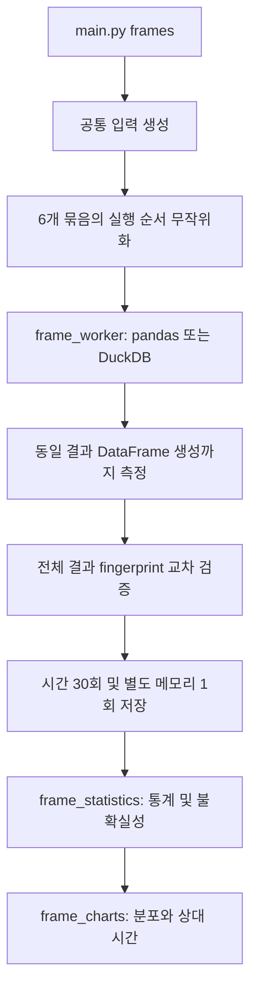
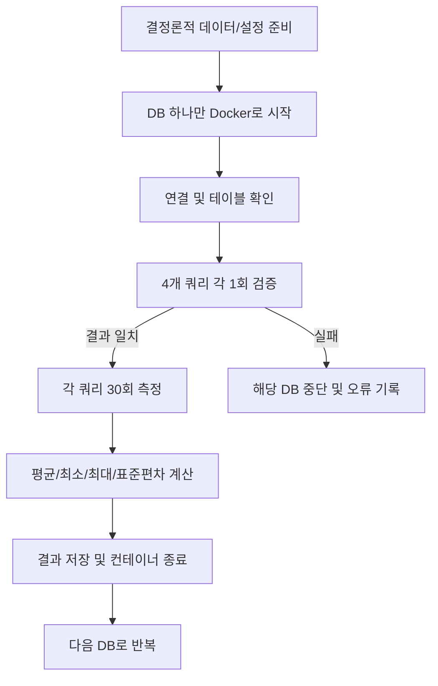

# DB Performance Comparison PRD

## 추가 실험: Python pandas vs DuckDB (2026-09-07)

목적은 데이터 크기와 전처리 유형에 따라 pandas와 DuckDB 중 유리한 경로를 찾는 것이다.
기존 Docker DB 실험과 별도 디렉터리·실행 명령으로 관리한다.

- `main.py frames`로 로컬 실행하며 uv·ruff를 사용한다.
- 기본 입력은 결정론적 난수로 생성한 10만·100만·1,000만 행, 수치형 8개 컬럼의 Parquet다.
- 작업은 필터·파생 컬럼, 결측치 처리·파생 컬럼, 지역 집계, dimension 조인·집계의 4개다.
- 파일에서 시작하는 전체 시간과 DataFrame이 이미 메모리에 있을 때의 시간을 분리한다.
- pandas 컬럼 선택·필터 pushdown을 허용하고 DuckDB `.df()` 결과 생성까지 포함한다.
- 최종 결과는 양쪽 모두 pandas DataFrame이며 금액·합계는 정수 센트로 비교한다.
- 48개 조합에서 각각 30회, 총 1,440개 시간 측정. 5회씩 6개 묶음, 순서 시드 무작위화,
  묶음별 별도 프로세스·워밍업 1회. 동시에 실행하는 측정 엔진은 하나다.
- 30개 시간값의 평균·표본 SD·중앙값·분위수·IQR·MAD·CV·처리량과 이상치 개수를 기록한다.
- 평균 구간은 묶음 평균 Student t, 상대 시간 구간은 대응 묶음 bootstrap으로 계산한다.
- 메모리는 검증 전 OS 프로세스 최대 RSS를 별도 프로세스에서 조합별 1회 측정한다.
- 매 측정 결과의 전체 행 fingerprint와 엔진·모드 간 결과를 비교하고, 실패 시 완료로 표시하지 않는다.
- 원자료·입력 해시·설정·패키지 버전·소스 해시·CPU/메모리 부하·그래프를 보존한다.
- 성공 기준: 경계값 직접 비교 테스트 통과, 48개 조합의 각 30회 기록, 결과 해시 일치,
  원자료로 재계산 가능한 통계와 시각화, 기존 DB CLI 동작 유지.
- 2026-09-07 완료: 1,440회·48개 조합 모두 검증. 단위 테스트 12개·ruff 통과,
  원자료의 평균·표본 SD·중앙값·극값·비율 독립 재계산 일치. 결과는
  `results/pandas-duckdb/run-20260907T022808832856Z/`에 보존한다.
- 해석 범위: 수치형 합성 데이터·warm-cache·로컬 단일 사용자 환경. 대형은 이번 실험 내 상대 크기이며
  메모리 초과 입력·문자열·UDF·전역 정렬·중복 제거·기존 10억 행 결과로의 외삽은 제외한다.



## 1. 목적

ClickHouse, DuckDB, SQLite, PostgreSQL을 동일한 논리 데이터와 실행 조건에서 비교한다. 비교 대상은 단일 클라이언트가 실행하는 분석 쿼리의 응답 시간과 결과 일치 여부다.

## 2. 목표

- 4개 DB를 Docker 환경에서 실행한다.
- 20개 컬럼을 가진 10억 행 테이블을 최종 벤치마크 대상으로 한다.
- `account_dim` 100만 행 dimension 테이블을 생성해 fact-dimension join을 추가한다.
- 작은 쿼리, 중간 쿼리, 큰 쿼리를 정의하고 DB별로 동일하게 실행한다.
- 각 쿼리는 먼저 1회 실행해 정상 결과를 확인한다.
- 검증에 성공하면 같은 쿼리를 30회 실행한다.
- 평균, 최솟값, 최댓값, 표준편차와 결과 checksum을 기록한다.
- 메모리 경쟁을 막기 위해 측정 시 한 번에 하나의 DB만 실행한다.

## 3. 범위

### 포함

- Docker Compose 기반 실행
- 결정론적 데이터 생성
- DB별 데이터 적재 및 행 수 검증
- 쿼리 결과 행 수와 checksum 검증
- 30회 반복 측정 및 JSON 결과 저장
- DB별 요약 표와 실행 메타데이터
- volume 삭제 직전의 엔진별 실제 저장 크기 기록
- 실험 흐름과 구성 문서화

### 제외

- 동시 접속자 성능
- 삽입/업데이트 성능 비교
- 인덱스 튜닝 대회
- 네트워크 분산 환경 비교
- 각 DB의 운영 배포 성능

DuckDB와 SQLite는 서버가 아닌 임베디드 엔진이므로 Docker 컨테이너 안에서 실행한다. PostgreSQL과 ClickHouse는 서버 컨테이너에 연결한다.

## 4. 실험 조건

### 데이터

- 테이블명: `benchmark`
- 행 수: 최종 1,000,000,000
- 컬럼 수: 20
- 데이터 생성 규칙: 모든 DB에서 같은 정수 기반 결정론적 수식 사용
- dimension 행 수: 1,000,000
- 데이터 적재 시간: 쿼리 측정값에서 제외
- `baseline` 프로파일은 보조 인덱스를 생성하지 않는다.
- `optimized` 프로파일은 엔진별 최적화 전략을 적용한다.

컬럼은 `id`, 계정·카테고리·지역 식별자, 수량·금액·할인율, 날짜/시간용 정수, 상태 식별자, 8개의 정수형 metric으로 구성한다. 모든 DB에서 동일한 논리값을 생성한다.

### 쿼리

1. 작은 쿼리: 단일 `id` 조건 조회. 결과는 1행이지만 보조 인덱스가 없어 전체 스캔이 발생할 수 있다.
2. 중간 쿼리: 전체 기간의 약 5.5%인 100일 범위를 필터링한 뒤 `region_id`별 집계. 10억 행 기준 집계 입력은 약 5,480만 행이다.
3. 큰 쿼리: 전체 10억 행을 읽고 `category_id`별 집계한다. 필터가 없으므로 가장 많은 데이터를 논리적으로 처리한다.
4. 조인 쿼리: 여러 fact 행이 하나의 dimension account에 대응하는 다대일 조인을 `account_id`로 수행한 뒤 `region_id`, `account_tier`별 집계한다.

중간 쿼리와 큰 쿼리의 핵심 차이는 결과 행 수가 아니라 필터 선택도와 집계 입력량이다. 공통 보조 인덱스를 만들지 않는 조건이므로 두 쿼리 모두 물리적으로 전체 테이블을 읽을 수 있으며, 이 점을 결과 해석 시 명시한다. 조인 쿼리는 전체 fact 스캔에 dimension hash join과 추가 group by를 포함한다.

쿼리 결과는 검증 단계에서 전체 행을 읽어 정규화한 뒤 SHA-256 checksum을 만든다. 반복 측정에서도 checksum이 최초 검증값과 다르면 실험을 실패 처리한다.

### 최적화 프로파일

실험 2에서는 동일한 논리 데이터와 쿼리에 다음 전략을 적용한다.

| 엔진 | 최적화 전략 |
|---|---|
| ClickHouse | fact `ORDER BY (event_day, id)`, `id` Bloom filter data-skipping index, dimension `ORDER BY account_id` |
| DuckDB | fact를 `event_day` 그룹별로 직접 순서대로 적재해 `(event_day, id)` 물리 레이아웃과 zone map 활용, 별도 ART 인덱스는 생성하지 않음 |
| PostgreSQL | `benchmark(id)`, `benchmark(event_day)`, `benchmark(account_id)`, `account_dim(account_id)` B-tree 인덱스 |
| SQLite | `benchmark(id)`, `benchmark(event_day)`, `benchmark(account_id)`, `account_dim(account_id)` 인덱스 |

DuckDB의 10억 행 3개 ART 인덱스 시도는 약 33분 후 24.6 GiB 메모리 한도로 OOM이 발생했다. 전역 `ORDER BY` 정렬도 임시공간 200 GB 한도에 도달했으므로, DuckDB는 event_day별 직접 순서 적재로 분석형 물리 레이아웃을 만들도록 전환했다. 이 변경과 실패 증거는 개발 기록에 남긴다. 인덱스 생성 시간과 데이터 정렬·레이아웃 구축 시간은 `results/optimized/<engine>/optimization.json`에 별도로 기록한다.

### 실행 순서



한 번에 실행되는 DB 컨테이너는 하나다. 측정 클라이언트가 별도 컨테이너로 필요한 경우에도 해당 DB와 측정 클라이언트만 실행한다.

10억 행 본 실험에서는 디스크 공간을 절약하기 위해 다음 엔진으로 넘어가기 전에 현재 엔진의 named volume을 삭제한다.

```text
DB 시작 → fact/dimension 생성 → 1회 검증 → 30회 측정
→ 결과 저장 → 컨테이너 종료 → 해당 DB volume 삭제 → 다음 DB
```

따라서 본 실험이 진행되는 동안에는 한 엔진의 데이터만 유지된다. 결과 JSON과 원시 측정값은 호스트 `results/` 디렉터리에 보존한다.

### 측정 정의

- 시간 단위: milliseconds
- 측정 구간: 쿼리 실행부터 결과 fetch 완료까지
- 검증 1회: 측정값 참고용이며 30회 통계에는 포함하지 않음
- 반복 횟수: 기본 30회
- 평균: 산술평균
- 표준편차: 표본 표준편차
- 추가 기록: p50, p95, 성공 횟수, 결과 행 수, checksum
- 동시성: 1
- 캐시 조건: 검증 1회 후 새 연결에서 반복 측정. cold-cache를 통제하지 않으며 모든 캐시 계층이 warm임을 보장하지 않는다.

## 5. 비기능 요구사항

- DB별 Docker 이미지 버전과 Python 클라이언트 버전을 기록한다.
- CPU와 메모리 제한은 Docker 환경에서 공통으로 적용할 수 있어야 한다.
- 데이터 볼륨은 컨테이너 수명과 분리한다.
- 1억 행 이상 실행은 디스크 용량 확인 후 명시적으로 허용한다.
- 결과 파일만으로 동일 실험의 통계와 결과 일치 여부를 재검토할 수 있어야 한다.

## 6. 산출물

- `prd.md`: 본 요구사항
- `README.md`: 설치 및 실행 방법
- `docker-compose.yml`: DB별 컨테이너 정의
- `main.py`: 순차 실험 오케스트레이터
- `scripts/engine_worker.py`: DB 생성·검증·측정 실행기
- `results/<engine>/validation.json`: baseline 최초 결과 검증
- `results/<engine>/measurements.jsonl`: baseline 반복별 원시 측정값
- `results/<engine>/summary.json`: baseline 통계 요약
- `results/<engine>/storage.json`: baseline volume 삭제 직전 측정한 저장 크기
- `results/optimized/<engine>/...`: optimized 프로파일의 동일 산출물
- `results/optimized/<engine>/optimization.json`: 인덱스 생성 또는 물리 정렬 메타데이터
- `results/benchmark-report.md`: DB 선택 판단, baseline·optimized 비교, DB별 추천 워크로드 중심의 전체 보고서
- LinkedIn 게시글: 실험 범위와 5개 핵심 불렛을 포함한 전문을 채팅으로 제공하며, 저장소에는 파일로 남기지 않음
- `daily-development-report.md`: 개발 및 실험 진행 기록

## 7. 성공 기준

- 각 프로파일의 4개 엔진이 Docker에서 독립적으로 시작된다.
- 동일한 행 수와 20개 컬럼이 생성된다.
- 4개 쿼리의 결과 checksum이 DB별로 일치한다.
- 각 쿼리에 대해 30개 측정값과 평균·최솟값·최댓값·표준편차가 남는다.
- 한 DB의 실패가 다음 DB의 실행 상태를 오염시키지 않는다.

## 8. 리스크와 대응

| 리스크 | 대응 |
|---|---|
| 10억 행 데이터가 너무 큼 | 실행 전 디스크 용량 게이트와 파일럿 모드 제공 |
| DuckDB 대형 ART 인덱스가 메모리 초과 | DuckDB는 물리 정렬·zone map 전략을 사용하고 ART 인덱스 실패를 기록 |
| PostgreSQL WAL/SQLite 저장공간 증가 | 적재 공간과 결과를 분리하고 충분한 SSD 용량 요구 |
| Docker Desktop VM 캐시 차이 | warm-cache 기준을 명시하고 실행 환경을 기록 |
| 서버형/임베디드형 차이 | 결과를 단일 프로세스 분석 엔진 비교로 해석하고 별도 표기 |
| 한 번의 실행이 오래 걸림 | 먼저 작은 행 수 파일럿으로 파이프라인 검증 |

## 9. 현재 실행 정책

기본 목표는 10억 행/쿼리별 30회다. 파일럿으로 파이프라인을 먼저 검증한 뒤, 본 실험은 엔진별 volume purge 모드로 실행한다. 전체 실험은 Docker 데몬이 실행 중이고, 한 엔진의 데이터 파일과 적재·쿼리 중간 공간을 감당할 수 있는 디스크가 확보된 경우에만 실행한다. PostgreSQL과 SQLite의 10억 행 전체 스캔은 다른 엔진보다 매우 오래 걸릴 수 있다.

단일 쿼리의 첫 반복이 6시간을 초과해 결과를 반환하지 않으면 해당 쿼리 측정을 중단할 수 있다. 이 경우 완료된 반복만 원시 결과로 보존하고, 해당 쿼리는 최종 엔진 순위와 완전한 프로파일 비교에서 제외하며 중단 시각·경과 시간·자원 사용 상태를 결과 보고서에 기록한다.

### 9.1 남은 엔진의 단계적 실행 변경

기존 5억 행 기준 결과는 기준선으로 보존한다. 본 재실험은 10억 행 기준으로 4개 엔진 모두 쿼리별 30회를 실행한다. 금액과 할인율은 2자리 고정 소수 데이터이므로 반복별 부동소수점 집계 순서 차이를 막기 위해 정수 센트로 집계한 뒤 표시 단위로 환산한다.

### 결과 시각화

보고서 4절은 평균 응답 시간을 동일한 로그 축의 쿼리별 세로 막대 차트로, 2.4절은 저장 크기를 0 기준 가로 막대 차트로 제공한다. 10억 행 결과만 사용하며 미완료 측정과 파일럿 파일은 명시적으로 구분한다.

성능 막대는 낮을수록 빠름을 명시하고, 엔진 순서를 고정한 채 평균 응답 시간·쿼리별 순위를 직접 표시한다. 가장 빠른 엔진을 강조하며 p50/p95는 표에서 제공한다. 로그 축 막대의 시작값은 0.01 ms이며 높이의 비율을 응답 시간 비율로 해석하지 않는다.

4절의 평균 막대에 ±1 표본 표준편차(SD, 분모 n-1)를 검은 오차막대와 숫자로 표시한다. SD는 신뢰구간이 아닌 반복 간 변동성이다. 로그 축에서 하한이 0.01 ms 미만이면 생략 기호(▽)와 설명을 제공한다. 완주한 실행의 SD는 summary.json과 대조한다.

2.2절에는 baseline·optimized 평균과 ±1 표본 SD를 엔진별로 나란히 놓은 세로 막대 차트와 수치 표를 제공한다. 개선 배수는 baseline 평균 / optimized 평균으로 정의하고, 미완료 조인은 비교에서 제외한다.

### 보고서와 외부 공유 글

보고서는 DB 선택 판단 → baseline·optimized의 성능·변동성·저장 비용 비교 → DB별 추천 워크로드 순서로 구성한다. 실제 SQL, 평균·p50·p95, 검증·중단·파일럿 제외 근거와 재현 경로를 유지한다. 워크로드 추천은 실험에서 관측한 사실과 공식 문서에 근거한 판단을 구분하며, 단일 클라이언트 결과를 프로덕션 전체 성능으로 일반화하지 않는다. LinkedIn 글은 정확히 5개 핵심 불렛을 중심으로 도입·결론을 포함해 작성하고 게시 자체는 사용자가 수행한다.

LinkedIn 글은 실험 중 눈에 띈 결과와 느낀 점을 자연스럽게 풀어 쓰는 경험 공유 문체로 작성한다. 짧은 문단과 쉬운 설명을 사용하고, 보고서식 표현을 줄이되 핵심 수치와 실험 범위는 유지한다. baseline과 optimized를 구분하고, 날짜 필터 집계(medium)·전체 집계(large)·조인 후 집계(join)의 우위를 각각 설명한다. 수정한 게시글 전문은 채팅에만 제공한다.

저장소에 게시하는 Markdown의 이미지와 내부 문서 링크는 해당 Markdown 파일 기준의 상대 경로를 사용한다. 개인 컴퓨터의 절대 경로를 포함하지 않으며, 링크 대상이 Git에 포함되어 있는지 확인한다.
