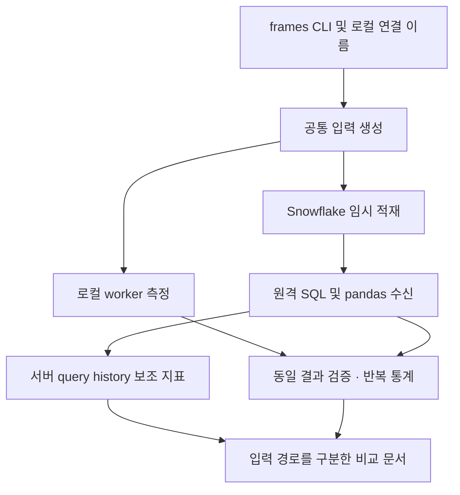
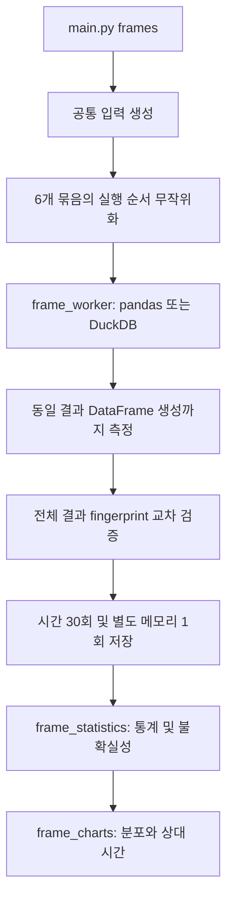
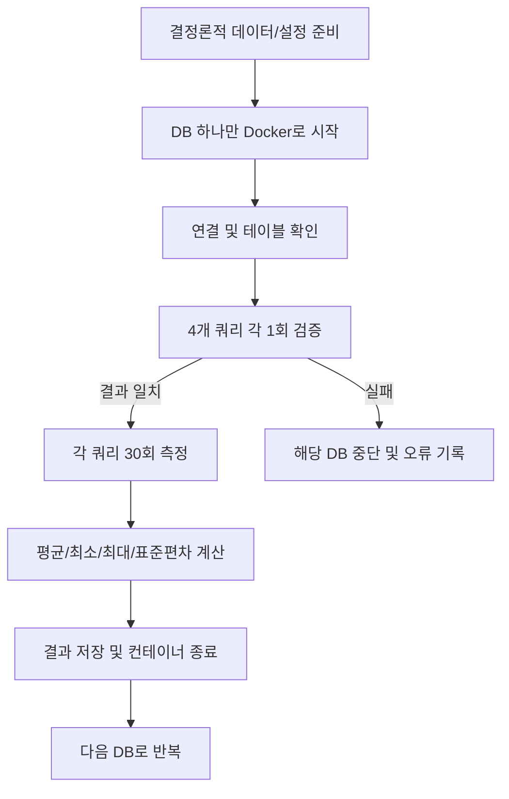

# DB Performance Comparison PRD

## 로컬 2개·Snowflake 4개 크기 비교 (측정 2026-09-09, 검수 2026-09-10)

- 사용자 요청: pandas·DuckDB는 로컬 Parquet를 처리하고 Snowflake는 X-Small·Small·Medium·Large에서 같은 적재 테이블을 처리한다. 이전의 10억 행 확장은 이 실험으로 이어간다.
- 행 수 10만·100만·1,000만·1억·10억, 기존 4개 작업, 6개 경로, 조건별 30회·6개 묶음으로 120개 조건·총 3,600회를 측정한다. 경로별 600회이며 한 번에 한 경로만 실행한다.
- 모든 크기의 로컬 실행은 최대 25만 행의 결과 배치를 순차 생성한다. pandas 부분 집계·DuckDB Parquet 직접 SQL, Arrow/DuckDB 4스레드·DuckDB 메모리 한도 8GB. 전체 DataFrame을 보유했던 기존 실험과 구분한다.
- 주 지표: 로컬은 Parquet 읽기부터 모든 출력 배치 생성까지, Snowflake는 서버 `total_elapsed_time`(실행·컴파일·대기). 원격 결과의 Mac 다운로드·최초 업로드/적재·연결 준비·예열·검증은 제외한다. 동일 CPU/RAM·입출력 형식의 순수 연산 속도 비교로 주장하지 않는다.
- 전용 FRAME_SWEEP_XSMALL/SMALL/MEDIUM/LARGE, Standard·단일 클러스터·자동 중지 60초·결과 재사용 캐시 해제. 본 실험 설정에서도 네 warehouse 모두 Gen2를 확인했다. 각 경로 묶음 종료 시 해당 warehouse를 중지한다.
- 각 묶음 예열에서 모든 출력 컬럼/행의 두 모듈러 체크섬과 행 수를 공통 기준에 대조한다. 매 측정 반복은 행 수를 확인한다. 체크섬은 비암호화 검증이며 완전한 원격 결과를 보존하거나 매 측정 반복의 전체 동일성을 검증했다고 표현하지 않는다.
- `main.py warehouse-sweep`가 실행 진입점이다. 적재용 Parquet 분할은 원본을 보존하고 1억 행 10개·10억 행 100개 파일을 생성했다. 행 수·연속 ID·파일 해시를 검증한다.
- 파일럿 `pilot-20260909T044933710556Z`: 144회·72개 조건·72개 전체 결과 검증·96개 고유 Snowflake 측정 쿼리, 서버 지표 누락 0개. 세로 막대 PNG 3개 검수 완료. 테스트 101개·ruff 검사를 통과했다. 본 실험 `run-20260909T045918099704Z`는 2026-09-09 13:59:18–17:29:04 KST에 3,600회 측정을 완료했다.
- [완료 리포트](results/warehouse-sweep/run-20260909T045918099704Z/report.md), 평균 ± 표본 SD 세로 막대 PNG 5개, 원자료·서버 구성요소·소스 사본·QA를 보존했다. 120개 조건·각 30회·6개 묶음, JSONL/CSV 동등성, 720개 예열 전체 체크섬, 3,600회 출력 행 수, 2,400개 고유 원격 query ID를 검증했다. 조회 오류·지표 누락은 없다.
- 독립 statistics 재계산으로 요약 통계 1,440개 및 구성요소 통계 1,440개를 대조했다(n 포함). 소스 20개·공통 입력 10개·적재 분할 파일 110개의 해시, 입력/적재 행 수·설정 기록과 PNG 5개의 평균/SD 120쌍을 검수했다. 검증기는 실행 폴더의 `verify_results.py`, `verify_provenance.py`, `verify_report.py`로 보존한다.
- 10억 행에서 Snowflake Large의 평균은 네 작업 모두 가장 짧았으며, 6개 묶음 평균에서도 유지됐다. 10만~1,000만 행에서는 단순 가공의 pandas와 집계의 DuckDB가 가장 짧았다. 작은 평균 차이·큰 SD·묶음별 역전을 설명하고, 비용·동시성·동일 자원 성능에 대한 결론은 내리지 않는다.

- 리포트에 네 작업별 pandas 변환 코드·DuckDB Parquet SQL·Snowflake SQL을 추가했다. 10억 행 예시의 파일·실제 임시 테이블, 공통 배치 처리와 부분 집계 병합, 네 작업의 독립 실행을 설명한다. 코드·SQL 14개 발췌는 보존된 측정 소스와 대조하며 측정값과 원본 코드는 변경하지 않는다.

## 10억 행 확장 요청 (2026-09-09)

- 사용자가 Snowflake 테이블을 10억 행으로 늘려 후속 실험을 요청했다. 같은 seed의 공통 원본 10억 행을 로컬에서 50만 행씩 생성했다. Parquet는 19,083,998,521 bytes이며 10,000개 row group·8개 컬럼·ID 0~999,999,999·계정 10만 행을 검증했다. 원본 SHA-256과 준비 상태는 `results/snowflake-small/billion-preparation.json`에 기록한다. 최대 1,000만 행의 기존 Small 실험은 아래와 같이 완료했다.
- 사전 확인 당시 로컬 여유 디스크는 약 394GiB로, 원본 준비를 위한 128GiB 여유 조건을 통과했다.
- 현재 프로토콜의 전체 DataFrame 방식은 10억 행에서 구조적인 메모리 제약이 있다. 정수 3개 입력 컬럼만 24GB, 결측치 처리 결과 2개 컬럼만 16GB이며, Python 런타임에서 보이는 12GiB보다 크다. 복사·중간 결과·런타임 비용은 이 계산에 포함하지 않았다.
- 기존 4개 DB 실험은 최종 결과가 1~1,000행인 조회·집계 중심이었다. 이후 사용자가 로컬 pandas·DuckDB와 Snowflake 네 크기의 비교를 선택해, 위의 배치 처리·플랫폼 시간 기준으로 진행한다. 이전 전체 DataFrame 방식의 한계를 숨기거나 수치를 합치지 않는다.

## 같은 Snowflake Small에서 재실험 (2026-09-09)

- 사용자가 실행 환경 변경을 요청했다. 전용 `FRAME_BENCH_SMALL`(Small, 단일 클러스터, 자동 중지 60초)을 만들고 세 경로를 같은 warehouse에서 실행한다.
- `main.py warehouse-frames`는 일반 pandas와 DuckDB를 Python 임시 저장 프로시저에서, SQL을 같은 warehouse의 실행 엔진에서 수행한다. Snowpark pandas로 대체하지 않는다.
- 공통 적재 테이블에서 시작해 서버 내부의 전체 pandas DataFrame 완성까지 측정한다. pandas·DuckDB의 필요한 컬럼 읽기·형 변환·등록을 포함하며, SQL의 스캔·계산은 분리 불가능하므로 입력 시간은 null이다.
- 업로드·연결·CALL 시작/왕복·예열·GC·결과 해시는 측정 밖이다. Mac에는 지표와 검증 요약만 반환한다. 모든 반복의 fingerprint, 시간 구성요소, child query ID, 모든 CALL의 패키지·자원·캐시 설정을 보존한다.
- 본 실험은 10만·100만·1,000만 행 × 4개 작업 × 3개 엔진 × 30회 = 1,080회다. 6개 묶음에서 순서를 무작위화하며 각 CALL의 예열 1회는 제외한다. 파일럿은 1천·1만·10만 행에서 각 2회다.
- 평균 ± 표본 SD를 0 기준 세로 막대로 표시한다. 같은 warehouse여도 Python 런타임과 SQL 엔진의 자원 배분은 동일하지 않다. 이전 로컬/원격 측정과 직접 개선 배율을 계산하지 않는다.
- 실행 호환성 확인: Python 3.12 Linux ARM64, pandas 2.3.3, DuckDB 1.5.5. 패키지 버전을 고정했다. 오프라인 검사 69개와 실제 파일럿 72회·전체 fingerprint·서버 query history 84개 검증을 통과했다.
- `run-20260909T020641284282Z`의 본 실험 1,080회는 2026-09-09 11:38:56 KST에 완료했다. 36개 조건 × 30회·6개 묶음, CSV/JSONL 동등성, 모든 fingerprint, 통계 독립 재계산, CALL 216개, 고유 child query 1,260개 및 측정 소스·입력 해시를 검증했다. 오류·누락은 없다.
- 리포트와 세로 막대 3개의 표시 검수를 완료했다. 1,000만 행 집계에서 SQL이 유리하며, pandas·DuckDB의 입력 읽기·형 변환 비용과 단순 가공의 반복 변동성을 함께 설명한다. 10억 행 원본 준비와 이 완료 실험의 결과를 구분한다.

## 평균·표준편차 시각화 형식 보완 (2026-09-09)

- 사용자 요청에 따라 한국어 세로 막대·평균 ± 표본 SD 숫자 표시를 세 엔진 결과에 적용한다.
- 크기별 4개 작업 패널에 메모리 pandas·DuckDB, Parquet pandas·DuckDB, 원격 Snowflake의 5개 경로를 표시한다. 모든 축은 0부터 시작하며 작업별 범위 차이와 SD 음수 하한의 잘림을 명시한다.
- 본 실험 폴더의 `mean-sd-100000.png`, `mean-sd-1000000.png`, `mean-sd-10000000.png`를 리포트에 추가했다. `source/mean-sd/main.py`는 측정 원자료·요약을 검증한 뒤 그림만 다시 생성한다.
- 같은 Small warehouse의 후속 비교는 실행 위치를 통제하지만 Python 프로세스와 SQL 엔진의 자원·분산 방식을 동일하게 만들지는 않는다. 후속 구현·실행 상태는 위 재실험 절에 기록한다.

## 세 엔진 본 실험과 리포트 완료 (2026-09-09)

- 사용자 터미널의 키체인 인증으로 `run-20260909T004556934215Z`를 실행했다. 실행 기록은 09:45:56–09:57:55 KST다.
- 10만·100만·1,000만 행, 4개 작업, 로컬 2개 입력 방식·2개 엔진 및 원격 warehouse를 6개 묶음·각 30회로 측정했다. 총 1,800회·60개 조합이며 누락·중복이 없다.
- JSONL·CSV 일치, 평균·표본 SD·중앙값·극값 및 로컬 배율 재계산 일치, 입력·측정 소스 해시, 새 로컬 계산의 12개 기준 fingerprint를 검증했다. 원격 결과의 당시 일치는 실행 중 검증 기록에 근거한다.
- Snowflake 360개 고유 query ID의 서버 지표를 모두 수집했고, 구성요소 통계 576개가 재계산과 일치했다. query history 조회 오류는 없다.
- 결과 폴더 `report.md`에 평균 ± SD 표와 그래프, 작업·입력 경로별 해석, 서버 실행·클라이언트 수신 분해, 1회 업로드·적재 시간 및 관측된 부하·변동성의 한계를 반영했다. 재현용 `verify_results.py`와 `qa.json`을 함께 보존한다.
- 1,000만 행 Parquet 조인 집계 평균은 DuckDB 43.687ms, pandas 355.653ms, 원격 Snowflake 252.399ms다. Snowflake SD는 157.108ms로 커서 평균 순위를 개별 요청의 보장으로 해석하지 않는다.
- 기존 9월 7일 로컬 실험과 10억 행 DB 리포트는 보존한다. 이번 pandas 2.3.3 결과를 이전 3.0.5 측정과 합치지 않는다.

## macOS 키체인으로 반복 실험 인증 (2026-09-09)

- 사용자가 요청한 macOS 키체인을 `--snowflake-keychain`으로 선택한다. 최초 등록과 본 실험은 같은 명령으로 실행한다.
- 프로필의 account·user 조합별로 비밀번호를 분리하고 네이티브 macOS Keychain만 사용한다.
- 최초 등록은 대화형 터미널 비표시 입력이며, Snowflake 인증에 성공한 뒤에만 저장한다. 등록 후에는 비대화형 실행에서도 재사용한다.
- 기존 `--snowflake-password-prompt`를 함께 지정하면 새 비밀번호로 인증 후 키체인 항목을 갱신한다.
- 비밀번호는 프로필·명령 인자·결과 파일에 포함하지 않는다. 키체인 접근 실패는 다른 저장 방식으로 우회하지 않는다.
- 인증이나 등록을 취소하면 실행을 실패로 기록하고 연결을 종료한다. 인증 입력 시간은 벤치마크 측정에서 제외한다.
- keyring 25.7.0을 Snowflake 선택 의존성에 고정했으며 기존 pandas·DuckDB·Connector 버전은 유지했다.
- 현재 상태: 네이티브 키체인 동작 검증과 사용자 터미널의 최초 등록·인증, 본 실험 1,800회 및 리포트 검증을 완료했다.

## Snowflake 실제 계정 연결 준비 (2026-09-09)

- 로그인된 브라우저에서 계정, 기존 X-Small warehouse, 개인 데이터베이스의 PUBLIC 스키마를 확인한다.
- 브라우저 SSO가 동작하지 않는 계정은 `--snowflake-password-prompt`로 로컬 터미널에서 인증한다.
- 비밀번호는 CLI 인자나 결과 manifest에 포함하지 않으며, 프로필에 저장하지 않고 토큰 캐시도 요청하지 않는다. 명시적 키체인 선택 시에는 시스템 키체인에만 저장한다.
- 직접 입력은 대화형 터미널에서만 허용한다. 연결 이름 없이 비밀번호 또는 키체인 옵션을 사용하는 경우 실행 전에 거부한다.
- 파일럿 `pilot-20260908T235954570516Z`는 세 엔진 120회로 완료했다. 본 실험은 최초 키체인 등록 후 재입력 없이 실행할 수 있다. 인증 전 중단된 실행은 측정 0회로 표시한다.

## Snowflake 비교 추가 (2026-09-08)

- `main.py frames --snowflake-connection <name>`으로 로컬 pandas·DuckDB와 원격 Snowflake를 순차 실행한다.
- 기존 3개 크기·4개 작업을 재사용한다. 로컬 2개 입력 방식 1,440회와 Snowflake warehouse 360회를 합쳐 1,800회 측정한다.
- 동일 Parquet를 세션 전용 임시 stage/table에 PUT/COPY하고 적재 행 수 및 전체 결과 fingerprint를 검증한다.
- Snowflake는 적재된 테이블에서 SQL → fetch_pandas_all → pandas 정규화까지 측정한다. 업로드·적재는 별도 시간이다.
- USE_CACHED_RESULT를 끄며, query ID별 서버 실행·컴파일·큐 시간·스캔량을 추가 수집한다. 조회 불가 값은 0으로 대체하지 않는다.
- warehouse 입력을 로컬 memory 또는 parquet 입력과 동등하게 표시하지 않는다. 서버 메모리도 클라이언트 RSS와 구분한다.
- 3개 경로의 평균·표본 SD·분위수·묶음 신뢰구간과 그래프, 원시 query ID·설정·업로드 시간·조회 실패 기록을 보존한다.
- 세션은 종료하되 사용자가 지정한 warehouse를 생성·확대·강제 중지하지 않는다. 연결 설정은 로컬 프로필, 비밀번호는 선택적 터미널 입력을 사용한다.
- Connector 4.7.3 호환으로 새 공통 pandas 버전은 2.3.3이다. 이전 3.0.5 수치와 섞지 않고 세 엔진을 재측정한다.
- 진행 상태: 9월 8일 코드·오프라인 테스트 24개·ruff 및 그래프 렌더링 검증 완료. 9월 9일 터미널 인증 테스트와 실제 파일럿 120회를 완료했다. 이후 키체인 인증을 추가했고 사용자 터미널에서 최초 등록 후 본 실험 1,800회와 리포트 검증까지 완료했다.



## 추가 실험: Python pandas vs DuckDB (2026-09-07)

목적은 데이터 크기와 전처리 유형에 따라 pandas와 DuckDB 중 유리한 경로를 찾는 것이다.
기존 Docker DB 실험과 별도 디렉터리·실행 명령으로 관리한다.

- `main.py frames`로 로컬 실행하며 uv·ruff를 사용한다.
- 기본 입력은 결정론적 난수로 생성한 10만·100만·1,000만 행, 수치형 8개 컬럼의 Parquet다.
- 작업은 필터·파생 컬럼, 결측치 처리·파생 컬럼, 지역 집계, dimension 조인·집계의 4개다.
- 파일에서 시작하는 전체 시간과 DataFrame이 이미 메모리에 있을 때의 시간을 분리한다.
- pandas 컬럼 선택·필터 pushdown을 허용하고 DuckDB `.df()` 결과 생성까지 포함한다.
- 최종 결과는 양쪽 모두 pandas DataFrame이며 금액·합계는 정수 센트로 비교한다.
- 48개 조합에서 각각 30회, 총 1,440개 시간 측정. 5회씩 6개 묶음, 순서 시드 무작위화,
  묶음별 별도 프로세스·워밍업 1회. 동시에 실행하는 측정 엔진은 하나다.
- 30개 시간값의 평균·표본 SD·중앙값·분위수·IQR·MAD·CV·처리량과 이상치 개수를 기록한다.
- 평균 구간은 묶음 평균 Student t, 상대 시간 구간은 대응 묶음 bootstrap으로 계산한다.
- 메모리는 검증 전 OS 프로세스 최대 RSS를 별도 프로세스에서 조합별 1회 측정한다.
- 매 측정 결과의 전체 행 fingerprint와 엔진·모드 간 결과를 비교하고, 실패 시 완료로 표시하지 않는다.
- 원자료·입력 해시·설정·패키지 버전·소스 해시·CPU/메모리 부하·그래프를 보존한다.
- 성공 기준: 경계값 직접 비교 테스트 통과, 48개 조합의 각 30회 기록, 결과 해시 일치,
  원자료로 재계산 가능한 통계와 시각화, 기존 DB CLI 동작 유지.
- 2026-09-07 완료: 1,440회·48개 조합 모두 검증. 단위 테스트 12개·ruff 통과,
  원자료의 평균·표본 SD·중앙값·극값·비율 독립 재계산 일치. 결과는
  `results/pandas-duckdb/run-20260907T022808832856Z/`에 보존한다.
- 해석 범위: 수치형 합성 데이터·warm-cache·로컬 단일 사용자 환경. 대형은 이번 실험 내 상대 크기이며
  메모리 초과 입력·문자열·UDF·전역 정렬·중복 제거·기존 10억 행 결과로의 외삽은 제외한다.



## 1. 목적

ClickHouse, DuckDB, SQLite, PostgreSQL을 동일한 논리 데이터와 실행 조건에서 비교한다. 비교 대상은 단일 클라이언트가 실행하는 분석 쿼리의 응답 시간과 결과 일치 여부다.

## 2. 목표

- 4개 DB를 Docker 환경에서 실행한다.
- 20개 컬럼을 가진 10억 행 테이블을 최종 벤치마크 대상으로 한다.
- `account_dim` 100만 행 dimension 테이블을 생성해 fact-dimension join을 추가한다.
- 작은 쿼리, 중간 쿼리, 큰 쿼리를 정의하고 DB별로 동일하게 실행한다.
- 각 쿼리는 먼저 1회 실행해 정상 결과를 확인한다.
- 검증에 성공하면 같은 쿼리를 30회 실행한다.
- 평균, 최솟값, 최댓값, 표준편차와 결과 checksum을 기록한다.
- 메모리 경쟁을 막기 위해 측정 시 한 번에 하나의 DB만 실행한다.

## 3. 범위

### 포함

- Docker Compose 기반 실행
- 결정론적 데이터 생성
- DB별 데이터 적재 및 행 수 검증
- 쿼리 결과 행 수와 checksum 검증
- 30회 반복 측정 및 JSON 결과 저장
- DB별 요약 표와 실행 메타데이터
- volume 삭제 직전의 엔진별 실제 저장 크기 기록
- 실험 흐름과 구성 문서화

### 제외

- 동시 접속자 성능
- 삽입/업데이트 성능 비교
- 인덱스 튜닝 대회
- 네트워크 분산 환경 비교
- 각 DB의 운영 배포 성능

DuckDB와 SQLite는 서버가 아닌 임베디드 엔진이므로 Docker 컨테이너 안에서 실행한다. PostgreSQL과 ClickHouse는 서버 컨테이너에 연결한다.

## 4. 실험 조건

### 데이터

- 테이블명: `benchmark`
- 행 수: 최종 1,000,000,000
- 컬럼 수: 20
- 데이터 생성 규칙: 모든 DB에서 같은 정수 기반 결정론적 수식 사용
- dimension 행 수: 1,000,000
- 데이터 적재 시간: 쿼리 측정값에서 제외
- `baseline` 프로파일은 보조 인덱스를 생성하지 않는다.
- `optimized` 프로파일은 엔진별 최적화 전략을 적용한다.

컬럼은 `id`, 계정·카테고리·지역 식별자, 수량·금액·할인율, 날짜/시간용 정수, 상태 식별자, 8개의 정수형 metric으로 구성한다. 모든 DB에서 동일한 논리값을 생성한다.

### 쿼리

1. 작은 쿼리: 단일 `id` 조건 조회. 결과는 1행이지만 보조 인덱스가 없어 전체 스캔이 발생할 수 있다.
2. 중간 쿼리: 전체 기간의 약 5.5%인 100일 범위를 필터링한 뒤 `region_id`별 집계. 10억 행 기준 집계 입력은 약 5,480만 행이다.
3. 큰 쿼리: 전체 10억 행을 읽고 `category_id`별 집계한다. 필터가 없으므로 가장 많은 데이터를 논리적으로 처리한다.
4. 조인 쿼리: 여러 fact 행이 하나의 dimension account에 대응하는 다대일 조인을 `account_id`로 수행한 뒤 `region_id`, `account_tier`별 집계한다.

중간 쿼리와 큰 쿼리의 핵심 차이는 결과 행 수가 아니라 필터 선택도와 집계 입력량이다. 공통 보조 인덱스를 만들지 않는 조건이므로 두 쿼리 모두 물리적으로 전체 테이블을 읽을 수 있으며, 이 점을 결과 해석 시 명시한다. 조인 쿼리는 전체 fact 스캔에 dimension hash join과 추가 group by를 포함한다.

쿼리 결과는 검증 단계에서 전체 행을 읽어 정규화한 뒤 SHA-256 checksum을 만든다. 반복 측정에서도 checksum이 최초 검증값과 다르면 실험을 실패 처리한다.

### 최적화 프로파일

실험 2에서는 동일한 논리 데이터와 쿼리에 다음 전략을 적용한다.

| 엔진 | 최적화 전략 |
|---|---|
| ClickHouse | fact `ORDER BY (event_day, id)`, `id` Bloom filter data-skipping index, dimension `ORDER BY account_id` |
| DuckDB | fact를 `event_day` 그룹별로 직접 순서대로 적재해 `(event_day, id)` 물리 레이아웃과 zone map 활용, 별도 ART 인덱스는 생성하지 않음 |
| PostgreSQL | `benchmark(id)`, `benchmark(event_day)`, `benchmark(account_id)`, `account_dim(account_id)` B-tree 인덱스 |
| SQLite | `benchmark(id)`, `benchmark(event_day)`, `benchmark(account_id)`, `account_dim(account_id)` 인덱스 |

DuckDB의 10억 행 3개 ART 인덱스 시도는 약 33분 후 24.6 GiB 메모리 한도로 OOM이 발생했다. 전역 `ORDER BY` 정렬도 임시공간 200 GB 한도에 도달했으므로, DuckDB는 event_day별 직접 순서 적재로 분석형 물리 레이아웃을 만들도록 전환했다. 이 변경과 실패 증거는 개발 기록에 남긴다. 인덱스 생성 시간과 데이터 정렬·레이아웃 구축 시간은 `results/optimized/<engine>/optimization.json`에 별도로 기록한다.

### 실행 순서



한 번에 실행되는 DB 컨테이너는 하나다. 측정 클라이언트가 별도 컨테이너로 필요한 경우에도 해당 DB와 측정 클라이언트만 실행한다.

10억 행 본 실험에서는 디스크 공간을 절약하기 위해 다음 엔진으로 넘어가기 전에 현재 엔진의 named volume을 삭제한다.

```text
DB 시작 → fact/dimension 생성 → 1회 검증 → 30회 측정
→ 결과 저장 → 컨테이너 종료 → 해당 DB volume 삭제 → 다음 DB
```

따라서 본 실험이 진행되는 동안에는 한 엔진의 데이터만 유지된다. 결과 JSON과 원시 측정값은 호스트 `results/` 디렉터리에 보존한다.

### 측정 정의

- 시간 단위: milliseconds
- 측정 구간: 쿼리 실행부터 결과 fetch 완료까지
- 검증 1회: 측정값 참고용이며 30회 통계에는 포함하지 않음
- 반복 횟수: 기본 30회
- 평균: 산술평균
- 표준편차: 표본 표준편차
- 추가 기록: p50, p95, 성공 횟수, 결과 행 수, checksum
- 동시성: 1
- 캐시 조건: 검증 1회 후 새 연결에서 반복 측정. cold-cache를 통제하지 않으며 모든 캐시 계층이 warm임을 보장하지 않는다.

## 5. 비기능 요구사항

- DB별 Docker 이미지 버전과 Python 클라이언트 버전을 기록한다.
- CPU와 메모리 제한은 Docker 환경에서 공통으로 적용할 수 있어야 한다.
- 데이터 볼륨은 컨테이너 수명과 분리한다.
- 1억 행 이상 실행은 디스크 용량 확인 후 명시적으로 허용한다.
- 결과 파일만으로 동일 실험의 통계와 결과 일치 여부를 재검토할 수 있어야 한다.

## 6. 산출물

- `prd.md`: 본 요구사항
- `README.md`: 설치 및 실행 방법
- `docker-compose.yml`: DB별 컨테이너 정의
- `main.py`: 순차 실험 오케스트레이터
- `scripts/engine_worker.py`: DB 생성·검증·측정 실행기
- `results/<engine>/validation.json`: baseline 최초 결과 검증
- `results/<engine>/measurements.jsonl`: baseline 반복별 원시 측정값
- `results/<engine>/summary.json`: baseline 통계 요약
- `results/<engine>/storage.json`: baseline volume 삭제 직전 측정한 저장 크기
- `results/optimized/<engine>/...`: optimized 프로파일의 동일 산출물
- `results/optimized/<engine>/optimization.json`: 인덱스 생성 또는 물리 정렬 메타데이터
- `results/benchmark-report.md`: DB 선택 판단, baseline·optimized 비교, DB별 추천 워크로드 중심의 전체 보고서
- LinkedIn 게시글: 실험 범위와 5개 핵심 불렛을 포함한 전문을 채팅으로 제공하며, 저장소에는 파일로 남기지 않음
- `daily-development-report.md`: 개발 및 실험 진행 기록

## 7. 성공 기준

- 각 프로파일의 4개 엔진이 Docker에서 독립적으로 시작된다.
- 동일한 행 수와 20개 컬럼이 생성된다.
- 4개 쿼리의 결과 checksum이 DB별로 일치한다.
- 각 쿼리에 대해 30개 측정값과 평균·최솟값·최댓값·표준편차가 남는다.
- 한 DB의 실패가 다음 DB의 실행 상태를 오염시키지 않는다.

## 8. 리스크와 대응

| 리스크 | 대응 |
|---|---|
| 10억 행 데이터가 너무 큼 | 실행 전 디스크 용량 게이트와 파일럿 모드 제공 |
| DuckDB 대형 ART 인덱스가 메모리 초과 | DuckDB는 물리 정렬·zone map 전략을 사용하고 ART 인덱스 실패를 기록 |
| PostgreSQL WAL/SQLite 저장공간 증가 | 적재 공간과 결과를 분리하고 충분한 SSD 용량 요구 |
| Docker Desktop VM 캐시 차이 | warm-cache 기준을 명시하고 실행 환경을 기록 |
| 서버형/임베디드형 차이 | 결과를 단일 프로세스 분석 엔진 비교로 해석하고 별도 표기 |
| 한 번의 실행이 오래 걸림 | 먼저 작은 행 수 파일럿으로 파이프라인 검증 |

## 9. 현재 실행 정책

기본 목표는 10억 행/쿼리별 30회다. 파일럿으로 파이프라인을 먼저 검증한 뒤, 본 실험은 엔진별 volume purge 모드로 실행한다. 전체 실험은 Docker 데몬이 실행 중이고, 한 엔진의 데이터 파일과 적재·쿼리 중간 공간을 감당할 수 있는 디스크가 확보된 경우에만 실행한다. PostgreSQL과 SQLite의 10억 행 전체 스캔은 다른 엔진보다 매우 오래 걸릴 수 있다.

단일 쿼리의 첫 반복이 6시간을 초과해 결과를 반환하지 않으면 해당 쿼리 측정을 중단할 수 있다. 이 경우 완료된 반복만 원시 결과로 보존하고, 해당 쿼리는 최종 엔진 순위와 완전한 프로파일 비교에서 제외하며 중단 시각·경과 시간·자원 사용 상태를 결과 보고서에 기록한다.

### 9.1 남은 엔진의 단계적 실행 변경

기존 5억 행 기준 결과는 기준선으로 보존한다. 본 재실험은 10억 행 기준으로 4개 엔진 모두 쿼리별 30회를 실행한다. 금액과 할인율은 2자리 고정 소수 데이터이므로 반복별 부동소수점 집계 순서 차이를 막기 위해 정수 센트로 집계한 뒤 표시 단위로 환산한다.

### 결과 시각화

보고서 4절은 평균 응답 시간을 동일한 로그 축의 쿼리별 세로 막대 차트로, 2.4절은 저장 크기를 0 기준 가로 막대 차트로 제공한다. 10억 행 결과만 사용하며 미완료 측정과 파일럿 파일은 명시적으로 구분한다.

성능 막대는 낮을수록 빠름을 명시하고, 엔진 순서를 고정한 채 평균 응답 시간·쿼리별 순위를 직접 표시한다. 가장 빠른 엔진을 강조하며 p50/p95는 표에서 제공한다. 로그 축 막대의 시작값은 0.01 ms이며 높이의 비율을 응답 시간 비율로 해석하지 않는다.

4절의 평균 막대에 ±1 표본 표준편차(SD, 분모 n-1)를 검은 오차막대와 숫자로 표시한다. SD는 신뢰구간이 아닌 반복 간 변동성이다. 로그 축에서 하한이 0.01 ms 미만이면 생략 기호(▽)와 설명을 제공한다. 완주한 실행의 SD는 summary.json과 대조한다.

2.2절에는 baseline·optimized 평균과 ±1 표본 SD를 엔진별로 나란히 놓은 세로 막대 차트와 수치 표를 제공한다. 개선 배수는 baseline 평균 / optimized 평균으로 정의하고, 미완료 조인은 비교에서 제외한다.

### 보고서와 외부 공유 글

보고서는 DB 선택 판단 → baseline·optimized의 성능·변동성·저장 비용 비교 → DB별 추천 워크로드 순서로 구성한다. 실제 SQL, 평균·p50·p95, 검증·중단·파일럿 제외 근거와 재현 경로를 유지한다. 워크로드 추천은 실험에서 관측한 사실과 공식 문서에 근거한 판단을 구분하며, 단일 클라이언트 결과를 프로덕션 전체 성능으로 일반화하지 않는다. LinkedIn 글은 정확히 5개 핵심 불렛을 중심으로 도입·결론을 포함해 작성하고 게시 자체는 사용자가 수행한다.

LinkedIn 글은 실험 중 눈에 띈 결과와 느낀 점을 자연스럽게 풀어 쓰는 경험 공유 문체로 작성한다. 짧은 문단과 쉬운 설명을 사용하고, 보고서식 표현을 줄이되 핵심 수치와 실험 범위는 유지한다. baseline과 optimized를 구분하고, 날짜 필터 집계(medium)·전체 집계(large)·조인 후 집계(join)의 우위를 각각 설명한다. 수정한 게시글 전문은 채팅에만 제공한다.

저장소에 게시하는 Markdown의 이미지와 내부 문서 링크는 해당 Markdown 파일 기준의 상대 경로를 사용한다. 개인 컴퓨터의 절대 경로를 포함하지 않으며, 링크 대상이 Git에 포함되어 있는지 확인한다.
