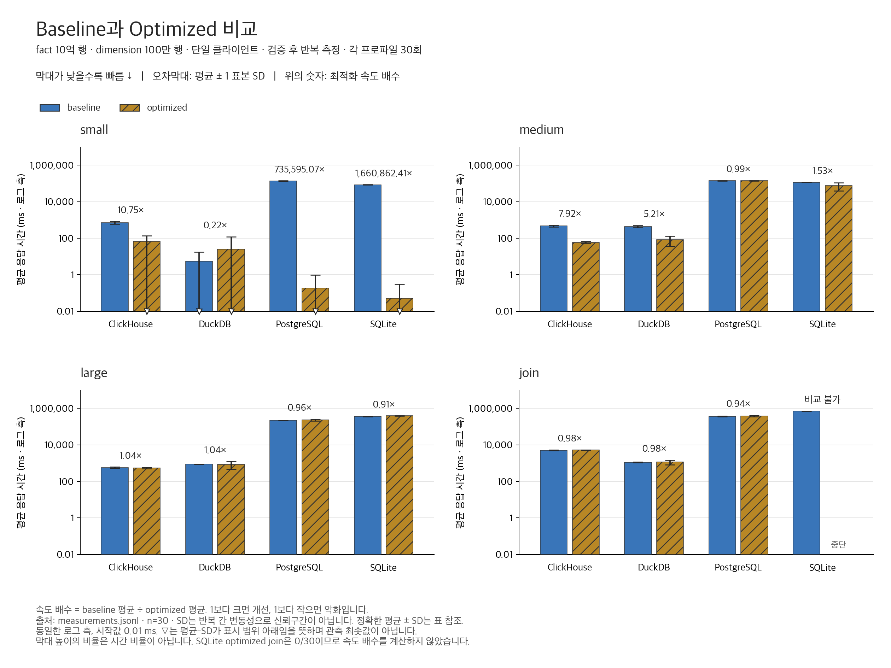
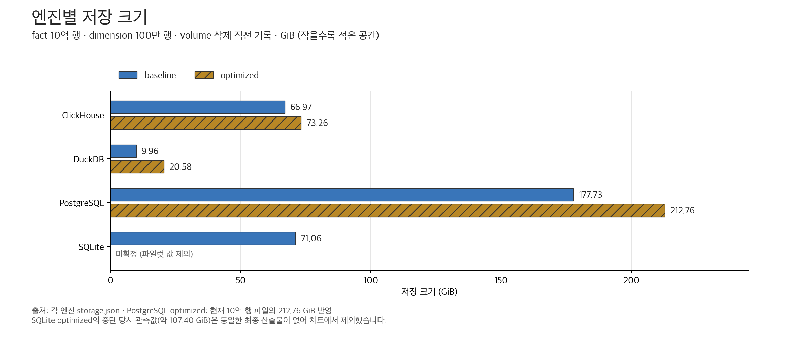
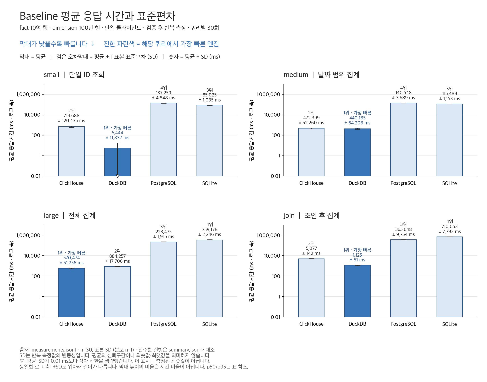
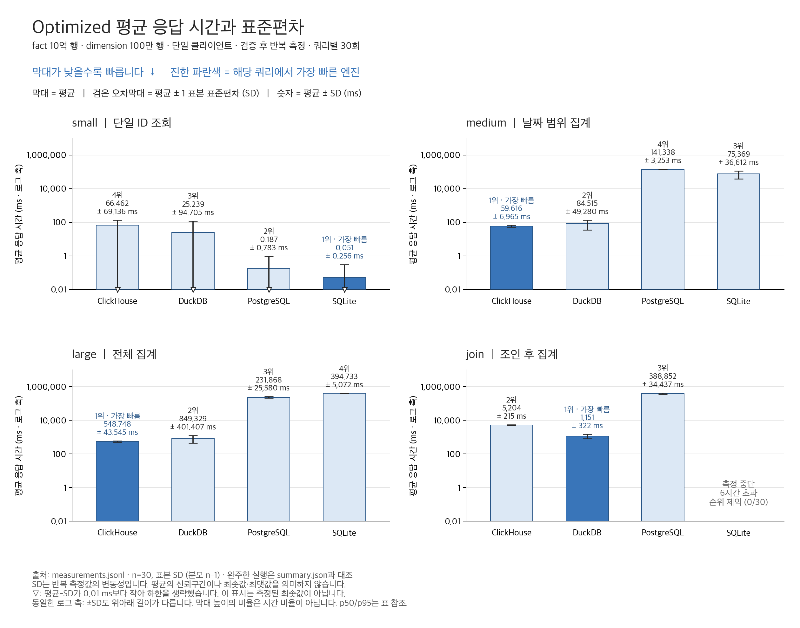

# 10억 행 DB 벤치마크: 어떤 DB를, 어떤 워크로드에 선택할 것인가

작성일: 2026-09-07 · 비교 대상: ClickHouse, DuckDB, PostgreSQL, SQLite · 프로파일: baseline / optimized

## 1. 어떤 DB가 좋은가: 분석 작업의 첫 후보는 DuckDB, 집계 중심이면 ClickHouse

**이번 조건에서 분석 파이프라인용 엔진을 하나 먼저 검토한다면 DuckDB를 선택하겠다.** baseline부터 필터 집계와 조인에서 낮은 평균 응답 시간을 보였고, 다른 DB에도 최적화를 적용한 뒤에도 경쟁력이 유지됐다. optimized DuckDB의 날짜 필터 집계는 약 **85 ms**, 전체 집계는 **849 ms**, fact-dimension 조인은 **1.15초**였다. 저장 크기도 **20.58 GiB**로 optimized의 유효한 기록이 있는 세 엔진 중 가장 작았다.

**집계 응답 시간을 우선한다면 ClickHouse가 더 좋은 후보였다.** optimized 날짜 필터 집계는 약 **60 ms**, 전체 집계는 **549 ms**로 이번 실험에서 가장 빨랐다. 반면 조인은 DuckDB가 ClickHouse의 약 **5.20초**보다 낮은 평균을 보였다.

**인덱스가 있는 단건 조회에서는 PostgreSQL과 SQLite가 강했다.** optimized 평균은 각각 **0.187 ms**, **0.051 ms**였다. 이 결과를 대규모 분석 집계 순위와 함께 보면, DB 선택은 주요 쿼리와 운영 방식에 따라 달라진다.

| 워크로드 | Baseline 최저 평균 | Optimized 최저 평균 | 이번 결과의 선택 근거 |
|---|---:|---:|---|
| `small`: 단일 id 조회 | DuckDB · 5.444 ms | SQLite · 0.051 ms | PostgreSQL도 0.187 ms. 단건 조회에는 인덱스가 결정적이었다. |
| `medium`: 날짜 필터 후 집계 | DuckDB · 440.185 ms | ClickHouse · 59.616 ms | DuckDB도 84.515 ms. 날짜 조건에 맞춘 물리 설계의 효과가 컸다. |
| `large`: 전체 fact 집계 | ClickHouse · 570.474 ms | ClickHouse · 548.748 ms | 두 프로파일 모두 ClickHouse의 평균이 가장 낮았다. |
| `join`: fact-dimension 조인·집계 | DuckDB · 1,124.878 ms | DuckDB · 1,151.178 ms | 완료된 결과 중 DuckDB의 평균이 가장 낮았다. SQLite optimized는 미완료다. |

이는 **합성 fact 10억 행·dimension 100만 행, 단일 클라이언트, 쿼리별 30회 반복**의 관측 결과다. 표의 1위는 표본 평균의 순위이며 통계적으로 확정된 우열을 뜻하지 않는다. 쿼리 비중이 정해지지 않아 종합 점수나 전체 1위는 산출하지 않았다. 특히 baseline `medium`의 DuckDB와 ClickHouse 차이는 440 ms 대 472 ms로, 반복 변동성까지 함께 봐야 한다.

프로덕션 도입 판단은 3절의 워크로드 추천과 5절의 실험 범위를 함께 적용한다. 이 실험은 동시 요청, 쓰기 처리량, 장애 복구를 검증하지 않았다.

## 2. Baseline vs optimized: 무엇이 좋아졌고, 무엇이 남았는가

### 2.1 두 프로파일의 의미

baseline은 **보조 인덱스를 추가하지 않은 구성**이다. 엔진 자체의 압축, 저장 순서, zone map 등은 작동하므로 ‘아무 최적화도 없는 엔진’으로 해석하지 않는다. optimized는 같은 논리 데이터와 쿼리에 **각 엔진에 맞춰 선택한 물리 설계**를 적용한 구성이다. 모든 튜닝 가능성을 탐색한 최상의 성능을 뜻하지 않는다.

| 엔진 | Optimized에서 적용한 변경 | 겨냥한 접근 패턴 |
|---|---|---|
| ClickHouse | fact `ORDER BY (event_day, id)`, `id` Bloom filter, dimension `ORDER BY account_id` | 날짜 범위 축소와 단건 조회의 data skipping |
| DuckDB | `event_day` 그룹별로 직접 순서 적재해 `(event_day, id)` 레이아웃 구성, 별도 ART 인덱스 없음 | 날짜 범위 필터에서 zone map 활용 |
| PostgreSQL | fact의 `id`, `event_day`, `account_id` 및 dimension의 `account_id`에 B-tree 인덱스 | 단건·범위 조회와 조인 키 접근 |
| SQLite | PostgreSQL과 같은 컬럼에 인덱스 | 단건·범위 조회와 조인 키 접근 |

### 2.2 평균과 표준편차를 함께 비교



파란색은 baseline, 사선이 있는 황금색은 optimized다. **막대가 낮을수록 빠르다.** 검은 오차막대는 **평균 ± 1 표본 표준편차(SD)**다. 모든 패널은 동일한 로그 축이며 막대는 0.01 ms에서 시작한다. 막대 높이의 비율을 시간의 비율로 읽지 않는다. `평균−SD < 0.01 ms`인 하한은 생략하고 ▽로 표시했다. SD는 반복 간 변동성으로, 평균의 신뢰구간이나 최솟값·최댓값을 뜻하지 않는다.

**속도 배수 = baseline 평균 / optimized 평균.** 1보다 크면 평균 시간이 줄었고, 1보다 작으면 늘었다. 각 프로파일의 평균을 나눈 값이며 반복 번호별 비율의 평균이 아니다. 각 유효 셀은 30회 원시 측정에서 계산했다.

| 엔진 | 쿼리 | Baseline 평균 ± SD (ms) | Optimized 평균 ± SD (ms) | 속도 배수 |
|---|---|---:|---:|---:|
| ClickHouse | small | 714.688 ± 120.435 | 66.462 ± 69.136 | 10.75배 |
| ClickHouse | medium | 472.399 ± 52.260 | 59.616 ± 6.965 | 7.92배 |
| ClickHouse | large | 570.474 ± 51.256 | 548.748 ± 43.545 | 1.04배 |
| ClickHouse | join | 5,076.662 ± 142.347 | 5,204.128 ± 215.364 | 0.98배 |
| DuckDB | small | 5.444 ± 11.837 | 25.239 ± 94.705 | 0.22배 |
| DuckDB | medium | 440.185 ± 64.208 | 84.515 ± 49.280 | 5.21배 |
| DuckDB | large | 884.257 ± 17.706 | 849.329 ± 401.407 | 1.04배 |
| DuckDB | join | 1,124.878 ± 51.405 | 1,151.178 ± 322.327 | 0.98배 |
| PostgreSQL | small | 137,259.049 ± 4,847.951 | 0.187 ± 0.783 | 735,595.07배 |
| PostgreSQL | medium | 140,548.054 ± 3,688.523 | 141,338.233 ± 3,253.329 | 0.99배 |
| PostgreSQL | large | 223,475.015 ± 1,914.970 | 231,867.791 ± 25,580.356 | 0.96배 |
| PostgreSQL | join | 365,647.704 ± 9,754.215 | 388,852.194 ± 34,437.038 | 0.94배 |
| SQLite | small | 85,024.640 ± 1,034.729 | 0.051 ± 0.256 | 1,660,862.41배 |
| SQLite | medium | 115,489.283 ± 1,153.385 | 75,369.337 ± 36,612.206 | 1.53배 |
| SQLite | large | 359,175.903 ± 2,246.334 | 394,733.001 ± 5,071.916 | 0.91배 |
| SQLite | join | 710,052.903 ± 7,793.117 | 중단 (0/30) | 비교 불가 |

### 2.3 최적화 효과를 어떻게 해석할 것인가

**선택적 조회에는 분명한 효과가 있었다.** ClickHouse의 단건 조회는 10.75배, 날짜 필터 집계는 7.92배 빨라졌다. DuckDB의 날짜 필터 집계도 5.21배 빨라졌다. PostgreSQL 단건 조회는 약 137초에서 0.187 ms, SQLite는 약 85초에서 0.051 ms로 줄었다. 단건 조회의 거대한 배수는 인덱스 없는 구성과 있는 구성의 차이이며, 일반적인 서비스 전체가 그 배수만큼 빨라진다는 뜻은 아니다.

**전체 집계와 조인은 이번 변경으로 일관되게 개선되지 않았다.** 전체 집계 평균 시간은 ClickHouse 약 3.8%, DuckDB 약 4.0% 감소했지만 PostgreSQL은 약 3.8%, SQLite는 약 9.9% 증가했다. 조인은 완료된 세 엔진 모두 평균 시간이 약 2~6% 늘었다. 인덱스가 추가됐다는 사실만으로 대규모 스캔·조인의 실행 비용이 줄어드는 것은 아니다. 실행 계획과 자원 사용량을 추가로 확인해야 원인을 확정할 수 있다.

**DuckDB의 장점은 최적화 이후에도 분석 전반에서 낮은 지연시간을 유지했다는 점이다.** optimized DuckDB는 ClickHouse보다 날짜 필터 집계와 전체 집계에서 각각 약 1.42배·1.55배 오래 걸렸지만, 조인은 약 4.52배 빨랐다. 이 조합은 필터·집계·조인이 함께 있는 배치 분석에서 DuckDB를 먼저 검토할 근거가 된다.

**평균 개선과 실행의 일관성은 별개다.** DuckDB 전체 집계의 평균은 884 ms에서 849 ms로 줄었으나 SD는 약 18 ms에서 401 ms로 커졌다. p95도 908 ms에서 980 ms로 늘었고, 관측 최댓값은 911 ms에서 2,963 ms로 늘었다. 단건 조회 역시 평균 5.444 ms → 25.239 ms, p50 2.721 ms → 7.623 ms로 악화됐다. 날짜 중심 레이아웃의 이점과 다른 쿼리의 손실을 함께 평가해야 한다.

30회는 각 프로파일의 한 실행 안에서 연속 측정한 값이다. 독립적인 환경 재구축·실행 순서 무작위화를 반복하지 않았으므로, 수 퍼센트의 차이를 재현 가능한 개선으로 단정하거나 SD 오차막대의 겹침만으로 유의성을 판단하지 않는다.

### 2.4 최적화에는 저장 공간과 구축 비용이 따른다



삭제 직전에 기록된 10억 행 실행의 저장 크기다. 선형 축은 0에서 시작하며 **작을수록 적은 공간**을 사용한다. GiB는 bytes / 2³⁰이다.

| 엔진 | Baseline | Optimized | 변화 |
|---|---:|---:|---:|
| ClickHouse | 66.97 GiB | 73.26 GiB | +9.4% |
| DuckDB | 9.96 GiB | 20.58 GiB | +106.7% |
| PostgreSQL | 177.73 GiB | 212.76 GiB | +19.7% |
| SQLite | 71.06 GiB | 유효한 최종 기록 없음 | 비교 불가 |

DuckDB는 비교 가능한 두 프로파일 모두 가장 작았지만, 날짜 중심 레이아웃으로 바꾸면서 자체 저장 크기는 약 **2.07배**가 됐다. 날짜 필터가 드물고 공간 효율과 단건 조회가 중요하다면 baseline을 유지할 이유도 있다. 이 데이터는 반복되는 정수 패턴이 많아 압축에 유리하므로, 이 저장 비율을 일반 데이터셋의 압축률로 확장하지 않는다.

저장 크기는 엔진별 volume의 기록이며 ClickHouse에는 로그 volume도 포함한다. 테이블 데이터만의 크기나 peak 임시 공간과 같지 않다. optimized PostgreSQL은 `total_bytes`를 기준으로 계산했고 `total_gib` 필드와의 약 0.001 GiB 차이는 반올림 후 모두 212.76 GiB다. optimized SQLite의 `storage.json`은 10,000행 파일럿이어서 제외했다.

적재·인덱스 생성·레이아웃 구축은 쿼리 시간에 포함하지 않았다. PostgreSQL·SQLite의 인덱스 생성과 DuckDB의 순서 적재는 `optimization.json`에 별도로 기록되지만, 측정 구간이 서로 달라 공통 구축 비용 순위로 쓰지 않는다. 특히 ClickHouse의 해당 파일에 있는 매우 짧은 후처리 시간은 적재 중 물리 정렬·Bloom filter 구축 전체 비용을 나타내지 않는다.

## 3. DB별 추천 워크로드: 실험 결과를 실제 선택에 적용하기

아래 추천은 **이번에 관측한 성능과 공식 문서의 엔진 특성을 결합한 판단**이다. 로그 수집, 동시 트랜잭션, 모바일 앱, pandas 처리 자체를 이 벤치마크에서 측정한 것은 아니다.

| DB | 먼저 검토할 워크로드 | 이번 실험이 제공하는 근거 | 도입 전에 확인할 조건 |
|---|---|---|---|
| **DuckDB** | Python 데이터 변환, 배치 ETL, 파일 기반 분석, fact-dimension 조인 | optimized 필터 집계 85 ms, 전체 집계 849 ms, 조인 1.15초; 유효 저장 크기 20.58 GiB | 실제 데이터의 메모리·임시 디스크 사용량, 작업 동시성, 결과를 Python으로 가져오는 비용 |
| **ClickHouse** | 로그·이벤트 집계, 기간별 지표, 집계 중심의 분석 대시보드 | optimized 날짜 필터 집계 60 ms, 전체 집계 549 ms로 최저 평균 | 지속 적재 중 조회 지연시간, 동시 사용자, 정렬 키, 조인 비중과 데이터 모델 |
| **PostgreSQL** | 주문·계정 등 서비스의 트랜잭션 DB, 인덱스 조회, 여러 클라이언트가 공유하는 업무 데이터 | optimized 단건 조회 0.187 ms; 이번 전체 분석 쿼리는 오래 걸림 | 실제 읽기·쓰기 혼합 부하, 잠금, p95/p99, 집계 분리 필요성 |
| **SQLite** | 모바일·데스크톱·오프라인 앱의 로컬 데이터, 설정·상태 저장, 인덱스 조회 | optimized 단건 조회 0.051 ms; 10억 행 조인은 미완료 | 파일별 쓰기 경쟁, 데이터 크기, 내구성 설정, 장시간 분석의 영향 |

### DuckDB: Python 분석 파이프라인의 우선 검토 대상

여러 테이블을 필터링·조인·집계한 뒤 작은 결과를 Python으로 전달하는 작업에 먼저 적용해 볼 만하다. DuckDB는 프로세스 안에서 실행하는 분석 엔진이며, Python의 pandas DataFrame을 SQL로 조회하거나 결과를 `.df()`로 받을 수 있다. **큰 변환은 DuckDB에서 수행하고, 필요한 결과만 pandas로 가져오는 흐름**이 후보가 된다. 이번에는 pandas와의 성능 비교나 DataFrame 변환 비용을 측정하지 않았으므로 pandas보다 몇 배 빠르다고 결론 내리지는 않는다. [DuckDB 설계](https://duckdb.org/why_duckdb), [pandas 연동 공식 문서](https://duckdb.org/docs/current/guides/python/sql_on_pandas)

운영에서는 데이터 파일을 누가 소유하고 쓰는지 설계해야 한다. DuckDB의 기본 in-process 모드는 하나의 프로세스가 읽기·쓰기를 담당하고 그 안에서 여러 스레드가 작업할 수 있다. 여러 프로세스가 파일을 직접 여는 읽기 전용 모드에서는 writer가 없어야 한다. 별도의 원격 프로토콜·공유 저장 구성을 이번 결과와 동일하게 취급하지 않는다. [DuckDB 동시성 모델](https://duckdb.org/docs/current/connect/concurrency)

### ClickHouse: 집계 중심 분석 서비스를 먼저 검토

이번 결과에서는 전체 집계가 baseline부터 빨랐고, 날짜 정렬을 적용한 뒤 범위 집계도 크게 좋아졌다. 기간 조건으로 로그·이벤트를 집계해 지표를 제공하는 설계와 잘 맞는 결과다. ClickHouse의 공식 설명도 대규모 분석 쿼리를 처리하는 컬럼 기반 OLAP 엔진을 중심에 둔다. 다만 이번 조인의 평균은 DuckDB보다 높았으므로, 조인이 많은 서비스는 실제 쿼리와 데이터 모델로 다시 비교할 필요가 있다. [ClickHouse 공식 소개](https://clickhouse.com/docs/get-started/about/intro)

### PostgreSQL: 서비스의 트랜잭션 요구를 함께 평가

인덱스 단건 조회의 성능은 대규모 전체 스캔 결과와 크게 달랐다. PostgreSQL의 트랜잭션, MVCC, 무결성 제약, 복제·복구 기능을 고려하면 주문·계정 등 업무 데이터의 후보로 평가하는 것이 타당하다. 이번 분석 쿼리가 느렸다는 이유만으로 서비스 DB 교체를 결정할 근거는 부족하다. 운영 데이터는 PostgreSQL에 두고 큰 분석을 별도 엔진으로 처리하는 구성을 검토할 수 있다. 이 조합과 OLTP 성능은 추가 검증 대상이다. [PostgreSQL 공식 소개](https://www.postgresql.org/about/)

### SQLite: 로컬 데이터와 단건 조회에 초점

이번 실험의 indexed lookup은 매우 빨랐지만, 전체 집계는 평균 약 395초였고 optimized 조인의 첫 측정은 6시간을 넘겼다. 따라서 이 10억 행 분석 패턴에는 우선 추천하지 않는다. 모바일·데스크톱·오프라인 앱처럼 데이터가 애플리케이션 가까이에 있고 쓰기 경쟁이 크지 않은 경우가 검토 대상이다. 다수의 동시 writer가 필요한 상황에서는 다른 구성을 비교해야 한다. [SQLite 적합한 사용 사례](https://www.sqlite.org/whentouse.html)

## 4. 엔진 간 성능 상세: 평균·p50·p95

차트는 요청에 맞춰 **세로 막대 + 평균 ± 1 표본 SD**로 구성했다. 낮을수록 빠르며, 가장 낮은 평균을 진한 파란색과 1위 표시로 강조했다. 모든 패널은 동일한 로그 축을 사용한다. SD 하한 생략 기호와 로그 축 해석은 2.2절과 같다.

표의 각 셀은 **평균 / p50 / p95 (ms)**다. p50은 중앙값, p95는 정렬한 30개 관측 중 29번째 값이다. 소수 셋째 자리까지 표기하며, 이는 반복 측정의 안정성이나 해당 자릿수의 재현성을 보장하지 않는다.

### 4.1 Baseline: DuckDB는 세 쿼리, ClickHouse는 전체 집계에서 최저 평균



| 엔진 | small | medium | large | join |
|---|---:|---:|---:|---:|
| ClickHouse | 714.688 / 688.882 / 854.335 | 472.399 / 460.197 / 502.589 | 570.474 / 556.462 / 673.460 | 5,076.662 / 5,022.595 / 5,204.370 |
| DuckDB | 5.444 / 2.721 / 13.100 | 440.185 / 427.644 / 459.540 | 884.257 / 884.036 / 908.084 | 1,124.878 / 1,113.492 / 1,239.484 |
| PostgreSQL | 137,259.049 / 138,482.897 / 142,303.761 | 140,548.054 / 139,292.809 / 147,742.906 | 223,475.015 / 223,261.437 / 227,679.585 | 365,647.704 / 365,416.764 / 385,624.063 |
| SQLite | 85,024.640 / 84,820.472 / 86,721.873 | 115,489.283 / 115,307.562 / 117,789.879 | 359,175.903 / 359,024.929 / 362,350.047 | 710,052.903 / 712,846.081 / 719,405.679 |

### 4.2 Optimized: 단건 조회와 분석 집계의 강점이 갈림



| 엔진 | small | medium | large | join |
|---|---:|---:|---:|---:|
| ClickHouse | 66.462 / 53.505 / 56.736 | 59.616 / 57.106 / 72.042 | 548.748 / 531.771 / 652.226 | 5,204.128 / 5,153.994 / 5,460.547 |
| DuckDB | 25.239 / 7.623 / 10.253 | 84.515 / 73.887 / 85.831 | 849.329 / 769.234 / 979.682 | 1,151.178 / 1,082.352 / 1,417.437 |
| PostgreSQL | 0.187 / 0.033 / 0.153 | 141,338.233 / 140,708.737 / 146,254.390 | 231,867.791 / 224,196.541 / 306,007.375 | 388,852.194 / 380,646.620 / 500,961.237 |
| SQLite | 0.051 / 0.004 / 0.010 | 75,369.337 / 69,766.308 / 72,209.733 | 394,733.001 / 393,562.730 / 402,256.946 | 중단 (0/30) |

일부 쿼리는 평균이 p95보다 크다. 소수의 긴 실행이 평균을 끌어올린 결과이며 계산 오류를 뜻하지 않는다. 예를 들어 DuckDB optimized `small`의 최댓값은 526.650 ms다. 첫 실행을 포함한 완료된 30회 모두를 사용했고, 느린 관측값을 임의로 제외하지 않았다. SQLite optimized의 세 쿼리는 원시 측정에서 재계산했다.

## 5. 실험 범위와 결과를 신뢰할 수 있는 범위

### 5.1 데이터와 실행 조건

| 항목 | 조건 |
|---|---|
| 데이터 | fact `benchmark` 1,000,000,000행·20컬럼, dimension `account_dim` 1,000,000행 |
| 데이터 분포 | id 기반 결정론적 수식으로 만든 정수·수치 데이터; 반복 패턴과 컬럼 간 상관관계가 존재 |
| 측정 | 쿼리 실행부터 전체 결과 fetch 완료까지; 결과는 쿼리별 1~1,000행 |
| 반복과 동시성 | 쿼리별 30회, 단일 클라이언트, 한 번에 한 엔진 실행 |
| 캐시 | 1회 검증 후 반복 실행. 캐시를 매번 비우는 cold-cache 실험은 아님 |
| 제외한 비용 | 데이터 생성·적재, 연결 수립, 인덱스·레이아웃 구축, 결과 checksum 계산 |
| 실행 구성 | Docker의 임베디드 DuckDB·SQLite와 서버형 ClickHouse·PostgreSQL |
| 저장 크기 | 각 엔진 종료 후 volume 삭제 직전에 기록; 결과 파일은 호스트에 보존 |
| 설정에 명시된 버전 | DuckDB 1.3.2, PostgreSQL 이미지 17.5, ClickHouse 이미지 25.3; SQLite는 Python 런타임 내장 버전 |

설정 버전은 [requirements-runner.txt](../requirements-runner.txt)와 [docker-compose.yml](../docker-compose.yml)에 근거한다. 최신 버전 전체의 성능을 대표하지 않으며, SQLite 실제 버전과 이미지 digest까지 고정한 실행 환경 스냅샷은 별도로 보완해야 한다.

| 쿼리 | 읽고 처리하는 범위 | 결과 행 수 |
|---|---|---:|
| `small` | `id = 987654321`인 단일 행 조회 | 1 |
| `medium` | `event_day` 600~699: 전체의 약 5.5%, 약 5,480만 행을 지역별 집계 | 50 |
| `large` | 전체 10억 행을 category별 집계 | 1,000 |
| `join` | 전체 fact를 account dimension과 조인한 뒤 지역·등급별 집계 | 250 |

`small`·`medium`·`large`는 데이터셋 크기가 다른 실험이 아니라 **같은 10억 행에서 접근 패턴이 다른 쿼리**다. 조인 관계는 여러 fact 행이 하나의 account에 대응하는 다대일 관계다.

### 5.2 완료 상태와 무효·부분 결과 처리

baseline 네 엔진은 각 쿼리 30회를 완료했다. optimized는 ClickHouse·DuckDB·PostgreSQL이 네 쿼리를 완료했고, SQLite는 `small`·`medium`·`large`만 각 30회를 완료했다. **완료 측정은 총 930회, 완성된 엔진·프로파일·쿼리 조합은 31개, 직접 비교 가능한 baseline/optimized 쌍은 15개**다.

8개 엔진·프로파일의 최초 검증에서 네 쿼리의 checksum은 모두 기준 결과와 일치했다. 완료된 반복 측정의 checksum도 일치했다. optimized DuckDB의 초기 생성식 괄호 오류가 있던 실행은 제외하고, 수정된 schema v3의 10억 행 검증·측정 결과를 사용했다.

SQLite optimized는 최초 조인 검증에는 성공했지만 **첫 timed join은 0/30회 완료 상태에서 중단**했다. 2026-09-06 13:48경 시작 후 20:02경까지 약 6시간 13분 동안 결과를 반환하지 않았다. 당시 개발 기록에는 CPU 약 100% 사용이 남아 있다. 이 경과 시간은 완료된 쿼리의 latency가 아니므로 평균·SD·속도 배수·순위에 대입하지 않는다.

중단 직전 SQLite volume의 `du` 관측값은 약 107.40 GiB였지만 유효한 최종 저장 크기 파일이 없어 차트에서 제외했다. `results/optimized/sqlite/`의 `summary.json`·`storage.json` 및 관련 manifest에는 이전 **10,000행 파일럿** 값이 남아 있다. 10억 행 부분 결과는 `dataset.json`, `validation.json`, `measurements.jsonl`, `optimization.json`에서 확인하며 파일럿 요약과 섞지 않는다.

### 5.3 일반화할 때의 한계

- **합성 데이터와 고정 쿼리다.** 문자열, 실제 데이터의 편향·NULL·복잡한 관계, 다양한 id·날짜 범위를 시험하지 않았다. baseline의 적재 순서도 데이터 skipping에 영향을 줄 수 있다.
- **검증 후 반복 측정이며 캐시 상태를 완전히 통제하지 않았다.** 검증과 측정은 새 연결로 실행된다. OS·DB 캐시의 모든 계층이 동일하게 warm이라는 보장은 없고 첫 측정이 길어지는 사례도 있다.
- **자원과 접근 방식이 완전히 같지는 않다.** Compose에 엔진별 CPU·메모리 제한이나 동일한 쿼리 스레드 수를 고정하지 않았다. 서버형은 클라이언트 통신·직렬화 비용을 포함하고 임베디드형은 같은 방식의 네트워크 왕복이 없다. CPU 모델·VM 자원·peak RSS를 포함한 실행별 환경 기록도 보완이 필요하다.
- **표현식과 설정의 영향이 포함된다.** checksum 일치를 위해 금액을 실행 중 정수 센트로 변환한다. PostgreSQL은 추가 `NUMERIC` 캐스팅을 사용하므로 엔진 구조만의 차이로 모든 시간 차이를 설명할 수 없다. SQLite는 `journal_mode=OFF`, `synchronous=OFF`, `temp_store=FILE`을 사용했으며, 이 결과로 운영 내구성 설정에서의 쓰기 성능을 판단할 수 없다.
- **단일 실행의 평균은 프로덕션 지연시간 보장이 아니다.** 30회 반복으로 서비스 p99나 장기간 안정성을 검증하지 않았다. 동시 쓰기·조회, 지속 적재, 장애·복구, pandas와의 비교는 범위 밖이다.
- **이번 optimized는 선택한 전략의 결과다.** DuckDB의 초기 ART 인덱스 생성은 약 33분 후 24.6 GiB 메모리 한도에서 실패했고, 전역 정렬도 임시 공간 200 GB 한도에 도달했다. 최종 결과는 날짜별 직접 순서 적재 전략이다. 다른 인덱스·파티셔닝·자료형·쿼리 계획을 적용한 최선의 성능이라고 볼 수 없다.

## 6. 다음 검증: 실제 워크로드에서 선택을 확정하기

| 판단할 질문 | 다음 실험 | 확인할 지표 |
|---|---|---|
| Python 분석 파이프라인에 DuckDB를 도입할 것인가? | 실제 Parquet·DataFrame 데이터로 필터·조인·집계 후 Python 반환까지 비교 | 전체 처리 시간, peak RSS, 임시 디스크, 결과 일치 |
| 분석 서비스에서 DuckDB와 ClickHouse 중 무엇이 맞는가? | 실제 쿼리 비중과 동시 요청, 지속 적재 조건으로 비교 | 처리량, p95/p99, 실패율, 자원 사용량 |
| 날짜 중심 optimized를 유지할 것인가? | 여러 날짜 범위·id를 무작위 순서로 실행하고 독립 재실행, cold/warm 조건 구분 | 쿼리별 평균·SD, 긴 실행, 구축 비용, 저장 증가 |
| PostgreSQL·SQLite의 운영 적합성은 어떤가? | 운영용 내구성 설정에서 실제 읽기·쓰기 혼합 부하와 복구 절차 검증 | 트랜잭션 처리량, 잠금·대기, 지연시간, 복구 결과 |

현재 결과로는 **DuckDB를 분석 파이프라인의 우선 후보로, ClickHouse를 집계 서비스의 우선 후보로 평가할 근거가 있다.** PostgreSQL과 SQLite는 각각 공유 트랜잭션 DB와 로컬 임베디드 DB의 요구까지 포함해 판단한다. 최적화 적용 여부는 쿼리별 이익, 변동성, 구축·저장 비용을 합쳐 결정한다.

## 부록 A. 실제 실행 SQL

아래는 [engine_worker.py](../scripts/engine_worker.py)의 `query_specs()`에 대응하는 SQL이다. 금액·할인율은 부동소수점 합산 순서에 따른 checksum 차이를 막기 위해 정수 센트로 집계한다. 표기는 DuckDB·SQLite 형태이고, PostgreSQL은 `NUMERIC` 캐스팅을 추가하며 ClickHouse는 `toInt64(round(... * 100))`를 사용한다. 필터·조인·그룹화·정렬 조건은 동일하다.

### small

```sql
SELECT id, account_id, category_id, amount
FROM benchmark
WHERE id = 987654321;
```

### medium

```sql
SELECT
    region_id,
    COUNT(*) AS row_count,
    SUM(CAST(ROUND(amount * 100) AS BIGINT)) / 100.0 AS amount_sum,
    ROUND(
        SUM(CAST(ROUND(discount * 100) AS BIGINT)) * 1.0
        / COUNT(*) / 100.0,
        6
    ) AS avg_discount
FROM benchmark
WHERE event_day BETWEEN 600 AND 699
GROUP BY region_id
ORDER BY region_id;
```

### large

```sql
SELECT
    category_id,
    COUNT(*) AS row_count,
    SUM(CAST(ROUND(amount * 100) AS BIGINT)) / 100.0 AS amount_sum,
    SUM(quantity) AS quantity_sum
FROM benchmark
GROUP BY category_id
ORDER BY category_id;
```

### join

```sql
SELECT
    b.region_id,
    d.account_tier,
    COUNT(*) AS row_count,
    SUM(CAST(ROUND(b.amount * 100) AS BIGINT)) / 100.0 AS amount_sum
FROM benchmark b
JOIN account_dim d
    ON b.account_id = d.account_id
GROUP BY b.region_id, d.account_tier
ORDER BY b.region_id, d.account_tier;
```

## 부록 B. 재현과 산출물

| 목적 | 파일 |
|---|---|
| Baseline 원시 결과 | [ClickHouse](clickhouse/measurements.jsonl), [DuckDB](duckdb/measurements.jsonl), [PostgreSQL](postgres/measurements.jsonl), [SQLite](sqlite/measurements.jsonl) |
| Optimized 원시 결과 | [ClickHouse](optimized/clickhouse/measurements.jsonl), [DuckDB](optimized/duckdb/measurements.jsonl), [PostgreSQL](optimized/postgres/measurements.jsonl), [SQLite 부분 결과](optimized/sqlite/measurements.jsonl) |
| 실행·데이터·쿼리 정의 | [main.py](../main.py), [engine_worker.py](../scripts/engine_worker.py), [PRD](../prd.md) |
| 시각화 재생성 | [visualize_results.py](../scripts/visualize_results.py) — 프로젝트 루트에서 `uv run scripts/visualize_results.py` |
| 진행·실패 기록 | [daily-development-report.md](../daily-development-report.md) |

각 엔진 디렉터리에는 데이터 크기와 검증·측정·저장 메타데이터가 함께 있다. SQLite optimized의 파일럿 요약은 5.2절의 제외 규칙을 적용한다. 외부 문서는 워크로드 추천의 근거이며 2026-09-07에 확인했다. 성능 수치는 이 저장소의 원시 측정에서만 가져왔다.


