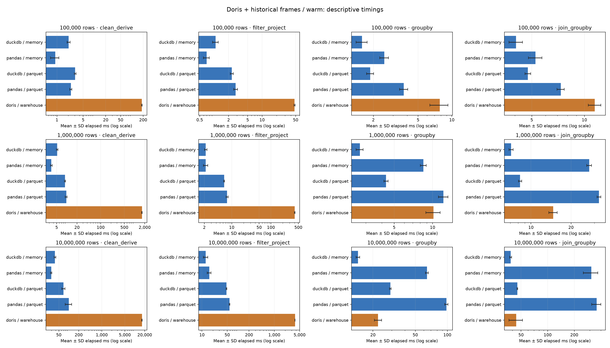

# Doris + historical frames comparison (warm)

| Rows | Workload | Engine / mode | Mean ± SD (ms) | p50 | p95 | Runs |
|---:|---|---|---:|---:|---:|---:|
| 100,000 | clean_derive | duckdb / memory | 2.063 ± 0.195 | 2.013 | 2.340 | 30 |
| 100,000 | clean_derive | pandas / memory | 0.900 ± 0.227 | 0.829 | 1.368 | 30 |
| 100,000 | filter_project | duckdb / memory | 1.076 ± 0.149 | 1.096 | 1.267 | 30 |
| 100,000 | filter_project | pandas / memory | 0.695 ± 0.100 | 0.682 | 0.836 | 30 |
| 100,000 | groupby | duckdb / memory | 1.585 ± 0.179 | 1.553 | 1.845 | 30 |
| 100,000 | groupby | pandas / memory | 2.507 ± 0.226 | 2.533 | 2.784 | 30 |
| 100,000 | join_groupby | duckdb / memory | 4.066 ± 0.360 | 3.977 | 4.737 | 30 |
| 100,000 | join_groupby | pandas / memory | 5.250 ± 0.468 | 5.123 | 5.959 | 30 |
| 100,000 | clean_derive | duckdb / parquet | 3.069 ± 0.162 | 3.034 | 3.373 | 30 |
| 100,000 | clean_derive | pandas / parquet | 2.351 ± 0.141 | 2.342 | 2.560 | 30 |
| 100,000 | filter_project | duckdb / parquet | 2.339 ± 0.176 | 2.329 | 2.678 | 30 |
| 100,000 | filter_project | pandas / parquet | 2.814 ± 0.246 | 2.803 | 3.181 | 30 |
| 100,000 | groupby | duckdb / parquet | 1.873 ± 0.135 | 1.865 | 2.083 | 30 |
| 100,000 | groupby | pandas / parquet | 3.737 ± 0.316 | 3.681 | 4.313 | 30 |
| 100,000 | join_groupby | duckdb / parquet | 4.751 ± 0.178 | 4.758 | 5.103 | 30 |
| 100,000 | join_groupby | pandas / parquet | 7.324 ± 0.350 | 7.298 | 7.961 | 30 |
| 1,000,000 | clean_derive | duckdb / memory | 5.220 ± 0.273 | 5.174 | 5.770 | 30 |
| 1,000,000 | clean_derive | pandas / memory | 3.486 ± 0.203 | 3.469 | 3.824 | 30 |
| 1,000,000 | filter_project | duckdb / memory | 2.179 ± 0.155 | 2.182 | 2.447 | 30 |
| 1,000,000 | filter_project | pandas / memory | 2.165 ± 0.280 | 2.095 | 2.744 | 30 |
| 1,000,000 | groupby | duckdb / memory | 2.691 ± 0.171 | 2.668 | 2.915 | 30 |
| 1,000,000 | groupby | pandas / memory | 8.475 ± 0.461 | 8.389 | 9.187 | 30 |
| 1,000,000 | join_groupby | duckdb / memory | 7.088 ± 0.249 | 7.033 | 7.498 | 30 |
| 1,000,000 | join_groupby | pandas / memory | 27.383 ± 1.157 | 26.998 | 29.871 | 30 |
| 1,000,000 | clean_derive | duckdb / parquet | 8.833 ± 0.334 | 8.747 | 9.488 | 30 |
| 1,000,000 | clean_derive | pandas / parquet | 9.614 ± 0.628 | 9.483 | 10.954 | 30 |
| 1,000,000 | filter_project | duckdb / parquet | 6.386 ± 0.181 | 6.361 | 6.728 | 30 |
| 1,000,000 | filter_project | pandas / parquet | 7.611 ± 0.472 | 7.447 | 8.503 | 30 |
| 1,000,000 | groupby | duckdb / parquet | 4.320 ± 0.168 | 4.327 | 4.582 | 30 |
| 1,000,000 | groupby | pandas / parquet | 12.172 ± 1.038 | 11.985 | 13.956 | 30 |
| 1,000,000 | join_groupby | duckdb / parquet | 8.288 ± 0.226 | 8.296 | 8.678 | 30 |
| 1,000,000 | join_groupby | pandas / parquet | 32.422 ± 1.084 | 32.159 | 34.688 | 30 |
| 10,000,000 | clean_derive | duckdb / memory | 38.261 ± 2.326 | 37.659 | 40.803 | 30 |
| 10,000,000 | clean_derive | pandas / memory | 29.384 ± 1.480 | 28.817 | 32.812 | 30 |
| 10,000,000 | filter_project | duckdb / memory | 12.686 ± 1.784 | 12.106 | 16.923 | 30 |
| 10,000,000 | filter_project | pandas / memory | 15.908 ± 1.956 | 15.343 | 17.558 | 30 |
| 10,000,000 | groupby | duckdb / memory | 14.462 ± 0.549 | 14.434 | 15.472 | 30 |
| 10,000,000 | groupby | pandas / memory | 64.302 ± 1.928 | 63.634 | 67.549 | 30 |
| 10,000,000 | join_groupby | duckdb / memory | 38.160 ± 0.881 | 37.975 | 40.010 | 30 |
| 10,000,000 | join_groupby | pandas / memory | 311.178 ± 57.496 | 290.259 | 423.136 | 30 |
| 10,000,000 | clean_derive | duckdb / parquet | 69.379 ± 7.863 | 67.336 | 80.421 | 30 |
| 10,000,000 | clean_derive | pandas / parquet | 100.152 ± 21.738 | 89.295 | 148.857 | 30 |
| 10,000,000 | filter_project | duckdb / parquet | 47.517 ± 1.251 | 47.145 | 49.182 | 30 |
| 10,000,000 | filter_project | pandas / parquet | 57.962 ± 1.348 | 57.591 | 60.396 | 30 |
| 10,000,000 | groupby | duckdb / parquet | 29.137 ± 0.551 | 29.094 | 29.835 | 30 |
| 10,000,000 | groupby | pandas / parquet | 97.919 ± 3.522 | 97.381 | 104.915 | 30 |
| 10,000,000 | join_groupby | duckdb / parquet | 45.399 ± 0.437 | 45.443 | 46.048 | 30 |
| 10,000,000 | join_groupby | pandas / parquet | 357.658 ± 42.012 | 332.816 | 418.024 | 30 |
| 100,000 | clean_derive | doris / warehouse | 184.514 ± 4.767 | 185.191 | 191.221 | 30 |
| 100,000 | filter_project | doris / warehouse | 47.511 ± 1.374 | 47.528 | 49.688 | 30 |
| 100,000 | groupby | doris / warehouse | 7.804 ± 1.435 | 7.276 | 10.446 | 30 |
| 100,000 | join_groupby | doris / warehouse | 11.469 ± 0.948 | 11.654 | 12.911 | 30 |
| 1,000,000 | clean_derive | doris / warehouse | 1660.031 ± 36.776 | 1645.129 | 1723.835 | 30 |
| 1,000,000 | filter_project | doris / warehouse | 404.279 ± 9.781 | 402.091 | 416.023 | 30 |
| 1,000,000 | groupby | doris / warehouse | 10.157 ± 1.311 | 9.805 | 12.759 | 30 |
| 1,000,000 | join_groupby | doris / warehouse | 14.676 ± 1.068 | 14.491 | 16.558 | 30 |
| 10,000,000 | clean_derive | doris / warehouse | 16507.247 ± 381.058 | 16420.325 | 17306.273 | 30 |
| 10,000,000 | filter_project | doris / warehouse | 3732.585 ± 31.909 | 3729.573 | 3789.617 | 30 |
| 10,000,000 | groupby | doris / warehouse | 22.345 ± 1.747 | 22.413 | 25.456 | 30 |
| 10,000,000 | join_groupby | doris / warehouse | 44.174 ± 7.639 | 45.231 | 54.530 | 30 |

- Historical pandas/DuckDB measurements are preserved. Input checksums, workload source and output fingerprints match the Doris run.
- Local Parquet, preloaded local DataFrame and preloaded server table paths are labeled separately. They have different I/O and deployment boundaries.
- No paired-block significance or bootstrap ratio is calculated across historical and new runs; these are descriptive timings from different dates.
- This comparison reuses the historical full-DataFrame pandas/DuckDB run. The existing Snowflake DW-size sweep uses batched local outputs and server-side SQL timing; it is not combined because the timing boundaries differ.
- Doris server memory and client RSS are different measures; this chart compares elapsed time only.

Statistics: sample standard deviation; p95 uses the historical linear interpolation (NumPy quantile default) definition. Chart bars show mean ± SD; lower error bars are clipped to the positive plotting floor when necessary on the logarithmic axis.

Recorded run dates:

- historical: 2026-09-07T02:28:08.833407+00:00 → 2026-09-07T02:33:16.932906+00:00; `/Users/soonmoseong/Documents/ChatGPT/db-performance-comparison/results/pandas-duckdb/run-20260907T022808832856Z/manifest.json`
- new: 2026-10-06T00:03:56.881002+00:00 → 2026-10-06T00:18:10.829090+00:00; `/Users/soonmoseong/Documents/ChatGPT/db-performance-comparison/results/doris/frames/run-20261006T000356880611Z/manifest.json`

Recorded resource limits, platform, versions, source hashes and physical designs are saved in [environments.json](environments.json). Any deployment.json supplied with a run is preserved with its checksum, including observed container image/quota/version metadata. Missing metadata is unknown; no environment equality is assumed.

Sources:

- reference_dir: `/Users/soonmoseong/Documents/ChatGPT/db-performance-comparison/results/pandas-duckdb/run-20260907T022808832856Z`
- doris_dir: `/Users/soonmoseong/Documents/ChatGPT/db-performance-comparison/results/doris/frames/run-20261006T000356880611Z`
