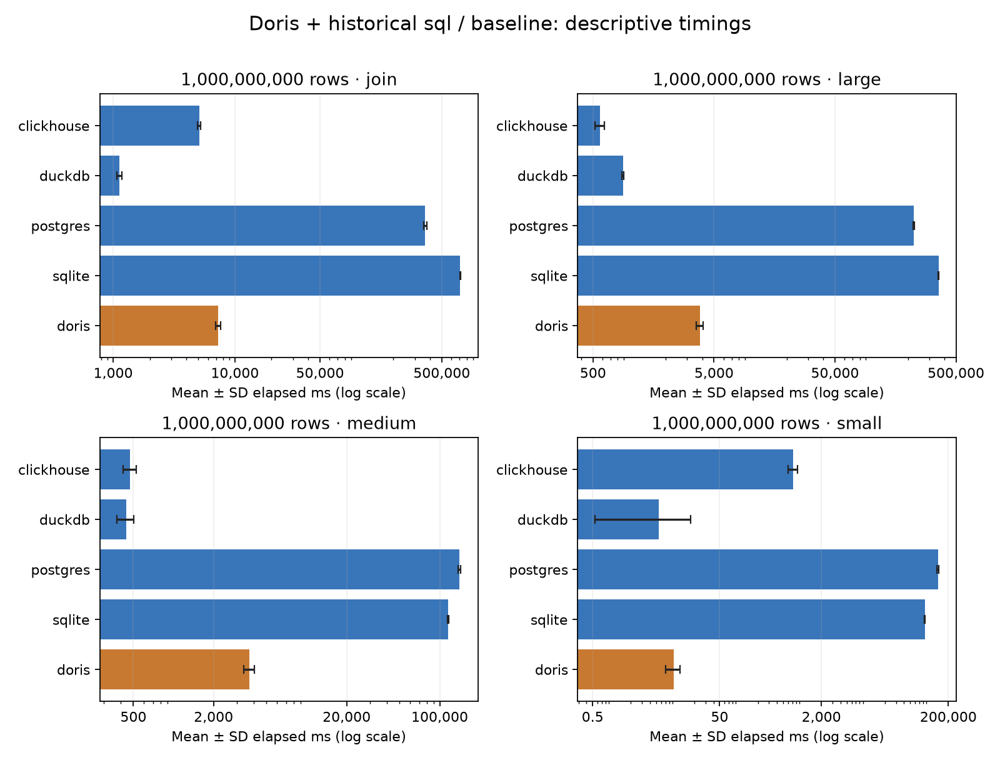

# Doris + historical sql comparison (baseline)

| Rows | Workload | Engine / mode | Mean ± SD (ms) | p50 | p95 | Runs |
|---:|---|---|---:|---:|---:|---:|
| 1,000,000,000 | small | clickhouse / sql | 714.688 ± 120.435 | 688.882 | 854.335 | 30 |
| 1,000,000,000 | medium | clickhouse / sql | 472.399 ± 52.260 | 460.197 | 502.589 | 30 |
| 1,000,000,000 | large | clickhouse / sql | 570.474 ± 51.256 | 556.462 | 673.460 | 30 |
| 1,000,000,000 | join | clickhouse / sql | 5076.662 ± 142.347 | 5022.595 | 5204.370 | 30 |
| 1,000,000,000 | small | duckdb / sql | 5.444 ± 11.837 | 2.721 | 13.100 | 30 |
| 1,000,000,000 | medium | duckdb / sql | 440.185 ± 64.208 | 427.644 | 459.540 | 30 |
| 1,000,000,000 | large | duckdb / sql | 884.257 ± 17.706 | 884.036 | 908.084 | 30 |
| 1,000,000,000 | join | duckdb / sql | 1124.878 ± 51.405 | 1113.492 | 1239.484 | 30 |
| 1,000,000,000 | small | postgres / sql | 137259.049 ± 4847.951 | 138482.897 | 142303.761 | 30 |
| 1,000,000,000 | medium | postgres / sql | 140548.054 ± 3688.523 | 139292.809 | 147742.906 | 30 |
| 1,000,000,000 | large | postgres / sql | 223475.015 ± 1914.970 | 223261.437 | 227679.585 | 30 |
| 1,000,000,000 | join | postgres / sql | 365647.704 ± 9754.215 | 365416.764 | 385624.063 | 30 |
| 1,000,000,000 | small | sqlite / sql | 85024.640 ± 1034.729 | 84820.472 | 86721.873 | 30 |
| 1,000,000,000 | medium | sqlite / sql | 115489.283 ± 1153.385 | 115307.562 | 117789.879 | 30 |
| 1,000,000,000 | large | sqlite / sql | 359175.903 ± 2246.334 | 359024.929 | 362350.047 | 30 |
| 1,000,000,000 | join | sqlite / sql | 710052.903 ± 7793.117 | 712846.081 | 719405.679 | 30 |
| 1,000,000,000 | small | doris / sql | 9.403 ± 2.415 | 8.837 | 14.992 | 30 |
| 1,000,000,000 | medium | doris / sql | 3718.970 ± 332.677 | 3635.354 | 4415.903 | 30 |
| 1,000,000,000 | large | doris / sql | 3816.098 ± 263.227 | 3771.364 | 4388.765 | 30 |
| 1,000,000,000 | join | doris / sql | 7294.055 ± 351.943 | 7242.245 | 7926.210 | 30 |

- Historical engines are not rerun. Raw measurements, dataset counts and result checksums are checked before comparison.
- Historical and Doris runs occurred at different times. Compare deployment, versions, CPU and memory metadata before interpreting rankings.
- Doris FE and BE resources must be considered together. This report does not infer resource equality from matching query results.

Statistics: sample standard deviation; p95 uses the historical nearest-rank definition. Chart bars show mean ± SD; lower error bars are clipped to the positive plotting floor when necessary on the logarithmic axis.

Recorded run dates:

- historical: start date unavailable → 2026-09-04T21:34:01.789160+00:00; `/Users/soonmoseong/Documents/ChatGPT/db-performance-comparison/results/experiment-manifest-baseline-postgres.json`
- historical: start date unavailable → 2026-09-05T16:12:57.791852+00:00; `/Users/soonmoseong/Documents/ChatGPT/db-performance-comparison/results/experiment-manifest-baseline-sqlite.json`
- historical: start date unavailable → 2026-09-04T01:30:38.076135+00:00; `/Users/soonmoseong/Documents/ChatGPT/db-performance-comparison/results/experiment-manifest-clickhouse.json`
- historical: start date unavailable → 2026-09-04T01:36:09.148177+00:00; `/Users/soonmoseong/Documents/ChatGPT/db-performance-comparison/results/experiment-manifest-duckdb.json`
- new: start date unavailable → 2026-10-06T00:32:41.413715+00:00; `/Users/soonmoseong/Documents/ChatGPT/db-performance-comparison/results/doris-sql/run-20261006-baseline/experiment-manifest-baseline-doris.json`

Recorded resource limits, platform, versions, source hashes and physical designs are saved in [environments.json](environments.json). Any deployment.json supplied with a run is preserved with its checksum, including observed container image/quota/version metadata. Missing metadata is unknown; no environment equality is assumed.

Sources:

- reference_dir: `/Users/soonmoseong/Documents/ChatGPT/db-performance-comparison/results`
- doris_dir: `/Users/soonmoseong/Documents/ChatGPT/db-performance-comparison/results/doris-sql/run-20261006-baseline`
