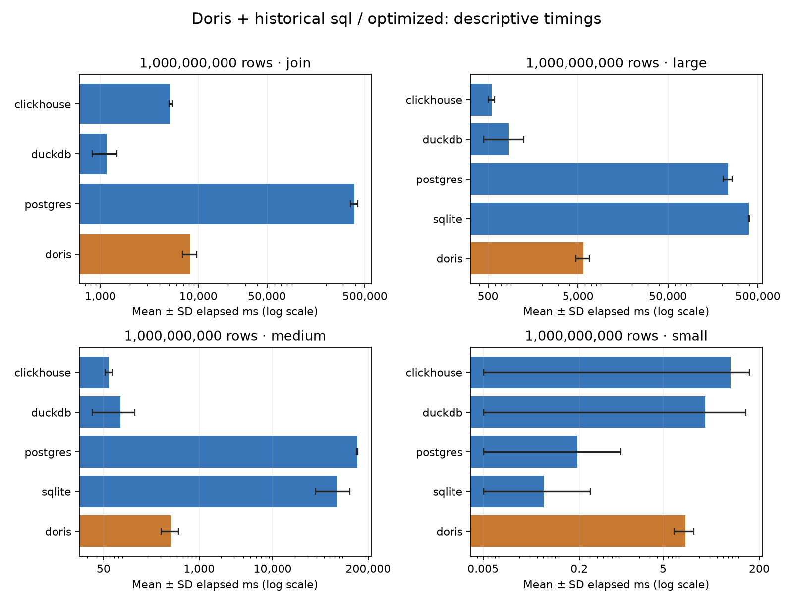

# Doris + historical sql comparison (optimized)

| Rows | Workload | Engine / mode | Mean ± SD (ms) | p50 | p95 | Runs |
|---:|---|---|---:|---:|---:|---:|
| 1,000,000,000 | small | clickhouse / sql | 66.462 ± 69.136 | 53.505 | 56.736 | 30 |
| 1,000,000,000 | medium | clickhouse / sql | 59.616 ± 6.965 | 57.106 | 72.042 | 30 |
| 1,000,000,000 | large | clickhouse / sql | 548.748 ± 43.545 | 531.771 | 652.226 | 30 |
| 1,000,000,000 | join | clickhouse / sql | 5204.128 ± 215.364 | 5153.994 | 5460.547 | 30 |
| 1,000,000,000 | small | duckdb / sql | 25.239 ± 94.705 | 7.623 | 10.253 | 30 |
| 1,000,000,000 | medium | duckdb / sql | 84.515 ± 49.280 | 73.887 | 85.831 | 30 |
| 1,000,000,000 | large | duckdb / sql | 849.329 ± 401.407 | 769.234 | 979.682 | 30 |
| 1,000,000,000 | join | duckdb / sql | 1151.178 ± 322.327 | 1082.352 | 1417.437 | 30 |
| 1,000,000,000 | small | postgres / sql | 0.187 ± 0.783 | 0.033 | 0.153 | 30 |
| 1,000,000,000 | medium | postgres / sql | 141338.233 ± 3253.329 | 140708.737 | 146254.390 | 30 |
| 1,000,000,000 | large | postgres / sql | 231867.791 ± 25580.356 | 224196.541 | 306007.375 | 30 |
| 1,000,000,000 | join | postgres / sql | 388852.194 ± 34437.038 | 380646.620 | 500961.237 | 30 |
| 1,000,000,000 | small | sqlite / sql | 0.051 ± 0.256 | 0.004 | 0.010 | 30 |
| 1,000,000,000 | medium | sqlite / sql | 75369.337 ± 36612.206 | 69766.308 | 72209.733 | 30 |
| 1,000,000,000 | large | sqlite / sql | 394733.001 ± 5071.916 | 393562.730 | 402256.946 | 30 |
| 1,000,000,000 | small | doris / sql | 11.862 ± 4.273 | 10.771 | 17.701 | 30 |
| 1,000,000,000 | medium | doris / sql | 411.267 ± 108.470 | 378.885 | 641.504 | 30 |
| 1,000,000,000 | large | doris / sql | 5740.346 ± 985.152 | 5466.813 | 7199.531 | 30 |
| 1,000,000,000 | join | doris / sql | 8267.184 ± 1369.293 | 8008.232 | 10243.581 | 30 |

- optimized SQLite join: missing; no value imputed
- optimized/sqlite: stale summary excluded; statistics recomputed from verified raw measurements
- Historical engines are not rerun. Raw measurements, dataset counts and result checksums are checked before comparison.
- Historical and Doris runs occurred at different times. Compare deployment, versions, CPU and memory metadata before interpreting rankings.
- Doris FE and BE resources must be considered together. This report does not infer resource equality from matching query results.

Statistics: sample standard deviation; p95 uses the historical nearest-rank definition. Chart bars show mean ± SD; lower error bars are clipped to the positive plotting floor when necessary on the logarithmic axis.

Recorded run dates:

- historical: start date unavailable → 2026-09-04T02:29:10.768833+00:00; `/Users/soonmoseong/Documents/ChatGPT/db-performance-comparison/results/experiment-manifest-optimized-clickhouse.json`
- historical: start date unavailable → 2026-09-04T13:42:52.301848+00:00; `/Users/soonmoseong/Documents/ChatGPT/db-performance-comparison/results/experiment-manifest-optimized-duckdb.json`
- new: start date unavailable → 2026-10-06T00:45:29.695596+00:00; `/Users/soonmoseong/Documents/ChatGPT/db-performance-comparison/results/doris-sql/run-20261006-optimized/experiment-manifest-optimized-doris.json`

Recorded resource limits, platform, versions, source hashes and physical designs are saved in [environments.json](environments.json). Any deployment.json supplied with a run is preserved with its checksum, including observed container image/quota/version metadata. Missing metadata is unknown; no environment equality is assumed.

Sources:

- reference_dir: `/Users/soonmoseong/Documents/ChatGPT/db-performance-comparison/results`
- doris_dir: `/Users/soonmoseong/Documents/ChatGPT/db-performance-comparison/results/doris-sql/run-20261006-optimized`
