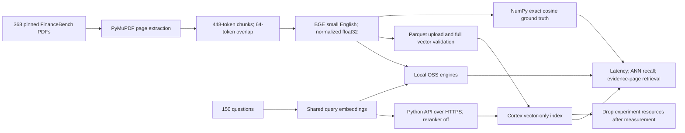
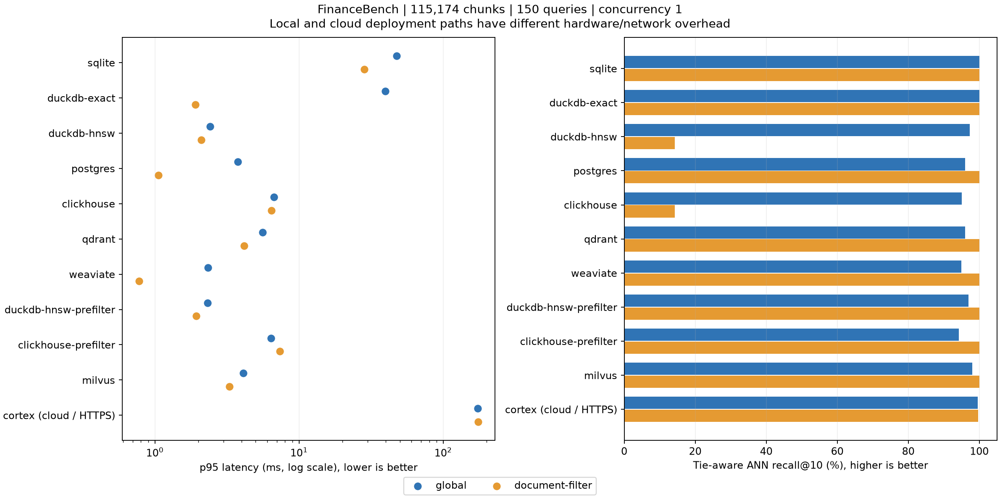

# FinanceBench Vector Database Benchmark

## Scope

Measured on macOS-27.0-arm64-arm-64bit-Mach-O. 368 PDFs, 54,120 pages, 115,174 chunks and all 150 public questions.
This is a small-corpus, warm-cache, single-client experiment. It is not a million-vector, saturation, high-availability or production-cost benchmark.

## Cortex Search: measured with the same embeddings

**Cortex Search reused all 115,174 BGE document vectors and all 150 query vectors without generating embeddings in Snowflake.** The service description confirms `embedding_model=user_provided_vectors`, `auto_embedded=false`, and a vector-only index. All uploaded vectors were read back and matched exactly to the local float32 arrays. Only vector queries were sent, with keyword weight zero and reranking disabled; results contained chunk IDs only.

| Cortex condition | p50 ms | p95 ms | p99 ms | Tie-aware recall@10 | Evidence hit@10 | Result shortfalls |
|---|---:|---:|---:|---:|---:|---:|
| Global | 90.77 | 173.68 | 674.31 | 99.53% | 29.33% | 0 / 450 |
| Oracle document filter | 89.11 | 174.54 | 316.91 | 99.67% | 62.67% | 0 / 450 |

The exact baselines achieved 29.33% global and 62.67% oracle-filter evidence hit@10. Cortex's evidence results should be interpreted against those fixed-embedding reference results for this dataset, separately from its ANN recall. The oracle filter supplies the correct source document and is not an end-to-end document-selection result.

**Cloud and localhost latency are different deployment measurements.** The Cortex client was the same ARM64 Mac, but requests travelled over HTTPS to `AWS_AP_NORTHEAST_2` (Seoul). Snowflake version 10.33.101 and Python API snowflake-core 1.13.1 were used. The X-Small warehouse handled source/index work; Cortex serving compute is managed separately. Server-only latency, matched hardware and equivalent ANN tuning were not measured. A larger Cortex latency number does not establish that its ANN engine is intrinsically slower.

Successful setup took 81.59 seconds including authentication, upload, full vector read-back validation and index readiness. The CREATE SEARCH SERVICE statement took 14.92 seconds. This total includes an additional full-payload validation step compared with the OSS runs and should not be ranked as equivalent index-build time.

The cloud extension completed 900 measured requests plus 300 warm-ups and one untimed readiness query. Together with the preserved OSS runs, this report contains 11 configurations across seven OSS databases and Cortex Search: 9,900 measured requests. The input hashes match across all source runs. The experiment database, schema, table and service were deleted after measurement; shared warehouse settings were not changed. Billing totals were not measured, and deletion does not imply zero charges or immediate removal of retained storage.

Two attempts ended before timed queries: the configured personal database rejected ordinary tables; a later attempt completed indexing but encountered datetime metadata serialization. Both were cleaned up. Their logs remain in `../cortex-20260921/` and `../cortex-20260921-retry/`. The successful run uses a separate experiment database and includes a tested cleanup path for metadata-write failures.

Cortex protocol: [DDL and supplied vectors](https://docs.snowflake.com/en/sql-reference/sql/create-cortex-search), [vector query API](https://docs.snowflake.com/en/user-guide/snowflake-cortex/cortex-search/query-cortex-search-service), [reranking controls](https://docs.snowflake.com/en/user-guide/snowflake-cortex/cortex-search/cortex-search-customize-scoring). Serving and warehouse charges are distinct in [Snowflake's cost documentation](https://docs.snowflake.com/en/user-guide/snowflake-cortex/cortex-search/cortex-search-costs).

## Preserved local findings

**Filter execution strategy changed retrieval correctness more than the small latency differences between ANN engines.** In the baseline configuration, DuckDB VSS and ClickHouse applied the document filter to too few ANN candidates. Both returned fewer than the expected `min(10, eligible chunks)` for every filtered request. Tie-aware ANN recall fell to 14.2% and 14.3%, respectively. Those timings should not be used as a successful-search speed ranking.

The follow-up configurations explicitly selected candidates before ranking them: a materialized CTE in DuckDB, and `vector_search_filter_strategy='prefilter'` in ClickHouse. Both reached 100% filtered recall with zero shortfalls. Their filtered p95 latencies were 1.94 ms and 7.34 ms. This is an exact-search fallback over a small candidate set, not evidence of filtered HNSW support. The eligible set comprised 0.005% to 0.857% of the corpus (median 0.260%).

In the initial global-search configurations, ANN p95 latency ranged from 2.33 to 6.71 ms, versus 39.77 ms for DuckDB exact search and 47.60 ms for sqlite-vec exact search. ANN tie-aware recall ranged from 94.9% to 98.1%. These configurations have different quality levels, and native embedded calls differ from Docker server calls; the data does not establish a universal fastest database.

**Exact vector retrieval did not imply successful evidence retrieval.** Both exact baselines found at least one annotated evidence page for 44/150 questions (29.3%) globally, versus 94/150 (62.7%) when the correct source document was supplied. This measures the combined parsing/chunking/embedding pipeline against annotated pages, not LLM answer accuracy. The document-filter result assumes an oracle source document and is not a deployable end-to-end accuracy claim.

## Local execution and provenance

- Seven OSS databases, ten configurations including the exact baseline and two prefilter refinements; 20 configuration/mode combinations and 9,000 measured requests. Warm-ups are additional and excluded.
- Host: 14 logical CPU cores, 48 GiB RAM, ARM64 macOS. Each server container had a 4 CPU / 8 GiB limit. Embeddings were generated once on MPS before database measurements.
- [Initial run](../run-20260921-local/manifest.json) and [follow-up run](../refinements-20260921/manifest.json) contain identical input hashes and separate measured-source snapshots. The initial Milvus attempt failed before collecting queries; after replacing its startup check with a successful search-API connection, the follow-up completed. The original failure log is retained.
- Each configuration's ANN index was built once. Follow-up builds used the same global-search parameters but produced slightly different recall. The three query repetitions do not measure index-build variability, and differences between baseline and follow-up global results should not be attributed to prefiltering.
- [Combined raw-result audit](audit.json) checks the full query/repeat matrix, input hashes, returned-ID validity, document filters, independently recomputed recall/evidence metrics and p95 aggregation. [Summary CSV](summary.csv) retains all metrics; raw per-query files and query plans are linked below through their result directories.
- The local runs incurred no Snowflake cost. The separately measured Cortex extension is described above; Snowflake SQL exact search remains unmeasured.


## Pipeline



## Method

- Source commit: `cc39aeb4afdf33909ee1412188bf89035950c2eb`; checksums: `sources.jsonl` and `manifest.json`.
- Embedding: `BAAI/bge-small-en-v1.5` revision `5c38ec7c405ec4b44b94cc5a9bb96e735b38267a`; 384 dimensions, normalized float32, identical query instruction for every DB.
- Parser: PyMuPDF 1.28.2; get_text(text, sort=True); no OCR. Page-local tokenizer chunks; tables are flattened text, not reconstructed tables.
- All 368 PDFs are searched, not only the 84 documents referenced by questions. Identical/near-identical passages across years are retained as realistic distractors.
- Top-10 cosine search. Global search and an oracle document filter (`doc_name` supplied by the benchmark) are separate modes. The latter is not evidence of automatic document selection.
- OSS HNSW target settings: M=16, efConstruction=128, efSearch=128 where exposed, without configured quantization or reranking. This is a fixed-configuration comparison, not a recall-matched tuned ranking. The prefilter variants use exact search after filtering; their global search still uses HNSW. Cortex index internals and tuning are managed by Snowflake.
- Every query is warmed once per mode, then all questions run in seeded shuffled order for each of 3 repetitions. Timings include request serialization and result IDs; exclude embedding, ground truth and scoring.
- For local OSS comparison runs, server backends run sequentially in Docker (4 CPU / 8 GiB limit each). SQLite and DuckDB run natively on macOS; DuckDB uses 4 threads and in-memory tables. Network and virtualization differences prevent a pure engine-speed ranking.
- Reported serial QPS is 1000 / mean request latency, not measured maximum concurrent throughput. p99 is descriptive with only 450 requests per mode.
- ANN recall uses exact top-10 chunk IDs; tie-aware recall counts unique returned candidates within 1e-5 cosine similarity of the exact tenth score. The tolerance addresses duplicated passages and floating-point ties; both are reported.
- Evidence hit@10 is the fraction of questions with any annotated evidence page among returned chunks. Evidence-page recall averages coverage of all annotated pages. These are page-level proxies, not answer accuracy or exact evidence-span coverage.
- Load/index time includes connection, schema creation, inserts and index preparation. These stages overlap in some engines, so the total is reported rather than misleading separate build times.

## Results



| Engine | Mode | p50 ms | p95 ms | ANN recall | Tie-aware recall | Evidence hit@10 | Shortfalls |
|---|---|---:|---:|---:|---:|---:|---:|
| sqlite | global | 45.19 | 47.60 | 99.7% | 100.0% | 29.3% | 0 |
| sqlite | document-filter | 24.02 | 28.33 | 100.0% | 100.0% | 62.7% | 0 |
| duckdb-exact | global | 38.40 | 39.77 | 99.9% | 100.0% | 29.3% | 0 |
| duckdb-exact | document-filter | 1.76 | 1.92 | 100.0% | 100.0% | 62.7% | 0 |
| duckdb-hnsw | global | 1.99 | 2.41 | 97.1% | 97.3% | 28.0% | 0 |
| duckdb-hnsw | document-filter | 1.90 | 2.10 | 14.2% | 14.2% | 28.0% | 450 |
| postgres | global | 2.34 | 3.77 | 95.8% | 96.0% | 28.7% | 0 |
| postgres | document-filter | 0.49 | 1.06 | 100.0% | 100.0% | 62.7% | 0 |
| clickhouse | global | 5.00 | 6.71 | 94.8% | 95.1% | 30.0% | 0 |
| clickhouse | document-filter | 4.76 | 6.42 | 14.3% | 14.3% | 30.0% | 450 |
| qdrant | global | 3.20 | 5.57 | 95.8% | 96.0% | 28.7% | 0 |
| qdrant | document-filter | 2.32 | 4.15 | 100.0% | 100.0% | 62.7% | 0 |
| weaviate | global | 1.47 | 2.33 | 94.9% | 94.9% | 29.3% | 0 |
| weaviate | document-filter | 0.59 | 0.78 | 100.0% | 100.0% | 62.7% | 0 |
| duckdb-hnsw-prefilter | global | 1.94 | 2.32 | 96.7% | 96.9% | 28.0% | 0 |
| duckdb-hnsw-prefilter | document-filter | 1.67 | 1.94 | 100.0% | 100.0% | 62.7% | 0 |
| clickhouse-prefilter | global | 4.79 | 6.41 | 94.1% | 94.3% | 28.7% | 0 |
| clickhouse-prefilter | document-filter | 5.80 | 7.34 | 100.0% | 100.0% | 62.7% | 0 |
| milvus | global | 2.90 | 4.10 | 98.0% | 98.1% | 30.0% | 0 |
| milvus | document-filter | 2.05 | 3.29 | 100.0% | 100.0% | 62.7% | 0 |
| cortex | global | 90.77 | 173.68 | 99.4% | 99.5% | 29.3% | 0 |
| cortex | document-filter | 89.11 | 174.54 | 99.7% | 99.7% | 62.7% | 0 |

## Coverage and limitations

Parsing QA: `{"pdf_pages": 54120, "empty_text_pages": 215, "unique_evidence_pages": 168, "evidence_pages_without_chunks": [], "completed_engines": ["sqlite", "duckdb-exact", "duckdb-hnsw", "postgres", "clickhouse", "qdrant", "weaviate", "duckdb-hnsw-prefilter", "clickhouse-prefilter", "milvus", "cortex"], "failed_engines": []}`

- Cortex Search uses supplied document/query vectors, a vector-only index, no embedding model, no text query and reranker=none. The Python API runs over HTTPS from the same Mac to AWS Seoul; these timings include WAN and SDK overhead, unlike localhost OSS timings. Shared embeddings make recall comparable, but cloud hardware and network differ. Snowflake SQL exact search and billed cloud credits were not measured.
- No OCR, layout reconstruction, embedding-model comparison, 1M/10M corpus, concurrency sweep, update/delete freshness, restart recovery, peak-memory or cloud-cost claims.
- 150 public financial questions limit statistical power and domain generalization. Repetitions are latency samples, not 450 independent questions.
- Timing order across engines is fixed; host background activity and different storage paths remain confounders. Repeat under Linux and matched resources before publication of general performance claims.

### Engine status

- sqlite: complete; results in `../run-20260921-local/sqlite`.
- duckdb-exact: complete; results in `../run-20260921-local/duckdb-exact`.
- duckdb-hnsw: complete; results in `../run-20260921-local/duckdb-hnsw`.
- postgres: complete; results in `../run-20260921-local/postgres`.
- clickhouse: complete; results in `../run-20260921-local/clickhouse`.
- qdrant: complete; results in `../run-20260921-local/qdrant`.
- weaviate: complete; results in `../run-20260921-local/weaviate`.
- duckdb-hnsw-prefilter: complete; results in `../refinements-20260921/duckdb-hnsw-prefilter`.
- clickhouse-prefilter: complete; results in `../refinements-20260921/clickhouse-prefilter`.
- milvus: complete; results in `../refinements-20260921/milvus`.
- cortex: complete; results in `../cortex-20260921-measured/cortex`.

### Versions and plans

- sqlite: v0.1.9; load + index 2.86s. Execution plans/settings in `../run-20260921-local/sqlite/metadata.json`.
- duckdb-exact: 1.5.5; load + index 2.18s. Execution plans/settings in `../run-20260921-local/duckdb-exact/metadata.json`.
- duckdb-hnsw: 1.5.5; load + index 6.49s. Execution plans/settings in `../run-20260921-local/duckdb-hnsw/metadata.json`.
- postgres: 0.8.1; load + index 28.09s. Execution plans/settings in `../run-20260921-local/postgres/metadata.json`.
- clickhouse: 25.8.33.6; load + index 32.33s. Execution plans/settings in `../run-20260921-local/clickhouse/metadata.json`.
- qdrant: 1.15.4; load + index 17.59s. Execution plans/settings in `../run-20260921-local/qdrant/metadata.json`.
- weaviate: 1.32.4; load + index 19.14s. Execution plans/settings in `../run-20260921-local/weaviate/metadata.json`.
- duckdb-hnsw-prefilter: 1.5.5; load + index 6.31s. Execution plans/settings in `../refinements-20260921/duckdb-hnsw-prefilter/metadata.json`.
- clickhouse-prefilter: 25.8.33.6; load + index 30.42s. Execution plans/settings in `../refinements-20260921/clickhouse-prefilter/metadata.json`.
- milvus: 2.6.4; load + index 14.37s. Execution plans/settings in `../refinements-20260921/milvus/metadata.json`.
- cortex: 10.33.101; load + index 81.59s. Execution plans/settings in `../cortex-20260921-measured/cortex/metadata.json`.

## Reproduce

```bash
uv sync --locked --extra vector --extra snowflake
# Requires the existing prepared data and benchmark Snowflake connection profile.
uv run --extra vector --extra snowflake python main.py financebench run --engine cortex --repeats 3
```

Sources: [FinanceBench](https://github.com/patronus-ai/financebench), [embedding model](https://huggingface.co/BAAI/bge-small-en-v1.5).

Cortex references: [user-provided vectors and DDL](https://docs.snowflake.com/en/sql-reference/sql/create-cortex-search), [multi-index query API](https://docs.snowflake.com/en/user-guide/snowflake-cortex/cortex-search/query-cortex-search-service), [reranker controls](https://docs.snowflake.com/en/user-guide/snowflake-cortex/cortex-search/cortex-search-customize-scoring).
