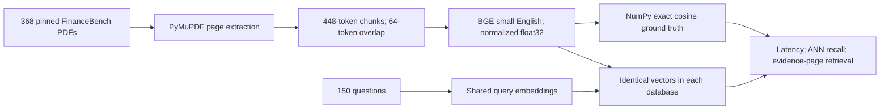
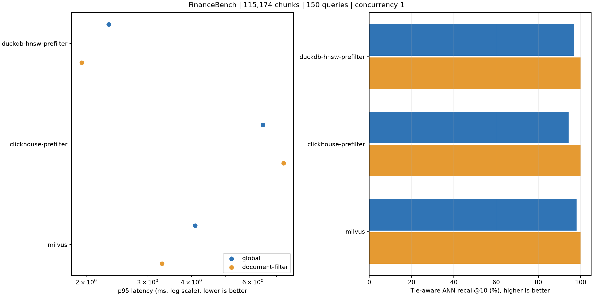

# FinanceBench Vector Database Benchmark

## Scope

Measured on macOS-27.0-arm64-arm-64bit-Mach-O. 368 PDFs, 54,120 pages, 115,174 chunks and all 150 public questions.
This is a small-corpus, warm-cache, single-client experiment. It is not a million-vector, saturation, high-availability or production-cost benchmark.

## Pipeline



## Method

- Source commit: `cc39aeb4afdf33909ee1412188bf89035950c2eb`; checksums: `sources.jsonl` and `manifest.json`.
- Embedding: `BAAI/bge-small-en-v1.5` revision `5c38ec7c405ec4b44b94cc5a9bb96e735b38267a`; 384 dimensions, normalized float32, identical query instruction for every DB.
- Parser: PyMuPDF 1.28.2; get_text(text, sort=True); no OCR. Page-local tokenizer chunks; tables are flattened text, not reconstructed tables.
- All 368 PDFs are searched, not only the 84 documents referenced by questions. Identical/near-identical passages across years are retained as realistic distractors.
- Top-10 cosine search. Global search and an oracle document filter (`doc_name` supplied by the benchmark) are separate modes. The latter is not evidence of automatic document selection.
- HNSW target settings: M=16, efConstruction=128, efSearch=128 where exposed. No quantization or reranker. This is a fixed-configuration comparison, not a recall-matched tuned ranking. The prefilter variants use exact search after filtering; their global search still uses HNSW.
- Every query is warmed once per mode, then all questions run in seeded shuffled order for each of 3 repetitions. Timings include request serialization and result IDs; exclude embedding, ground truth and scoring.
- Server backends run sequentially in Docker (4 CPU / 8 GiB limit each). SQLite and DuckDB run natively on macOS; DuckDB uses 4 threads and in-memory tables. Network and virtualization differences prevent a pure engine-speed ranking.
- Reported serial QPS is 1000 / mean request latency, not measured maximum concurrent throughput. p99 is descriptive with only 450 requests per mode.
- ANN recall uses exact top-10 chunk IDs; tie-aware recall counts unique returned candidates within 1e-5 cosine similarity of the exact tenth score. The tolerance addresses duplicated passages and floating-point ties; both are reported.
- Evidence hit@10 is the fraction of questions with any annotated evidence page among returned chunks. Evidence-page recall averages coverage of all annotated pages. These are page-level proxies, not answer accuracy or exact evidence-span coverage.
- Load/index time includes connection, schema creation, inserts and index preparation. These stages overlap in some engines, so the total is reported rather than misleading separate build times.

## Results



| Engine | Mode | p50 ms | p95 ms | ANN recall | Tie-aware recall | Evidence hit@10 | Shortfalls |
|---|---|---:|---:|---:|---:|---:|---:|
| duckdb-hnsw-prefilter | global | 1.94 | 2.32 | 96.7% | 96.9% | 28.0% | 0 |
| duckdb-hnsw-prefilter | document-filter | 1.67 | 1.94 | 100.0% | 100.0% | 62.7% | 0 |
| clickhouse-prefilter | global | 4.79 | 6.41 | 94.1% | 94.3% | 28.7% | 0 |
| clickhouse-prefilter | document-filter | 5.80 | 7.34 | 100.0% | 100.0% | 62.7% | 0 |
| milvus | global | 2.90 | 4.10 | 98.0% | 98.1% | 30.0% | 0 |
| milvus | document-filter | 2.05 | 3.29 | 100.0% | 100.0% | 62.7% | 0 |

## Coverage and limitations

Parsing QA: `{"pdf_pages": 54120, "empty_text_pages": 215, "unique_evidence_pages": 168, "evidence_pages_without_chunks": [], "completed_engines": ["duckdb-hnsw-prefilter", "clickhouse-prefilter", "milvus"], "failed_engines": []}`

- Snowflake SQL and Cortex Search: not measured in this local run; credentials/configuration and a separate cloud-cost measurement are required.
- No OCR, layout reconstruction, embedding-model comparison, 1M/10M corpus, concurrency sweep, update/delete freshness, restart recovery, peak-memory or cloud-cost claims.
- 150 public financial questions limit statistical power and domain generalization. Repetitions are latency samples, not 450 independent questions.
- Timing order across engines is fixed; host background activity and different storage paths remain confounders. Repeat under Linux and matched resources before publication of general performance claims.

### Engine status

- duckdb-hnsw-prefilter: complete; results in `duckdb-hnsw-prefilter`.
- clickhouse-prefilter: complete; results in `clickhouse-prefilter`.
- milvus: complete; results in `milvus`.

### Versions and plans

- duckdb-hnsw-prefilter: 1.5.5; load + index 6.31s. Execution plans/settings in `duckdb-hnsw-prefilter/metadata.json`.
- clickhouse-prefilter: 25.8.33.6; load + index 30.42s. Execution plans/settings in `clickhouse-prefilter/metadata.json`.
- milvus: 2.6.4; load + index 14.37s. Execution plans/settings in `milvus/metadata.json`.

## Reproduce

```bash
uv sync --locked --extra vector
uv run --extra vector python main.py financebench prepare
docker compose -f docker-compose.vector.yml pull
uv run --extra vector python main.py financebench run --repeats 3
```

Sources: [FinanceBench](https://github.com/patronus-ai/financebench), [embedding model](https://huggingface.co/BAAI/bge-small-en-v1.5).
