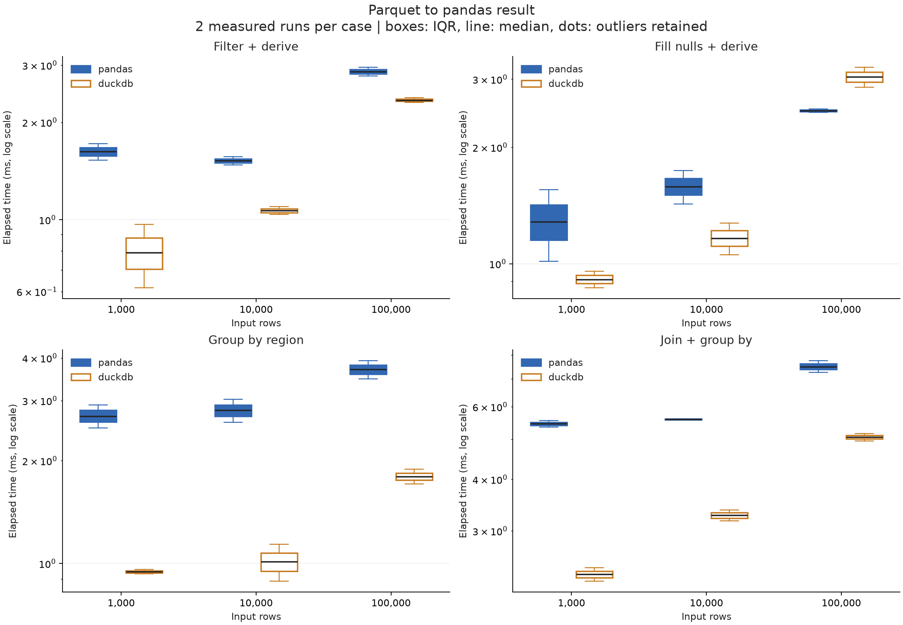
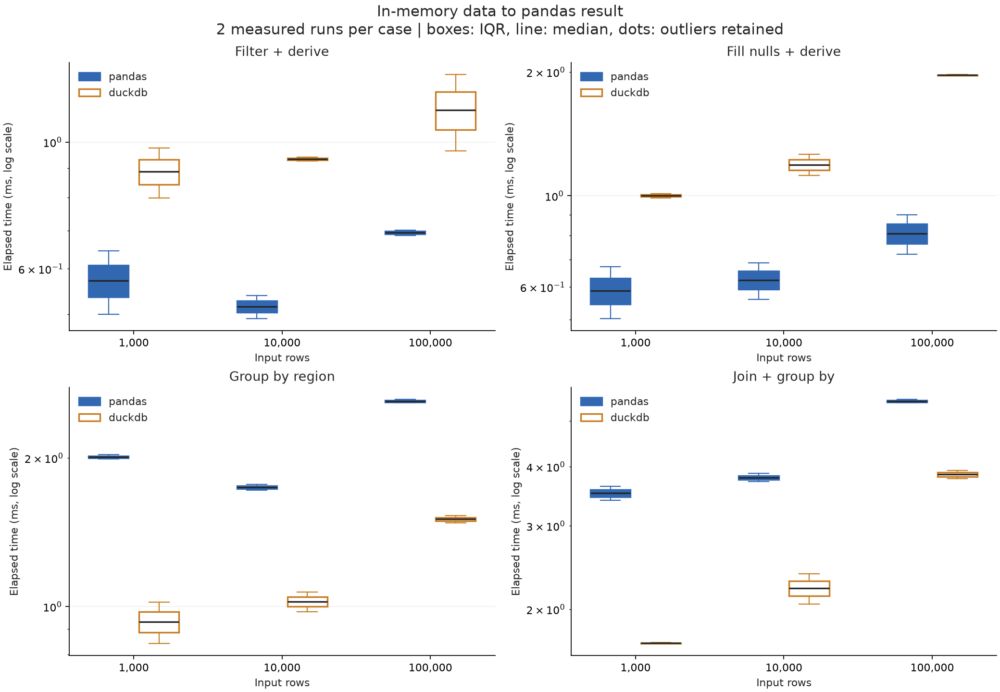
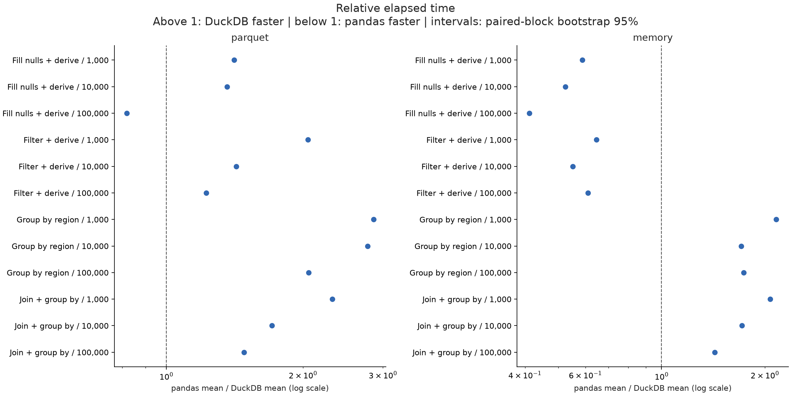

# pandas vs DuckDB 전처리 실험

실행 완료(UTC): 2026-09-07T02:27:50.764571+00:00 / 상태: complete

입력 크기: 1,000, 10,000, 100,000행. 8개 수치형 컬럼. 각 조합 2회, 1개 묶음. 아래 값은 생성 데이터에 대한 실제 측정이며 다른 데이터 유형에 일반화할 수 없다.

## 평균 실행 시간

±는 표본 표준편차다. 배율은 pandas 평균 / DuckDB 평균으로, 1보다 크면 DuckDB가 빠르다.

| 입력 행 | 입력 방식 | 작업 | pandas 평균 ± SD(ms) | DuckDB 평균 ± SD(ms) | 배율 |
|---:|---|---|---:|---:|---:|
| 1,000 | memory | Fill nulls + derive | 0.588 ± 0.120 | 1.000 ± 0.016 | 0.59× |
| 1,000 | memory | Filter + derive | 0.573 ± 0.103 | 0.887 ± 0.127 | 0.65× |
| 1,000 | memory | Group by region | 2.010 ± 0.027 | 0.931 ± 0.126 | 2.16× |
| 1,000 | memory | Join + group by | 3.516 ± 0.170 | 1.696 ± 0.005 | 2.07× |
| 1,000 | parquet | Fill nulls + derive | 1.284 ± 0.380 | 0.911 ± 0.063 | 1.41× |
| 1,000 | parquet | Filter + derive | 1.623 ± 0.132 | 0.792 ± 0.247 | 2.05× |
| 1,000 | parquet | Group by region | 2.703 ± 0.299 | 0.945 ± 0.019 | 2.86× |
| 1,000 | parquet | Join + group by | 5.454 ± 0.142 | 2.353 ± 0.124 | 2.32× |
| 10,000 | memory | Fill nulls + derive | 0.624 ± 0.090 | 1.190 ± 0.100 | 0.52× |
| 10,000 | memory | Filter + derive | 0.515 ± 0.034 | 0.933 ± 0.011 | 0.55× |
| 10,000 | memory | Group by region | 1.745 ± 0.035 | 1.023 ± 0.067 | 1.71× |
| 10,000 | memory | Join + group by | 3.793 ± 0.105 | 2.213 ± 0.229 | 1.71× |
| 10,000 | parquet | Fill nulls + derive | 1.583 ± 0.221 | 1.164 ± 0.155 | 1.36× |
| 10,000 | parquet | Filter + derive | 1.520 ± 0.061 | 1.067 ± 0.043 | 1.42× |
| 10,000 | parquet | Group by region | 2.808 ± 0.303 | 1.012 ± 0.176 | 2.78× |
| 10,000 | parquet | Join + group by | 5.592 ± 0.022 | 3.271 ± 0.138 | 1.71× |
| 100,000 | memory | Fill nulls + derive | 0.810 ± 0.127 | 1.965 ± 0.009 | 0.41× |
| 100,000 | memory | Filter + derive | 0.694 ± 0.011 | 1.138 ± 0.246 | 0.61× |
| 100,000 | memory | Group by region | 2.607 ± 0.029 | 1.503 ± 0.038 | 1.73× |
| 100,000 | memory | Join + group by | 5.499 ± 0.064 | 3.849 ± 0.110 | 1.43× |
| 100,000 | parquet | Fill nulls + derive | 2.485 ± 0.036 | 3.040 ± 0.254 | 0.82× |
| 100,000 | parquet | Filter + derive | 2.866 ± 0.125 | 2.340 ± 0.055 | 1.22× |
| 100,000 | parquet | Group by region | 3.698 ± 0.319 | 1.798 ± 0.126 | 2.06× |
| 100,000 | parquet | Join + group by | 7.507 ± 0.346 | 5.063 ± 0.148 | 1.48× |

## 분포와 상대 시간

## 측정 범위와 해석

- parquet: 파일 읽기·변환·pandas 결과 생성 포함. pandas도 필요한 컬럼과 필터 pushdown을 사용한다.
- memory: 필요한 원본 컬럼을 pandas로 미리 읽은 상태. DuckDB도 같은 DataFrame을 등록해 SQL을 수행한다. 사전 읽기·등록은 시간에서 제외한다.
- DuckDB .df()의 전체 결과 생성 비용 포함. clean_derive는 입력과 같은 행 수를 반환하고 groupby는 최대 50행만 반환한다.
- 금액은 정수 센트, 결측 할인율은 0, 할인 후 금액은 정수 내림. 출력 정렬은 요구하지 않는다.
- 데이터 생성·import·연결·명시적 GC·결과 해시 검증은 시간에서 제외. 각 새 프로세스는 1회 워밍업 후 측정한다. 자동 GC는 켜져 있다.
- 엔진은 한 번에 하나씩 별도 프로세스로 실행한다. 묶음마다 케이스와 엔진 순서를 시드로 섞는다. 두 엔진의 동일 묶음을 대응시킨다.
- OS 파일 캐시를 비우지 않은 warm-cache 실험이다. 메모리 한도를 넘는 데이터, 문자열·UDF·전역 정렬·중복 제거는 이번 범위에 없다.
- DuckDB와 Arrow의 스레드 한도는 4개, DuckDB 내부 메모리 한도는 8GB다. pandas의 모든 연산이 멀티스레드인 것은 아니다.
- 평균 신뢰구간은 묶음 평균의 Student t 구간, 배율 구간은 대응 묶음 bootstrap 10,000회다. 기본 6개 묶음으로 추정한 탐색적 구간이며 시스템 부하·캐시·시간 의존성을 완전히 제거하지 못한다.
- p95/p99는 30개 표본의 선형 보간 추정으로 꼬리 지연 보장이 아니다. Tukey 이상치는 개수만 표시하고 제거하지 않는다.
- memory.csv의 process_peak_rss_bytes는 별도의 새 프로세스에서 1회 실행한 OS 최대 RSS다. import·입력 사전 로딩을 포함하고 검증은 제외한다. 30회 메모리 평균이나 연산만의 추가 메모리가 아니다.
- 모든 측정 결과의 전체 행을 순서 독립 해시 합·XOR로 검증하고 엔진·입력 방식끼리 비교했다. 해시 충돌 가능성은 0이 아니며 단위 테스트에서는 실제 값을 직접 비교한다.
- 데이터는 독립 균등분포의 수치형 합성 매출, 5% 할인 결측, 지역 50개, 계정 dimension 10만 행이다. 실제 업무 데이터의 편향·문자열·폭에 따라 결과가 달라진다.

## 환경과 원자료

- macOS-26.6.2-arm64-arm-64bit-Mach-O / Python 3.13.5 / 메모리 48GiB / 논리 CPU 14
- 패키지: {'pandas': '3.0.5', 'duckdb': '1.5.5', 'numpy': '2.5.3', 'pyarrow': '23.0.1', 'psutil': '7.2.2', 'scipy': '1.18.1'}
- measurements.csv / measurements.jsonl: 전체 개별 시간·CPU 시간·실행 순번·검증 여부
- summary.csv / summary.json: 평균·표본 SD·중앙값·최소·최대·Q1/Q3·IQR·MAD·p90/p95/p99·CV·95% CI·처리량
- comparison.csv: 평균 배율·대응 묶음 bootstrap 구간
- datasets.json / validation.json: 파일 SHA-256·스키마/크기·결과 fingerprint
- manifest.json / execution-order.json: 버전·설정·소스 해시·순서·시스템 CPU/메모리/swap

## 공식 API 근거

- [DuckDB → pandas .df()](https://duckdb.org/docs/current/guides/python/export_pandas)
- [DuckDB로 pandas 입력 질의](https://duckdb.org/docs/current/guides/python/sql_on_pandas)
- [pandas read_parquet 컬럼·필터](https://pandas.pydata.org/docs/reference/api/pandas.read_parquet.html)
