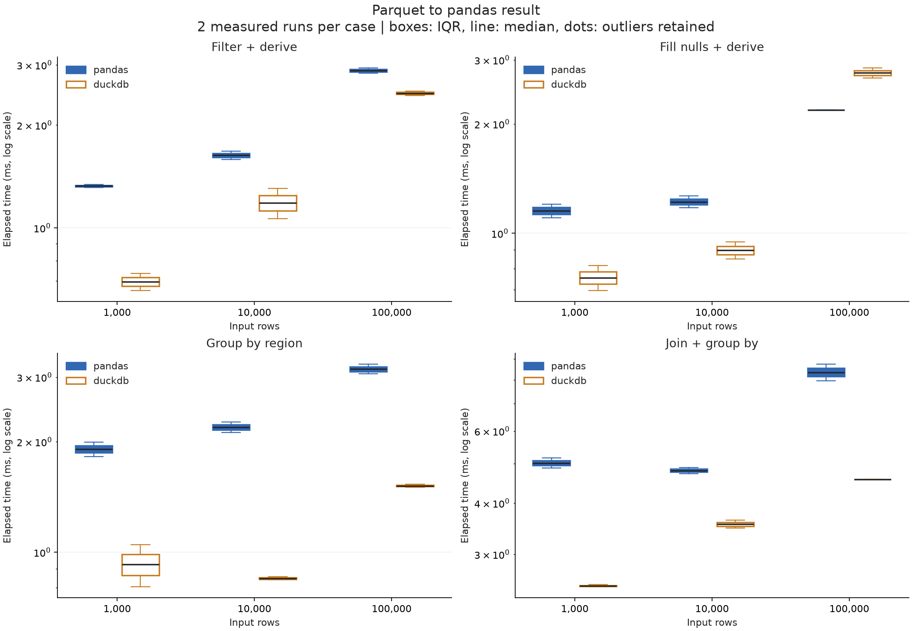
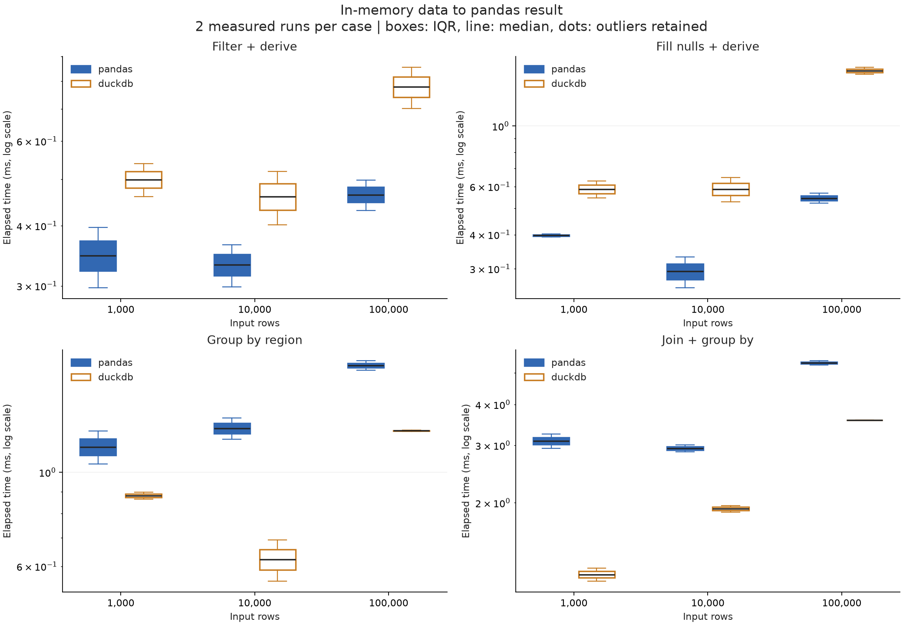
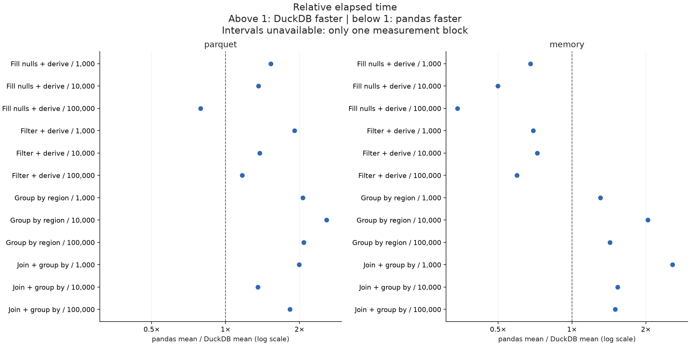
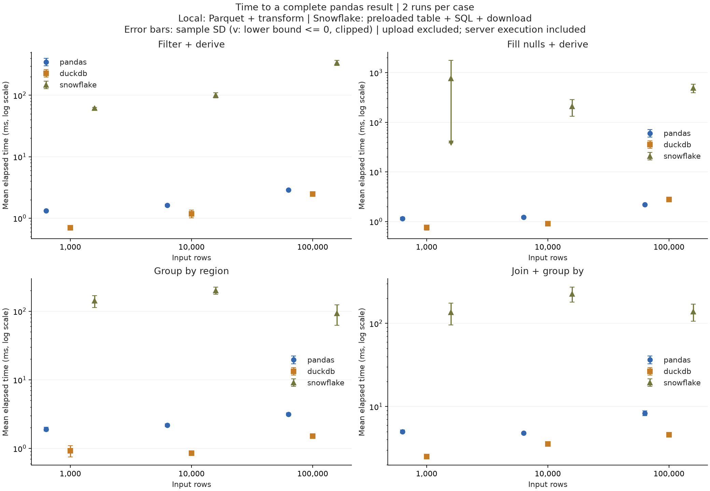

# pandas vs DuckDB vs Snowflake 전처리 실험

실행 완료(UTC): 2026-09-09T00:02:24.247086+00:00 / 상태: complete

입력 크기: 1,000, 10,000, 100,000행. 8개 수치형 컬럼. 각 조합 2회, 1개 묶음. 아래 값은 생성 데이터에 대한 실제 측정이며 다른 데이터 유형에 일반화할 수 없다.

## 평균 실행 시간

±는 표본 표준편차다. 배율은 pandas 평균 / DuckDB 평균으로, 1보다 크면 DuckDB가 빠르다.

| 입력 행 | 입력 방식 | 작업 | pandas 평균 ± SD(ms) | DuckDB 평균 ± SD(ms) | 배율 |
|---:|---|---|---:|---:|---:|
| 1,000 | memory | Fill nulls + derive | 0.397 ± 0.008 | 0.587 ± 0.060 | 0.68× |
| 1,000 | memory | Filter + derive | 0.347 ± 0.070 | 0.499 ± 0.056 | 0.70× |
| 1,000 | memory | Group by region | 1.148 ± 0.145 | 0.880 ± 0.024 | 1.30× |
| 1,000 | memory | Join + group by | 3.093 ± 0.222 | 1.206 ± 0.078 | 2.56× |
| 1,000 | parquet | Fill nulls + derive | 1.153 ± 0.071 | 0.755 ± 0.084 | 1.53× |
| 1,000 | parquet | Filter + derive | 1.326 ± 0.018 | 0.696 ± 0.057 | 1.91× |
| 1,000 | parquet | Group by region | 1.909 ± 0.121 | 0.926 ± 0.172 | 2.06× |
| 1,000 | parquet | Join + group by | 5.013 ± 0.202 | 2.514 ± 0.021 | 1.99× |
| 10,000 | memory | Fill nulls + derive | 0.293 ± 0.053 | 0.587 ± 0.084 | 0.50× |
| 10,000 | memory | Filter + derive | 0.332 ± 0.047 | 0.460 ± 0.083 | 0.72× |
| 10,000 | memory | Group by region | 1.269 ± 0.102 | 0.623 ± 0.098 | 2.04× |
| 10,000 | memory | Join + group by | 2.937 ± 0.098 | 1.918 ± 0.064 | 1.53× |
| 10,000 | parquet | Fill nulls + derive | 1.221 ± 0.064 | 0.898 ± 0.068 | 1.36× |
| 10,000 | parquet | Filter + derive | 1.631 ± 0.063 | 1.184 ± 0.171 | 1.38× |
| 10,000 | parquet | Group by region | 2.189 ± 0.102 | 0.849 ± 0.012 | 2.58× |
| 10,000 | parquet | Join + group by | 4.803 ± 0.117 | 3.552 ± 0.112 | 1.35× |
| 100,000 | memory | Fill nulls + derive | 0.544 ± 0.032 | 1.595 ± 0.064 | 0.34× |
| 100,000 | memory | Filter + derive | 0.464 ± 0.047 | 0.778 ± 0.108 | 0.60× |
| 100,000 | memory | Group by region | 1.786 ± 0.064 | 1.253 ± 0.007 | 1.43× |
| 100,000 | memory | Join + group by | 5.363 ± 0.109 | 3.580 ± 0.002 | 1.50× |
| 100,000 | parquet | Fill nulls + derive | 2.183 ± 0.001 | 2.763 ± 0.123 | 0.79× |
| 100,000 | parquet | Filter + derive | 2.889 ± 0.070 | 2.477 ± 0.050 | 1.17× |
| 100,000 | parquet | Group by region | 3.155 ± 0.136 | 1.517 ± 0.020 | 2.08× |
| 100,000 | parquet | Join + group by | 8.344 ± 0.548 | 4.569 ± 0.002 | 1.83× |

## 분포와 상대 시간

## 측정 범위와 해석

- parquet: 파일 읽기·변환·pandas 결과 생성 포함. pandas도 필요한 컬럼과 필터 pushdown을 사용한다.
- memory: 필요한 원본 컬럼을 pandas로 미리 읽은 상태. DuckDB도 같은 DataFrame을 등록해 SQL을 수행한다. 사전 읽기·등록은 시간에서 제외한다.
- DuckDB .df()의 전체 결과 생성 비용 포함. clean_derive는 입력과 같은 행 수를 반환하고 groupby는 최대 50행만 반환한다.
- 금액은 정수 센트, 결측 할인율은 0, 할인 후 금액은 정수 내림. 출력 정렬은 요구하지 않는다.
- 데이터 생성·import·연결·명시적 GC·결과 해시 검증은 시간에서 제외. 각 새 프로세스는 1회 워밍업 후 측정한다. 자동 GC는 켜져 있다.
- 로컬 엔진은 한 번에 하나씩 별도 프로세스로 실행한다. 묶음마다 케이스와 엔진 순서를 시드로 섞는다. 로컬 두 엔진의 동일 묶음을 대응시킨다. Snowflake 추가 시 원격 세션을 별도로 유지하며 순차 실행한다.
- OS 파일 캐시를 비우지 않은 warm-cache 실험이다. 메모리 한도를 넘는 데이터, 문자열·UDF·전역 정렬·중복 제거는 이번 범위에 없다.
- DuckDB와 Arrow의 스레드 한도는 4개, DuckDB 내부 메모리 한도는 8GB다. pandas의 모든 연산이 멀티스레드인 것은 아니다.
- 평균 신뢰구간은 묶음 평균의 Student t 구간, 배율 구간은 대응 묶음 bootstrap 10,000회다. 기본 6개 묶음으로 추정한 탐색적 구간이며 시스템 부하·캐시·시간 의존성을 완전히 제거하지 못한다.
- p95/p99는 2개 표본의 선형 보간 추정으로 꼬리 지연 보장이 아니다. Tukey 이상치는 개수만 표시하고 제거하지 않는다.
- memory.csv의 process_peak_rss_bytes는 별도의 새 프로세스에서 1회 실행한 OS 최대 RSS다. import·입력 사전 로딩을 포함하고 검증은 제외한다. 30회 메모리 평균이나 연산만의 추가 메모리가 아니다.
- 모든 측정 결과의 전체 행을 순서 독립 해시 합·XOR로 검증하고 엔진·입력 방식끼리 비교했다. 해시 충돌 가능성은 0이 아니며 단위 테스트에서는 실제 값을 직접 비교한다.
- 데이터는 독립 균등분포의 수치형 합성 매출, 5% 할인 결측, 지역 50개, 계정 dimension 10만 행이다. 실제 업무 데이터의 편향·문자열·폭에 따라 결과가 달라진다.

## 환경과 원자료

- macOS-26.6.2-arm64-arm-64bit-Mach-O / Python 3.13.5 / 메모리 48GiB / 논리 CPU 14
- 패키지: {'pandas': '2.3.3', 'duckdb': '1.5.5', 'numpy': '2.5.3', 'pyarrow': '23.0.1', 'psutil': '7.2.2', 'scipy': '1.18.1'}
- measurements.csv / measurements.jsonl: 전체 개별 시간·CPU 시간·실행 순번·검증 여부
- summary.csv / summary.json: 평균·표본 SD·중앙값·최소·최대·Q1/Q3·IQR·MAD·p90/p95/p99·CV·95% CI·처리량
- comparison.csv: 평균 배율·대응 묶음 bootstrap 구간
- datasets.json / validation.json: 파일 SHA-256·스키마/크기·결과 fingerprint
- manifest.json / execution-order.json: 버전·설정·소스 해시·순서·시스템 CPU/메모리/swap

## 공식 API 근거

- [DuckDB → pandas .df()](https://duckdb.org/docs/current/guides/python/export_pandas)
- [DuckDB로 pandas 입력 질의](https://duckdb.org/docs/current/guides/python/sql_on_pandas)
- [pandas read_parquet 컬럼·필터](https://pandas.pydata.org/docs/reference/api/pandas.read_parquet.html)

## Snowflake 추가 비교

**입력 위치와 자원이 다른 애플리케이션 경로 비교다.** 로컬 parquet 결과와 원격 warehouse 결과를 병기한다. Snowflake 업로드·COPY 비용은 별도이며, 로컬 memory와 동일한 시작 조건이라고 해석하지 않는다.

| 입력 행 | 작업 | pandas Parquet(ms) | DuckDB Parquet(ms) | Snowflake 적재 테이블(ms) |
|---:|---|---:|---:|---:|
| 1,000 | Fill nulls + derive | 1.153 ± 0.071 | 0.755 ± 0.084 | 771.312 ± 988.447 |
| 1,000 | Filter + derive | 1.326 ± 0.018 | 0.696 ± 0.057 | 61.770 ± 1.991 |
| 1,000 | Group by region | 1.909 ± 0.121 | 0.926 ± 0.172 | 141.570 ± 27.902 |
| 1,000 | Join + group by | 5.013 ± 0.202 | 2.514 ± 0.021 | 135.909 ± 39.911 |
| 10,000 | Fill nulls + derive | 1.221 ± 0.064 | 0.898 ± 0.068 | 210.521 ± 77.512 |
| 10,000 | Filter + derive | 1.631 ± 0.063 | 1.184 ± 0.171 | 100.478 ± 9.128 |
| 10,000 | Group by region | 2.189 ± 0.102 | 0.849 ± 0.012 | 200.779 ± 23.752 |
| 10,000 | Join + group by | 4.803 ± 0.117 | 3.552 ± 0.112 | 226.416 ± 46.214 |
| 100,000 | Fill nulls + derive | 2.183 ± 0.001 | 2.763 ± 0.123 | 491.270 ± 94.834 |
| 100,000 | Filter + derive | 2.889 ± 0.070 | 2.477 ± 0.050 | 337.065 ± 31.346 |
| 100,000 | Group by region | 3.155 ± 0.136 | 1.517 ± 0.020 | 93.547 ± 31.092 |
| 100,000 | Join + group by | 8.344 ± 0.548 | 4.569 ± 0.002 | 138.570 ± 31.941 |

- Snowflake 환경: {'account': 'XN15248', 'region': 'AWS_AP_NORTHEAST_2', 'role': 'ACCOUNTADMIN', 'warehouse': 'COMPUTE_WH', 'database': 'USER$ESPSEONGSM', 'schema': 'PUBLIC', 'version': '10.32.102', 'warehouse_settings': {'size': 'X-Small', 'type': 'STANDARD', 'auto_suspend': 300, 'auto_resume': 'true', 'min_cluster_count': 1, 'max_cluster_count': 1, 'scaling_policy': 'STANDARD', 'resource_monitor': 'null'}, 'use_cached_result': False, 'connector_version': '4.7.3', 'client_memory_is_not_server_memory': True}
- elapsed_ms는 쿼리 요청부터 fetch_pandas_all 및 컬럼명·int64 정규화 완료까지다. 연결·업로드·COPY·워밍업·검증·query history 조회는 제외한다.
- execute_roundtrip_ms는 서버 시간과 네트워크 왕복을 포함한다. fetch_dataframe_ms는 결과 다운로드·DataFrame 생성을 포함하며 순수 네트워크 시간은 아니다.
- server_* 값은 QUERY_HISTORY에서 query_id로 조회한다. 조회 실패/지연은 빈 값으로 보존하며 count가 실제 관측 수다. 서버 시간은 전체 대기 시간과 별도이며 단순 차를 네트워크 시간으로 해석하지 않는다.
- USE_CACHED_RESULT=FALSE로 결과 재사용을 비활성화한다. warehouse 데이터 캐시·자동 중지는 변경하지 않는다. SQL 워밍업 후 측정하며 서버 재시작·큐 시간도 기록한다.
- 임시 테이블·stage는 실험 세션에 속한다. 지정한 기존 warehouse를 사용하며 생성·크기 변경·강제 중지는 하지 않는다. 세션 종료와 warehouse 중지는 별개이므로 실행 전 계정의 auto_suspend 및 과금 설정을 확인한다.
- Snowflake의 메모리/CPU 서버 자원은 로컬 psutil로 측정하지 않는다. Snowflake RSS는 빈 값, cpu_ms는 로컬 클라이언트 CPU만 의미한다.
- three-engine-comparison.csv: 입력 경로별 기술통계. snowflake-components.csv: 시간 구성요소와 서버 메타데이터 통계. snowflake-setup.json: 업로드·적재 시간. 실제 청구 비용을 추정한 값은 아니다.
- Query history 조회 오류: []
- [Python → pandas API](https://docs.snowflake.com/en/developer-guide/python-connector/python-connector-pandas)
- [결과 캐시](https://docs.snowflake.com/en/user-guide/querying-persisted-results)
- [서버 쿼리 기록](https://docs.snowflake.com/en/sql-reference/functions/query_history)
