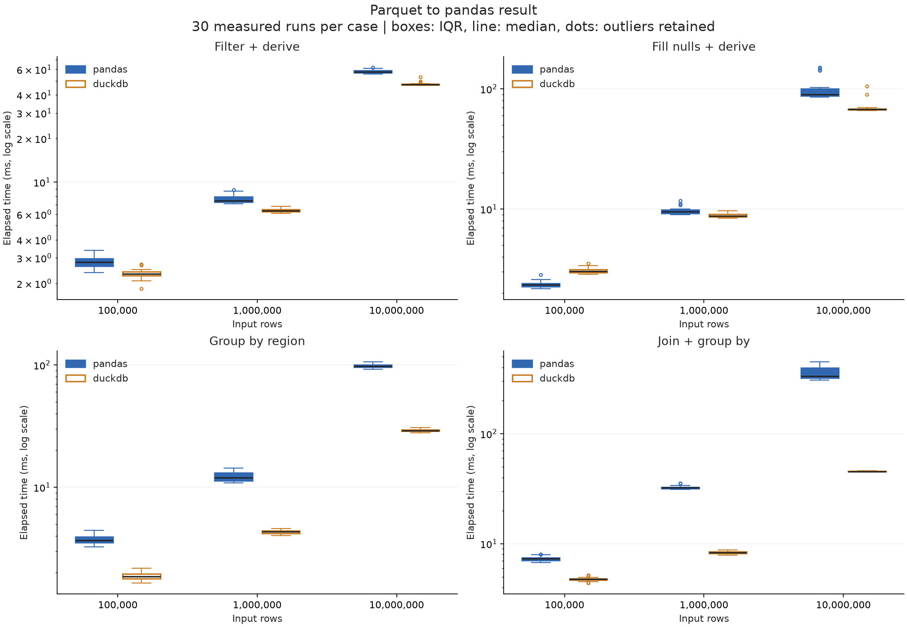
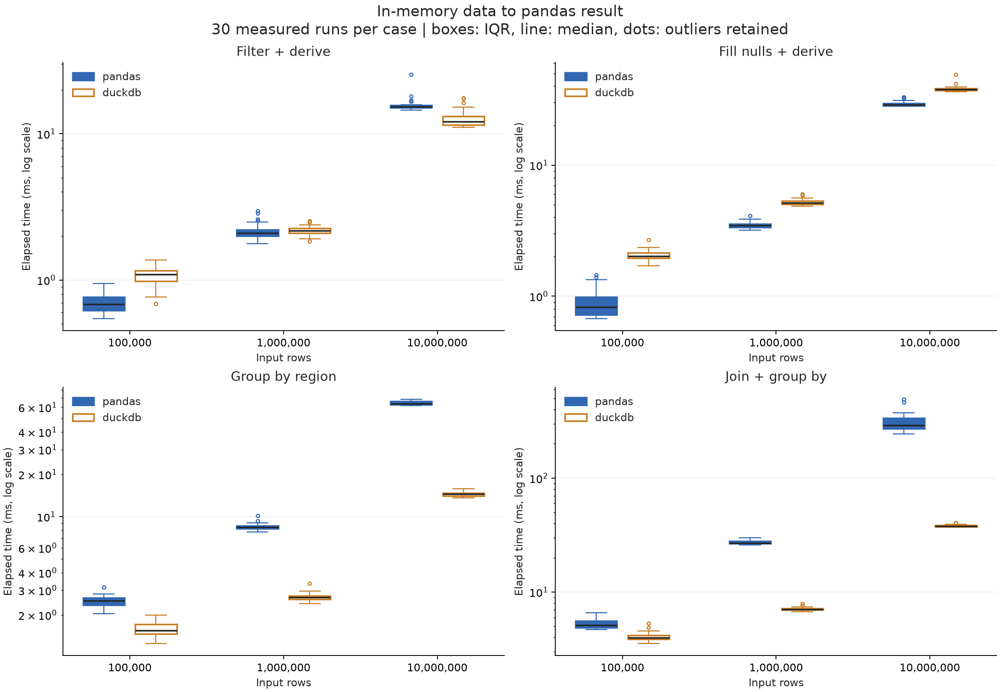
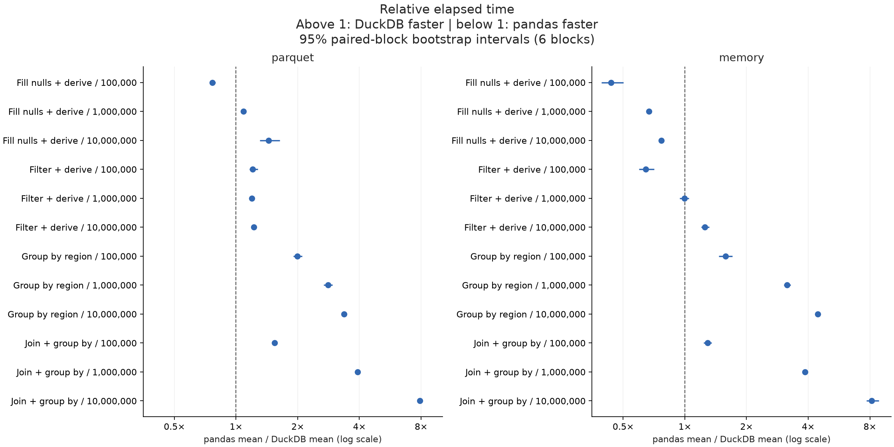

# pandas vs DuckDB 전처리 실험

실행 완료(UTC): 2026-09-07T02:33:16.932906+00:00 / 상태: complete

입력 크기: 100,000, 1,000,000, 10,000,000행. 8개 수치형 컬럼. 각 조합 30회, 6개 묶음. 아래 값은 생성 데이터에 대한 실제 측정이며 다른 데이터 유형에 일반화할 수 없다.

## 결과 해석

이번 측정에서는 **메모리에 있는 데이터의 단순 결측치·파생 컬럼 처리는 pandas, 집계·조인 후 집계는 DuckDB가 유리했다.** 파일에서 시작하는지와 최종 반환 행 수를 함께 고려해야 한다.

- **결측치·파생 컬럼, memory:** pandas가 10만·100만·1,000만 행에서 각각 2.29배·1.50배·1.30배 빨랐다. 1,000만 행에서는 pandas 29.384ms, DuckDB 38.261ms였다. 입력 크기가 커졌다고 단순 변환까지 자동으로 DuckDB가 빨라지는 것은 아니었다.
- **지역별 집계, parquet:** DuckDB가 크기별 1.99배·2.82배·3.36배 빨랐다. 1,000만 행을 50행으로 줄이는 경우 pandas 97.919ms, DuckDB 29.137ms였다.
- **조인 후 집계, parquet:** DuckDB의 우위는 1.54배·3.91배·7.88배였다. 1,000만 행에서 pandas 357.658 ± 42.012ms, DuckDB 45.399 ± 0.437ms였다(± 표본 SD).
- **필터·파생 컬럼, memory:** 10만 행은 pandas 우위, 100만 행은 거의 같음(2.165 vs 2.179ms, 배율 구간 0.94–1.05), 1,000만 행은 DuckDB가 1.25배 빨랐다. 이 세 지점만으로 정확한 전환 행 수를 추정하지 않는다.
- **입력 경로의 영향:** 1,000만 행 결측치·파생 컬럼은 memory에서는 pandas가 빨랐으나 parquet에서는 DuckDB가 1.44배 빨랐다. 사전 로딩을 측정에 포함하는지가 선택을 바꿨다.

이 결과에 근거해, 이미 DataFrame에 있는 수치형 컬럼의 단순 가공에는 pandas를 유지하고, Parquet의 집계·조인처럼 최종 결과를 크게 줄이는 작업에는 DuckDB → `.df()` 경로를 우선 검토할 수 있다. 이는 이번 작업·데이터·환경에 한정한 판단이다.

**환경 한계:** 수치형 합성 데이터이며 최대 입력은 논리 크기 약 610MiB(Parquet 약 182MiB)다. 메모리 용량을 초과한 입력 성능은 측정하지 않았다. 실행 중 다른 앱이 동작했고 시스템 전체 swap 입출력이 관찰됐다. 따라서 깨끗한 전용 벤치마크 장비의 성능이나 DuckDB/pandas만의 swap으로 해석할 수 없다. pandas는 기본 NumPy 기반 열을 사용하고 numexpr는 비활성화했다.

**검증:** 48개 조합의 각 30회, 총 1,440개 결과가 검증됐다. 평균·표본 SD·중앙값·최솟값·최댓값·배율을 원시 JSONL에서 독립 재계산했고 12개 직접 값 비교·통계 테스트가 통과했다. `qa.json`에 검증 범위와 시각화 수정 이력을 보존했다.

## 평균 실행 시간

±는 표본 표준편차다. 배율은 pandas 평균 / DuckDB 평균으로, 1보다 크면 DuckDB가 빠르다.

| 입력 행 | 입력 방식 | 작업 | pandas 평균 ± SD(ms) | DuckDB 평균 ± SD(ms) | 배율 |
|---:|---|---|---:|---:|---:|
| 100,000 | memory | Fill nulls + derive | 0.900 ± 0.227 | 2.063 ± 0.195 | 0.44× |
| 100,000 | memory | Filter + derive | 0.695 ± 0.100 | 1.076 ± 0.149 | 0.65× |
| 100,000 | memory | Group by region | 2.507 ± 0.226 | 1.585 ± 0.179 | 1.58× |
| 100,000 | memory | Join + group by | 5.250 ± 0.468 | 4.066 ± 0.360 | 1.29× |
| 100,000 | parquet | Fill nulls + derive | 2.351 ± 0.141 | 3.069 ± 0.162 | 0.77× |
| 100,000 | parquet | Filter + derive | 2.814 ± 0.246 | 2.339 ± 0.176 | 1.20× |
| 100,000 | parquet | Group by region | 3.737 ± 0.316 | 1.873 ± 0.135 | 1.99× |
| 100,000 | parquet | Join + group by | 7.324 ± 0.350 | 4.751 ± 0.178 | 1.54× |
| 1,000,000 | memory | Fill nulls + derive | 3.486 ± 0.203 | 5.220 ± 0.273 | 0.67× |
| 1,000,000 | memory | Filter + derive | 2.165 ± 0.280 | 2.179 ± 0.155 | 0.99× |
| 1,000,000 | memory | Group by region | 8.475 ± 0.461 | 2.691 ± 0.171 | 3.15× |
| 1,000,000 | memory | Join + group by | 27.383 ± 1.157 | 7.088 ± 0.249 | 3.86× |
| 1,000,000 | parquet | Fill nulls + derive | 9.614 ± 0.628 | 8.833 ± 0.334 | 1.09× |
| 1,000,000 | parquet | Filter + derive | 7.611 ± 0.472 | 6.386 ± 0.181 | 1.19× |
| 1,000,000 | parquet | Group by region | 12.172 ± 1.038 | 4.320 ± 0.168 | 2.82× |
| 1,000,000 | parquet | Join + group by | 32.422 ± 1.084 | 8.288 ± 0.226 | 3.91× |
| 10,000,000 | memory | Fill nulls + derive | 29.384 ± 1.480 | 38.261 ± 2.326 | 0.77× |
| 10,000,000 | memory | Filter + derive | 15.908 ± 1.956 | 12.686 ± 1.784 | 1.25× |
| 10,000,000 | memory | Group by region | 64.302 ± 1.928 | 14.462 ± 0.549 | 4.45× |
| 10,000,000 | memory | Join + group by | 311.178 ± 57.496 | 38.160 ± 0.881 | 8.15× |
| 10,000,000 | parquet | Fill nulls + derive | 100.152 ± 21.738 | 69.379 ± 7.863 | 1.44× |
| 10,000,000 | parquet | Filter + derive | 57.962 ± 1.348 | 47.517 ± 1.251 | 1.22× |
| 10,000,000 | parquet | Group by region | 97.919 ± 3.522 | 29.137 ± 0.551 | 3.36× |
| 10,000,000 | parquet | Join + group by | 357.658 ± 42.012 | 45.399 ± 0.437 | 7.88× |

## 분포와 상대 시간

## 측정 범위와 해석

- parquet: 파일 읽기·변환·pandas 결과 생성 포함. pandas도 필요한 컬럼과 필터 pushdown을 사용한다.
- memory: 필요한 원본 컬럼을 pandas로 미리 읽은 상태. DuckDB도 같은 DataFrame을 등록해 SQL을 수행한다. 사전 읽기·등록은 시간에서 제외한다.
- DuckDB .df()의 전체 결과 생성 비용 포함. clean_derive는 입력과 같은 행 수를 반환하고 groupby는 최대 50행만 반환한다.
- 금액은 정수 센트, 결측 할인율은 0, 할인 후 금액은 정수 내림. 출력 정렬은 요구하지 않는다.
- 데이터 생성·import·연결·명시적 GC·결과 해시 검증은 시간에서 제외. 각 새 프로세스는 1회 워밍업 후 측정한다. 자동 GC는 켜져 있다.
- 엔진은 한 번에 하나씩 별도 프로세스로 실행한다. 묶음마다 케이스와 엔진 순서를 시드로 섞는다. 두 엔진의 동일 묶음을 대응시킨다.
- OS 파일 캐시를 비우지 않은 warm-cache 실험이다. 메모리 한도를 넘는 데이터, 문자열·UDF·전역 정렬·중복 제거는 이번 범위에 없다.
- DuckDB와 Arrow의 스레드 한도는 4개, DuckDB 내부 메모리 한도는 8GB다. pandas의 모든 연산이 멀티스레드인 것은 아니다.
- 평균 신뢰구간은 묶음 평균의 Student t 구간, 배율 구간은 대응 묶음 bootstrap 10,000회다. 기본 6개 묶음으로 추정한 탐색적 구간이며 시스템 부하·캐시·시간 의존성을 완전히 제거하지 못한다.
- p95/p99는 30개 표본의 선형 보간 추정으로 꼬리 지연 보장이 아니다. Tukey 이상치는 개수만 표시하고 제거하지 않는다.
- memory.csv의 process_peak_rss_bytes는 별도의 새 프로세스에서 1회 실행한 OS 최대 RSS다. import·입력 사전 로딩을 포함하고 검증은 제외한다. 30회 메모리 평균이나 연산만의 추가 메모리가 아니다.
- 모든 측정 결과의 전체 행을 순서 독립 해시 합·XOR로 검증하고 엔진·입력 방식끼리 비교했다. 해시 충돌 가능성은 0이 아니며 단위 테스트에서는 실제 값을 직접 비교한다.
- 데이터는 독립 균등분포의 수치형 합성 매출, 5% 할인 결측, 지역 50개, 계정 dimension 10만 행이다. 실제 업무 데이터의 편향·문자열·폭에 따라 결과가 달라진다.

## 환경과 원자료

- macOS-26.6.2-arm64-arm-64bit-Mach-O / Python 3.13.5 / 메모리 48GiB / 논리 CPU 14
- 패키지: {'pandas': '3.0.5', 'duckdb': '1.5.5', 'numpy': '2.5.3', 'pyarrow': '23.0.1', 'psutil': '7.2.2', 'scipy': '1.18.1'}
- measurements.csv / measurements.jsonl: 전체 개별 시간·CPU 시간·실행 순번·검증 여부
- summary.csv / summary.json: 평균·표본 SD·중앙값·최소·최대·Q1/Q3·IQR·MAD·p90/p95/p99·CV·95% CI·처리량
- comparison.csv: 평균 배율·대응 묶음 bootstrap 구간
- datasets.json / validation.json: 파일 SHA-256·스키마/크기·결과 fingerprint
- manifest.json / execution-order.json: 버전·설정·소스 해시·순서·시스템 CPU/메모리/swap

## 공식 API 근거

- [DuckDB → pandas .df()](https://duckdb.org/docs/current/guides/python/export_pandas)
- [DuckDB로 pandas 입력 질의](https://duckdb.org/docs/current/guides/python/sql_on_pandas)
- [pandas read_parquet 컬럼·필터](https://pandas.pydata.org/docs/reference/api/pandas.read_parquet.html)
