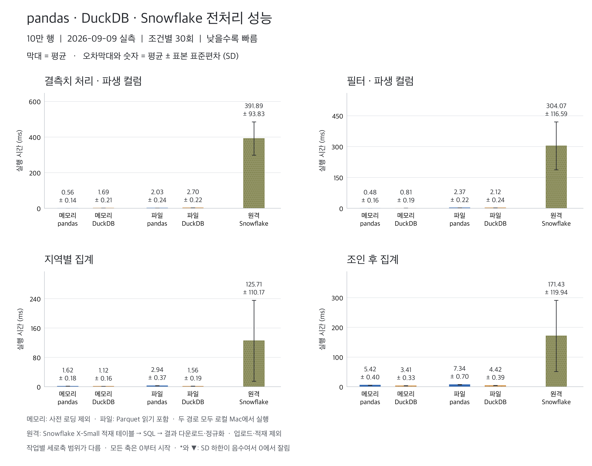
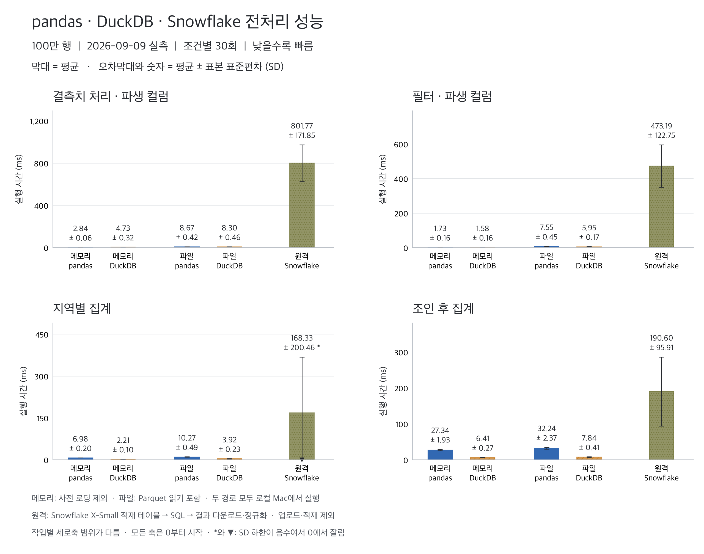
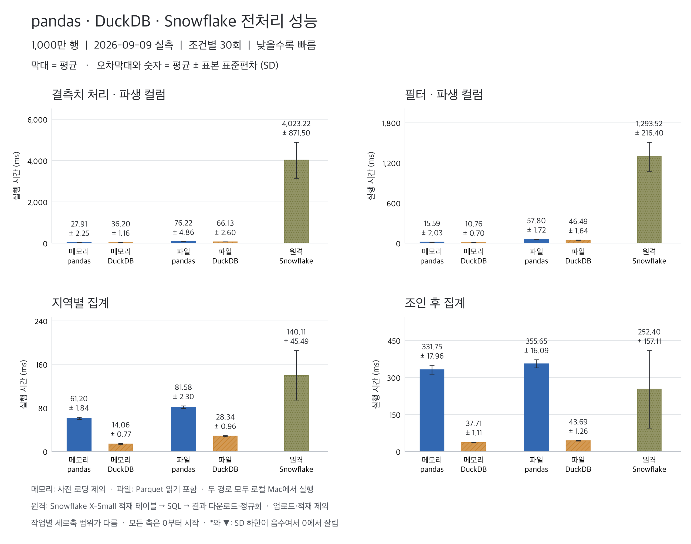
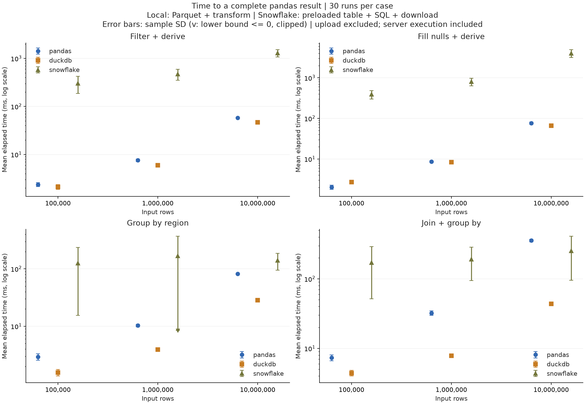
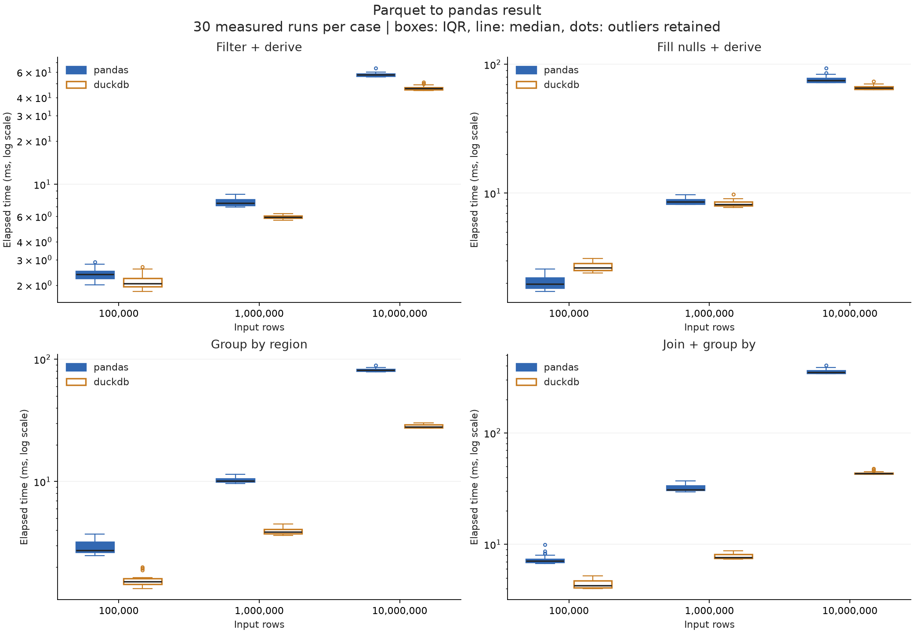
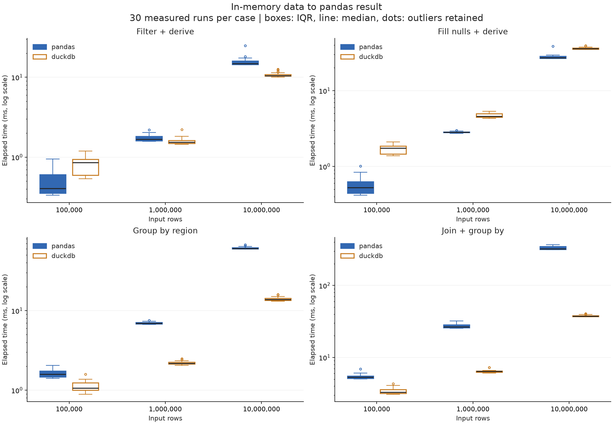
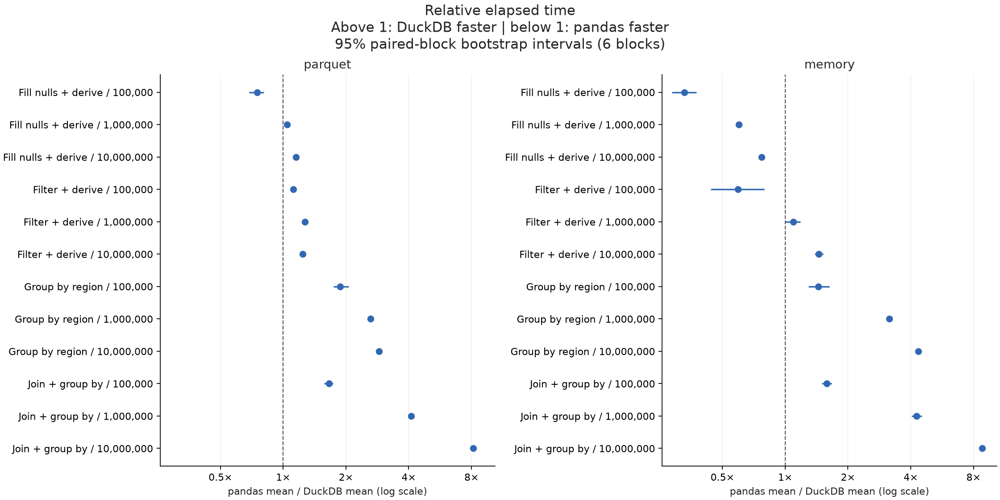

# pandas vs DuckDB vs Snowflake 전처리 실험

**2026년 9월 9일 본 실험 완료 · 1,800회 · 60개 조합 × 각 30회 · 6개 묶음**

실행 기록: 2026년 9월 9일 09:45:56–09:57:55 KST. 인증·입력 준비·검증을 포함한 기록 범위는 약 11분 58초이며, 아래의 순수 측정 시간 합계와 다르다. 입력은 10만·100만·1,000만 행의 수치형 합성 데이터다.

## 집계는 DuckDB, 메모리의 단순 가공은 pandas가 유리했다

**이번 조건에서는 로컬 집계·조인 후 집계는 DuckDB, 이미 메모리에 있는 결측치·파생 컬럼은 pandas의 평균 시간이 짧았다. Snowflake는 결과를 많이 내려받을수록 클라이언트의 전체 대기 시간이 커졌다.** 다만 1,000만 행을 조인·집계해 200행으로 반환할 때 Snowflake의 평균은 pandas보다 낮았다.

- **지역 집계, 1,000만 행:** pandas Parquet **81.576 ± 2.299ms**, DuckDB Parquet **28.335 ± 0.964ms**, Snowflake **140.107 ± 45.493ms**. DuckDB의 평균 시간이 pandas의 약 1/2.88이었다.
- **조인 후 집계, 1,000만 행:** pandas Parquet **355.653 ± 16.088ms**, DuckDB Parquet **43.687 ± 1.258ms**, Snowflake **252.399 ± 157.108ms**. DuckDB가 가장 낮았고, Snowflake는 pandas보다 평균이 약 29.0% 낮았으나 SD가 크다. 6개 묶음 중 1개에서는 Snowflake의 묶음 평균이 pandas보다 높았다.
- **결측치·파생 컬럼, 1,000만 행:** 메모리 입력은 pandas **27.914 ± 2.254ms**, DuckDB **36.199 ± 1.158ms**. Parquet에서 시작하면 각각 **76.217 ± 4.859ms**, **66.133 ± 2.600ms**로 순서가 바뀌었다.
- **같은 작업의 Snowflake 경로:** 1,000만 행 전체를 반환하는 결측치·파생 컬럼은 **4,023.223 ± 871.502ms**였다. 다운로드·DataFrame 생성·정규화 단계의 평균이 **3,234.466ms**, 전체 평균의 **80.4%**를 차지했다. 이 단계가 순수 네트워크 전송 시간이라는 뜻은 아니다.

위 ± 값은 모두 30회 측정의 **표본 표준편차(SD, ddof=1)**다. 순위는 관측한 평균의 순위이며 통계적으로 확정된 일반 순위가 아니다. 서로 다른 작업을 합친 종합 점수는 계산하지 않았다.

## 무엇을 같은 기준으로 측정했는가

세 엔진 모두 **로컬 pandas DataFrame으로 결과 전체가 만들어질 때까지** 측정했다. pandas·DuckDB는 이 Mac에서 실행했고, Snowflake SQL은 AWS 서울 리전의 X-Small warehouse에서 실행했다. **입력 위치와 자원이 다른 애플리케이션 경로 비교이며 동일 하드웨어의 엔진 성능 비교가 아니다.**

| 경로 | 시간 측정의 시작과 끝 | 시간 밖의 준비 |
|---|---|---|
| pandas / DuckDB · Parquet | 로컬 파일 읽기 → 변환 → 결과 DataFrame 생성 | 공통 데이터 생성 |
| pandas / DuckDB · memory | 사전 로딩된 입력 → 변환 → 결과 DataFrame 생성 | 파일 읽기, DuckDB 입력 등록 |
| Snowflake · warehouse | 사전 적재된 테이블 → SQL 요청 → 결과 수신·정규화 | 연결, PUT 업로드, COPY 적재 |

아래 세 엔진 표는 **Parquet와 warehouse 경로**를 병기한다. 메모리 입력은 뒤의 별도 표에서 비교한다. 이번 공통 환경의 pandas는 **2.3.3**, DuckDB는 **1.5.5**, Snowflake Connector는 **4.7.3**, Snowflake 서버는 **10.32.102**다. pandas 3.0.5를 사용한 [9월 7일 로컬 실험](../run-20260907T022808832856Z/report.md)과 수치를 합치거나 차이를 버전 변경의 효과로 단정하지 않는다.

## 세 엔진의 평균과 표준편차

**입력 위치와 자원이 다른 애플리케이션 경로 비교다.** 로컬 parquet 결과와 원격 warehouse 결과를 병기한다. Snowflake 업로드·COPY 비용은 별도이며, 로컬 memory와 동일한 시작 조건이라고 해석하지 않는다.

| 입력 행 | 작업 | pandas Parquet(ms) | DuckDB Parquet(ms) | Snowflake 적재 테이블(ms) |
|---:|---|---:|---:|---:|
| 100,000 | Fill nulls + derive | 2.030 ± 0.245 | 2.705 ± 0.217 | 391.891 ± 93.829 |
| 100,000 | Filter + derive | 2.371 ± 0.224 | 2.119 ± 0.238 | 304.065 ± 116.588 |
| 100,000 | Group by region | 2.935 ± 0.368 | 1.562 ± 0.193 | 125.711 ± 110.173 |
| 100,000 | Join + group by | 7.339 ± 0.704 | 4.417 ± 0.391 | 171.433 ± 119.941 |
| 1,000,000 | Fill nulls + derive | 8.671 ± 0.423 | 8.303 ± 0.461 | 801.771 ± 171.854 |
| 1,000,000 | Filter + derive | 7.551 ± 0.445 | 5.945 ± 0.168 | 473.187 ± 122.748 |
| 1,000,000 | Group by region | 10.273 ± 0.487 | 3.919 ± 0.229 | 168.328 ± 200.457 |
| 1,000,000 | Join + group by | 32.245 ± 2.368 | 7.841 ± 0.408 | 190.596 ± 95.914 |
| 10,000,000 | Fill nulls + derive | 76.217 ± 4.859 | 66.133 ± 2.600 | 4023.223 ± 871.502 |
| 10,000,000 | Filter + derive | 57.796 ± 1.719 | 46.486 ± 1.638 | 1293.520 ± 216.396 |
| 10,000,000 | Group by region | 81.576 ± 2.299 | 28.335 ± 0.964 | 140.107 ± 45.493 |
| 10,000,000 | Join + group by | 355.653 ± 16.088 | 43.687 ± 1.258 | 252.399 ± 157.108 |

### 크기별 세로 막대 비교

이전 실험의 형식에 맞춰 **평균 세로 막대 + 표본 SD 오차막대 + 정확한 숫자**로 표시했다. 메모리·파일 입력은 로컬 Mac, 원격 행은 Snowflake X-Small이다. 모든 세로축은 0에서 시작하는 선형 축이며 작업별 범위는 다르다. 큰 원격 시간 옆에서 짧게 보이는 로컬 막대는 숫자로도 확인할 수 있다.

#### 10만 행

작은 입력에서는 로컬 경로와 Snowflake 전체 대기 시간의 차이가 크다. Python 변환 성능뿐 아니라 원격 요청·실행·반환을 포함하는 경로의 차이로 해석한다.

#### 100만 행

지역 집계의 Snowflake SD가 평균보다 커 하한이 음수가 된다. 그림에서 *와 ▼는 하한을 0에서 잘랐다는 표시다. 음수 실행 시간이 관측됐다는 뜻은 아니며 정확한 평균·SD는 그대로 표기했다.

#### 1,000만 행

결측치·파생 컬럼은 메모리 입력에서는 pandas, 파일 입력에서는 DuckDB의 평균이 낮다. 조인 후 집계는 DuckDB가 가장 낮고 Snowflake는 pandas보다 평균이 낮지만 SD가 크다. 전체 결과를 다운로드하는 원격 단순 가공은 대기 시간이 커진다.

재생성 코드는 [그림 전용 main.py](source/mean-sd/main.py)에 있다. 입력 원자료와 통계는 동일하며 표시 방식을 추가했다.

### 세 크기 전체 보기: 로그축

아래 점은 평균, 오차막대는 **±1 표본 표준편차(SD)**다. SD는 반복 간 변동성이며 평균의 신뢰구간이 아니다. 각 패널의 세로축은 로그축이고 범위가 서로 다르므로 패널 간 점 높이를 직접 비교하지 않는다. Snowflake 100만 행 지역 집계는 평균보다 SD가 커서 하한이 음수다. 그림의 ▽는 표시를 위한 잘림이며 실제 최솟값이 아니다. 정확한 값은 위 표에 보존했다.

로컬 Parquet의 DuckDB는 네 작업 모두 입력 증가에 따라 시간이 늘었으나, Snowflake의 지역 집계는 100만 행에서 1,000만 행으로 갈 때 평균이 오히려 낮아졌다. 서버가 큰 입력을 더 빨리 처리한다는 결론으로 읽지 않는다. 아래 변동성 절에서 해당 표본의 지연을 확인한다.

- Snowflake 환경: {'account': 'XN15248', 'region': 'AWS_AP_NORTHEAST_2', 'role': 'ACCOUNTADMIN', 'warehouse': 'COMPUTE_WH', 'database': 'USER$ESPSEONGSM', 'schema': 'PUBLIC', 'version': '10.32.102', 'warehouse_settings': {'size': 'X-Small', 'type': 'STANDARD', 'auto_suspend': 300, 'auto_resume': 'true', 'min_cluster_count': 1, 'max_cluster_count': 1, 'scaling_policy': 'STANDARD', 'resource_monitor': 'null'}, 'use_cached_result': False, 'connector_version': '4.7.3', 'client_memory_is_not_server_memory': True}
- elapsed_ms는 쿼리 요청부터 fetch_pandas_all 및 컬럼명·int64 정규화 완료까지다. 연결·업로드·COPY·워밍업·검증·query history 조회는 제외한다.
- execute_roundtrip_ms는 서버 시간과 네트워크 왕복을 포함한다. fetch_dataframe_ms는 결과 다운로드·DataFrame 생성을 포함하며 순수 네트워크 시간은 아니다.
- server_* 값은 QUERY_HISTORY에서 query_id로 조회한다. 조회 실패/지연은 빈 값으로 보존하며 count가 실제 관측 수다. 서버 시간은 전체 대기 시간과 별도이며 단순 차를 네트워크 시간으로 해석하지 않는다.
- USE_CACHED_RESULT=FALSE로 결과 재사용을 비활성화한다. warehouse 데이터 캐시·자동 중지는 변경하지 않는다. SQL 워밍업 후 측정하며 서버 재시작·큐 시간도 기록한다.
- 임시 테이블·stage는 실험 세션에 속한다. 지정한 기존 warehouse를 사용하며 생성·크기 변경·강제 중지는 하지 않는다. 세션 종료와 warehouse 중지는 별개이므로 실행 전 계정의 auto_suspend 및 과금 설정을 확인한다.
- Snowflake의 메모리/CPU 서버 자원은 로컬 psutil로 측정하지 않는다. Snowflake RSS는 빈 값, cpu_ms는 로컬 클라이언트 CPU만 의미한다.
- three-engine-comparison.csv: 입력 경로별 기술통계. snowflake-components.csv: 시간 구성요소와 서버 메타데이터 통계. snowflake-setup.json: 업로드·적재 시간. 실제 청구 비용을 추정한 값은 아니다.
- Query history 조회 오류: []
- [Python → pandas API](https://docs.snowflake.com/en/developer-guide/python-connector/python-connector-pandas)
- [결과 캐시](https://docs.snowflake.com/en/user-guide/querying-persisted-results)
- [서버 쿼리 기록](https://docs.snowflake.com/en/sql-reference/functions/query_history)

## Snowflake에서 많은 결과를 반환하면 수신 단계가 커졌다

1,000만 행 기준으로 결측치·파생 컬럼은 1,000만 행, 필터·파생 컬럼은 198만 90행을 반환한다. 수신 단계의 비중은 각각 전체 평균의 **80.4%**, **69.3%**였다. 지역 집계와 조인 집계는 50행·200행만 반환해 수신 평균이 4.326ms·6.221ms였다. 이는 이 경로의 관측 결과이며, 압축·배치 처리·클라이언트 변환이 함께 포함돼 전송 대역폭만의 효과로 분리할 수 없다.

다음 표는 1,000만 행의 **평균 ± 표본 SD(ms), 각각 30회**다. **전체 = SQL 요청·왕복 + 수신·DataFrame 생성·정규화**가 개별 표본에서도 일치한다. 서버 실행 시간은 SQL 왕복과 겹치는 별도 서버 계측값이므로 전체에 다시 더하지 않는다. 구성요소의 SD 또한 서로 더할 수 없다.

| 작업 | 반환 행 | 전체 대기 | SQL 요청·왕복 | 수신·DataFrame 생성·정규화 | 서버 실행 |
|---|---:|---:|---:|---:|---:|
| 필터·파생 컬럼 | 1,980,090 | 1,293.520 ± 216.396 | 397.582 ± 72.764 | 895.939 ± 204.744 | 258.633 ± 25.979 |
| 결측치·파생 컬럼 | 10,000,000 | 4,023.223 ± 871.502 | 788.757 ± 270.294 | 3,234.466 ± 722.694 | 619.867 ± 150.908 |
| 지역 집계 | 50 | 140.107 ± 45.493 | 135.781 ± 41.664 | 4.326 ± 9.821 | 56.233 ± 13.138 |
| 조인 후 집계 | 200 | 252.399 ± 157.108 | 246.178 ± 154.218 | 6.221 ± 19.282 | 111.933 ± 65.695 |

서버 총시간(실행·컴파일 등 포함) 평균은 위 순서로 **293.700, 660.500, 93.667, 172.967ms**다. 세 크기의 모든 서버 구성요소·관측 수·SD는 [snowflake-components.csv](snowflake-components.csv)에 보존했다. 360개 query ID의 서버 지표가 모두 수집됐고, 측정된 provisioning·overload queue는 모두 0ms였다. 이 값만으로 다른 형태의 지연까지 없었다고 단정하지 않는다.

### 업로드·적재는 1회 준비 시간으로 따로 기록했다

PUT와 COPY는 반복 실행 시간에서 제외했다. 테이블마다 한 번 관측했으므로 평균·SD를 제시하지 않는다. 아래 총합은 약 **34.02초**이며 연결·테이블 생성·행 수 확인 등 전체 준비 과정의 총시간이나 청구 비용이 아니다.

| 입력 | 행 수 | PUT 업로드(ms) | COPY 적재(ms) | 두 단계 합계(ms) |
|---|---:|---:|---:|---:|
| 계정 dimension | 100,000 | 498.498 | 1,273.912 | 1,772.410 |
| 매출 fact | 100,000 | 351.988 | 925.591 | 1,277.579 |
| 매출 fact | 1,000,000 | 603.847 | 4,439.514 | 5,043.362 |
| 매출 fact | 10,000,000 | 4,811.929 | 21,118.898 | 25,930.827 |

원격 데이터는 실험 세션의 임시 테이블·stage로 적재했다. 이 1회 준비 시간은 이후 재실험 때 다시 발생할 수 있다. [적재 원자료](snowflake-setup.json)에 업로드·적재 상태와 query ID가 있다.

## Snowflake의 큰 SD와 시스템 활동을 함께 고려해야 한다

Snowflake 100만 행 지역 집계의 평균은 **168.328 ± 200.457ms**, 중앙값은 **109.038ms**였다. 1,048.768ms인 표본에는 서버 컴파일 706ms가 기록됐다. 또 다른 709.856ms 표본의 서버 컴파일·실행 합은 92ms였으므로 같은 원인으로 설명할 수 없다. 이상치는 제거하지 않았다. 100만 행보다 1,000만 행 집계 평균이 낮다는 현상은 이 변동성 안에서 해석해야 한다.

1,000만 행 조인 집계에서 Snowflake의 평균은 pandas Parquet보다 낮지만 SD는 157.108ms로 평균의 62.2%다. Snowflake 최대는 855.611ms, 중앙값은 191.231ms였다. 묶음 5의 평균은 Snowflake 400.393ms, pandas 348.143ms로 순서가 바뀌었다. 단발 요청의 우열이나 보장된 지연으로 해석하지 않는다.

로컬 환경도 전용 장비가 아니었다. 실행 순서에 기록된 1분 load average는 **4.17–8.39**, 순간 시스템 CPU는 **0–97.1%**였다. 시작·종료 사이 시스템 전체 swap-in 누적값이 **1,206.11MiB**, swap-out은 **22.75MiB** 늘었다. 기록 시점의 swap 사용량은 0이었으며, 누적 I/O를 특정 엔진의 메모리 초과로 귀속할 수 없다. 최대 입력은 논리 크기 약 **610.35MiB**, Parquet 약 **182.00MiB**, 로컬 RAM은 48GiB다. 메모리보다 큰 데이터 실험은 아니다.

## 로컬 입력 방식에 따른 평균 실행 시간

±는 표본 표준편차다. 배율은 pandas 평균 / DuckDB 평균으로, 1보다 크면 DuckDB가 빠르다.

| 입력 행 | 입력 방식 | 작업 | pandas 평균 ± SD(ms) | DuckDB 평균 ± SD(ms) | 배율 |
|---:|---|---|---:|---:|---:|
| 100,000 | memory | Fill nulls + derive | 0.558 ± 0.138 | 1.693 ± 0.206 | 0.33× |
| 100,000 | memory | Filter + derive | 0.480 ± 0.163 | 0.809 ± 0.187 | 0.59× |
| 100,000 | memory | Group by region | 1.623 ± 0.184 | 1.124 ± 0.157 | 1.44× |
| 100,000 | memory | Join + group by | 5.418 ± 0.405 | 3.415 ± 0.330 | 1.59× |
| 100,000 | parquet | Fill nulls + derive | 2.030 ± 0.245 | 2.705 ± 0.217 | 0.75× |
| 100,000 | parquet | Filter + derive | 2.371 ± 0.224 | 2.119 ± 0.238 | 1.12× |
| 100,000 | parquet | Group by region | 2.935 ± 0.368 | 1.562 ± 0.193 | 1.88× |
| 100,000 | parquet | Join + group by | 7.339 ± 0.704 | 4.417 ± 0.391 | 1.66× |
| 1,000,000 | memory | Fill nulls + derive | 2.843 ± 0.062 | 4.730 ± 0.316 | 0.60× |
| 1,000,000 | memory | Filter + derive | 1.732 ± 0.158 | 1.584 ± 0.155 | 1.09× |
| 1,000,000 | memory | Group by region | 6.979 ± 0.202 | 2.208 ± 0.104 | 3.16× |
| 1,000,000 | memory | Join + group by | 27.340 ± 1.931 | 6.412 ± 0.270 | 4.26× |
| 1,000,000 | parquet | Fill nulls + derive | 8.671 ± 0.423 | 8.303 ± 0.461 | 1.04× |
| 1,000,000 | parquet | Filter + derive | 7.551 ± 0.445 | 5.945 ± 0.168 | 1.27× |
| 1,000,000 | parquet | Group by region | 10.273 ± 0.487 | 3.919 ± 0.229 | 2.62× |
| 1,000,000 | parquet | Join + group by | 32.245 ± 2.368 | 7.841 ± 0.408 | 4.11× |
| 10,000,000 | memory | Fill nulls + derive | 27.914 ± 2.254 | 36.199 ± 1.158 | 0.77× |
| 10,000,000 | memory | Filter + derive | 15.586 ± 2.029 | 10.765 ± 0.696 | 1.45× |
| 10,000,000 | memory | Group by region | 61.198 ± 1.841 | 14.062 ± 0.773 | 4.35× |
| 10,000,000 | memory | Join + group by | 331.749 ± 17.956 | 37.712 ± 1.108 | 8.80× |
| 10,000,000 | parquet | Fill nulls + derive | 76.217 ± 4.859 | 66.133 ± 2.600 | 1.15× |
| 10,000,000 | parquet | Filter + derive | 57.796 ± 1.719 | 46.486 ± 1.638 | 1.24× |
| 10,000,000 | parquet | Group by region | 81.576 ± 2.299 | 28.335 ± 0.964 | 2.88× |
| 10,000,000 | parquet | Join + group by | 355.653 ± 16.088 | 43.687 ± 1.258 | 8.14× |

## 분포와 상대 시간

Parquet 입력에서는 10만 행 결측치·파생 컬럼을 제외한 11개 조건에서 DuckDB의 표본 평균이 낮았다. 100만 행 결측치·파생 컬럼의 차이는 8.671 대 8.303ms로 약 4.4%였고, 집계·조인에서는 차이가 더 컸다. 상자는 중앙 50%(IQR), 선은 중앙값, 점은 제거하지 않은 이상치다. 세로축은 로그축이며 패널마다 범위가 다르다.

이미 메모리에 있는 결측치·파생 컬럼은 pandas가 세 크기 모두 낮은 평균을 보였다. 1,000만 행에서 pandas 27.914 ± 2.254ms, DuckDB 36.199 ± 1.158ms로 pandas가 평균 기준 약 1.30배 빨랐다. 반면 같은 입력의 지역 집계·조인 집계는 DuckDB가 낮았다. 사전 읽기와 등록 시간이 빠진 비교이므로 파일 입력 표와 구분한다.

아래 배율은 pandas 평균 / DuckDB 평균이다. 1보다 크면 DuckDB의 평균 시간이 짧다. 구간은 6개 대응 묶음의 bootstrap 95% 구간으로, 앞의 SD 오차막대와 의미가 다르다. 100만 행 메모리 필터의 배율은 1.09, 구간은 약 1.001–1.187로 차이가 작고 경계에 가깝다. 이를 안정적인 전환점으로 일반화하지 않는다.

## 측정 범위와 해석

- parquet: 파일 읽기·변환·pandas 결과 생성 포함. pandas도 필요한 컬럼과 필터 pushdown을 사용한다.
- memory: 필요한 원본 컬럼을 pandas로 미리 읽은 상태. DuckDB도 같은 DataFrame을 등록해 SQL을 수행한다. 사전 읽기·등록은 시간에서 제외한다.
- DuckDB .df()의 전체 결과 생성 비용 포함. clean_derive는 입력과 같은 행 수를 반환하고 groupby는 최대 50행만 반환한다.
- 금액은 정수 센트, 결측 할인율은 0, 할인 후 금액은 정수 내림. 출력 정렬은 요구하지 않는다.
- 데이터 생성·import·연결·명시적 GC·결과 해시 검증은 시간에서 제외. 각 새 프로세스는 1회 워밍업 후 측정한다. 자동 GC는 켜져 있다.
- 로컬 엔진은 한 번에 하나씩 별도 프로세스로 실행한다. 묶음마다 케이스와 엔진 순서를 시드로 섞는다. 로컬 두 엔진의 동일 묶음을 대응시킨다. Snowflake 추가 시 원격 세션을 별도로 유지하며 순차 실행한다.
- OS 파일 캐시를 비우지 않은 warm-cache 실험이다. 메모리 한도를 넘는 데이터, 문자열·UDF·전역 정렬·중복 제거는 이번 범위에 없다.
- DuckDB와 Arrow의 스레드 한도는 4개, DuckDB 내부 메모리 한도는 8GB다. pandas의 모든 연산이 멀티스레드인 것은 아니다.
- 평균 신뢰구간은 묶음 평균의 Student t 구간, 배율 구간은 대응 묶음 bootstrap 10,000회다. 기본 6개 묶음으로 추정한 탐색적 구간이며 시스템 부하·캐시·시간 의존성을 완전히 제거하지 못한다.
- p95/p99는 30개 표본의 선형 보간 추정으로 꼬리 지연 보장이 아니다. Tukey 이상치는 개수만 표시하고 제거하지 않는다.
- memory.csv의 process_peak_rss_bytes는 별도의 새 프로세스에서 1회 실행한 OS 최대 RSS다. import·입력 사전 로딩을 포함하고 검증은 제외한다. 30회 메모리 평균이나 연산만의 추가 메모리가 아니다.
- 모든 측정 결과의 전체 행을 순서 독립 해시 합·XOR로 검증하고 엔진·입력 방식끼리 비교했다. 해시 충돌 가능성은 0이 아니며 단위 테스트에서는 실제 값을 직접 비교한다.
- 데이터는 독립 균등분포의 수치형 합성 매출, 5% 할인 결측, 지역 50개, 계정 dimension 10만 행이다. 실제 업무 데이터의 편향·문자열·폭에 따라 결과가 달라진다.

## 환경과 원자료

- macOS-26.6.2-arm64-arm-64bit-Mach-O / Python 3.13.5 / 메모리 48GiB / 논리 CPU 14
- 패키지: {'pandas': '2.3.3', 'duckdb': '1.5.5', 'numpy': '2.5.3', 'pyarrow': '23.0.1', 'psutil': '7.2.2', 'scipy': '1.18.1'}
- measurements.csv / measurements.jsonl: 전체 개별 시간·CPU 시간·실행 순번·검증 여부
- summary.csv / summary.json: 평균·표본 SD·중앙값·최소·최대·Q1/Q3·IQR·MAD·p90/p95/p99·CV·95% CI·처리량
- comparison.csv: 평균 배율·대응 묶음 bootstrap 구간
- datasets.json / validation.json: 파일 SHA-256·스키마/크기·결과 fingerprint
- manifest.json / execution-order.json: 버전·설정·소스 해시·순서·시스템 CPU/메모리/swap

## 공식 API 근거

- [DuckDB → pandas .df()](https://duckdb.org/docs/current/guides/python/export_pandas)
- [DuckDB로 pandas 입력 질의](https://duckdb.org/docs/current/guides/python/sql_on_pandas)
- [pandas read_parquet 컬럼·필터](https://pandas.pydata.org/docs/reference/api/pandas.read_parquet.html)

## 원자료 검증과 후속 판단

**측정 행렬과 통계 검증을 통과했다.** 로컬 pandas 720회, DuckDB 720회, Snowflake 360회로 총 1,800회이며, 60개 조합마다 30회·6개 묶음이 존재한다. 중복·누락은 없고 모든 표본에 실행 중 검증 성공이 기록됐다.

- 원시 JSONL과 CSV가 일치한다. Python 표준 라이브러리로 평균·표본 SD·중앙값·최솟값·최댓값을 독립 재계산했고, 최대 절대 차이는 평균 **2.3×10⁻¹³ms**, SD **2.9×10⁻¹⁴ms** 이하로 부동소수점 반올림 범위였다.
- 로컬 평균 배율 24개와 Snowflake 구성요소 통계 576개를 재계산해 대조했다. 360개 원격 query ID가 고유하고 서버 지표 누락·조회 오류는 없었다.
- 측정 소스 해시와 입력 파일 SHA-256을 확인했다. 원본 Parquet에서 pandas 결과를 새로 계산한 **12개 전체 결과 fingerprint**가 저장된 기준과 일치했다.
- 원격 결과 본문과 개별 실행 fingerprint는 파일로 보존되지 않는다. 당시의 엔진 간 일치는 실행 중 비교, 검증 성공 표시, 변경되지 않은 측정 소스에 근거한다. 이번 사후 검증은 원격 쿼리를 재실행하지 않았다.

재현 가능한 검증 절차는 [verify_results.py](verify_results.py), 확인 결과는 [qa.json](qa.json)에 있다. 저장소 루트에서 `uv run --no-sync python results/pandas-duckdb/run-20260909T004556934215Z/verify_results.py`로 실행한다.

이번 데이터가 이미 로컬 DataFrame에 있다면 단순 가공에 pandas를 유지하고, Parquet 집계·조인에는 DuckDB 경로를 먼저 검토할 근거가 있다. 이미 Snowflake에 적재된 업무 데이터라면 필요한 집계 결과만 반환하는 경로를 평가할 가치가 있다. 다만 기존 Snowflake 데이터를 로컬로 내리는 초기 비용, 동시 사용자, 더 큰 입력, 문자열·UDF, 다른 warehouse 크기와 실제 청구 비용은 이번에 측정하지 않았다. 다음 비교의 판단 기준은 실제 데이터의 위치, 반환량, 동시 요청 수여야 한다.

## 같은 Small warehouse에서 비교하는 후속 실험은 무엇을 통제하는가

**이 문서의 수치는 기존 로컬/X-Small 결과다.** 후속 [Small 내부 본 실험 1,080회와 리포트 검수](../../snowflake-small/run-20260909T020641284282Z/report.md)를 완료했다. 최대 1,000만 행이며 10억 행 측정은 포함하지 않는다. 세 경로를 같은 Small로 옮기고 결과를 서버 내부에서 완성해 Mac까지의 결과 전송을 측정에서 제외했다. 다만 Small이라는 이름만으로 프로세스별 CPU·메모리, 병렬도와 데이터 읽기 방식이 같아지지는 않는다.

일반 pandas는 Python 저장 프로시저의 메모리에서 동작할 수 있다. 이 방식의 Python 계산은 단일 노드 작업이며 SQL 호출은 별도로 Snowflake 엔진에서 실행된다. 따라서 Python 프로세스 안의 pandas·DuckDB와 Snowflake SQL의 자원 사용을 따로 기록해야 한다. [Snowpark 실행 구조](https://docs.snowflake.com/en/developer-guide/snowpark/python/python-snowpark-training-ml)

실제 계정의 Small warehouse에서 Python 3.12, pandas 2.3.3, DuckDB 1.5.5로 파일럿 실행과 전체 결과 검증을 통과했다. Anaconda 패키지 버전을 고정하고 임시 프로시저에서 실행했다. 이 검증은 선택한 버전과 작업에 한정한다. [패키지 지원 방식](https://docs.snowflake.com/en/developer-guide/udf/python/udf-python-packages)

| 통제할 항목 | 후속 실험의 측정 방법 |
|---|---|
| 데이터·작업 | 같은 행·타입·연산 의미·전체 결과를 사용하고 fingerprint 대조 |
| 시간 범위 | 입력 로딩, 변환, 결과 구체화·반환을 별도로 기록하고 전체 경로도 비교 |
| 실행 위치 | 서버 안에서 결과를 완성해 측정하고 Mac에는 시간·검증 요약만 반환 |
| 실행 자원 | Small을 고정하되 Python의 실제 메모리·스레드 한도와 SQL warehouse 설정을 각각 기록 |
| 반복 조건 | 버전 고정, 워밍업·캐시 기준 통일, 동시 작업 억제, 순서 무작위화와 30회 반복 |

이 실험은 **Snowflake 안에서 어떤 실행 경로를 선택할지** 판단하는 데 도움이 된다. CPU·RAM을 엄밀하게 동일하게 맞춘 순수 라이브러리 비교가 목적이라면 pandas·DuckDB를 같은 VM 또는 컨테이너에서 비교하는 설계가 더 직접적이며, Snowflake SQL은 관리형 서비스 경로로 별도 해석해야 한다.

또한 일반 `pandas`와 **pandas on Snowflake**는 구분한다. 후자는 Snowpark pandas API의 하이브리드 실행으로 로컬 pandas 또는 SQL로 변환된 Snowflake 실행을 선택할 수 있다. 이를 쓰면 일반 pandas 라이브러리 자체의 성능이라는 이름으로 보고하지 않고 별도 경로로 표시해야 한다. [공식 설명](https://docs.snowflake.com/en/developer-guide/snowpark/python/pandas-on-snowflake)
