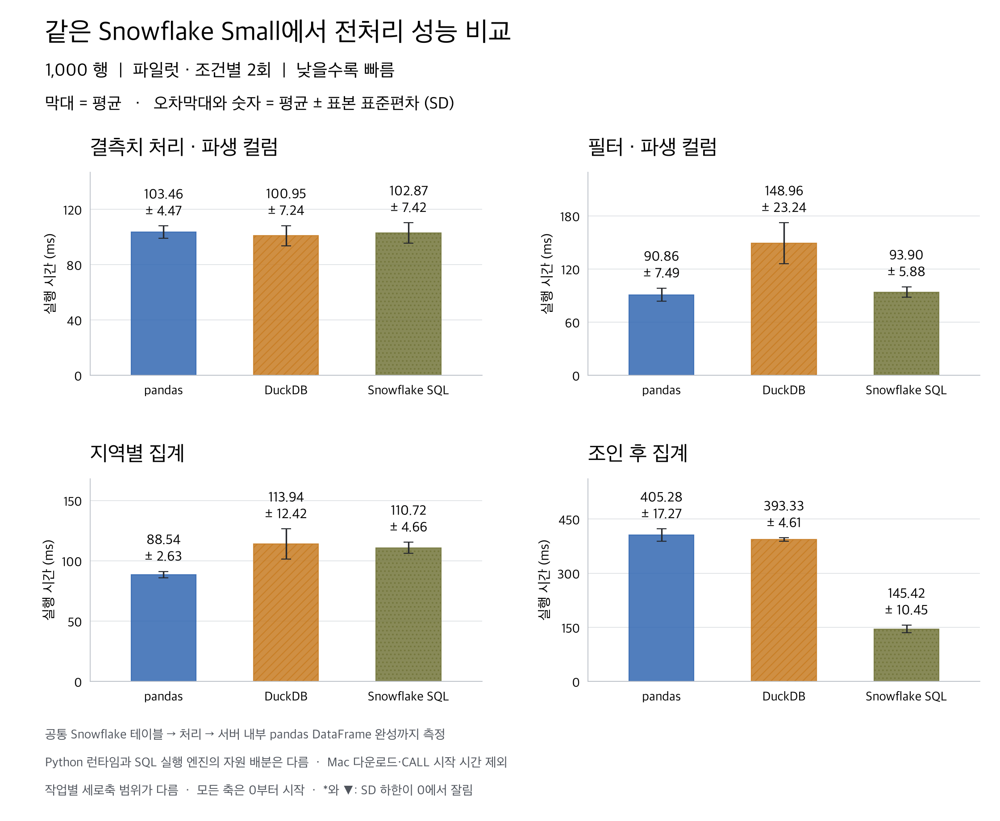
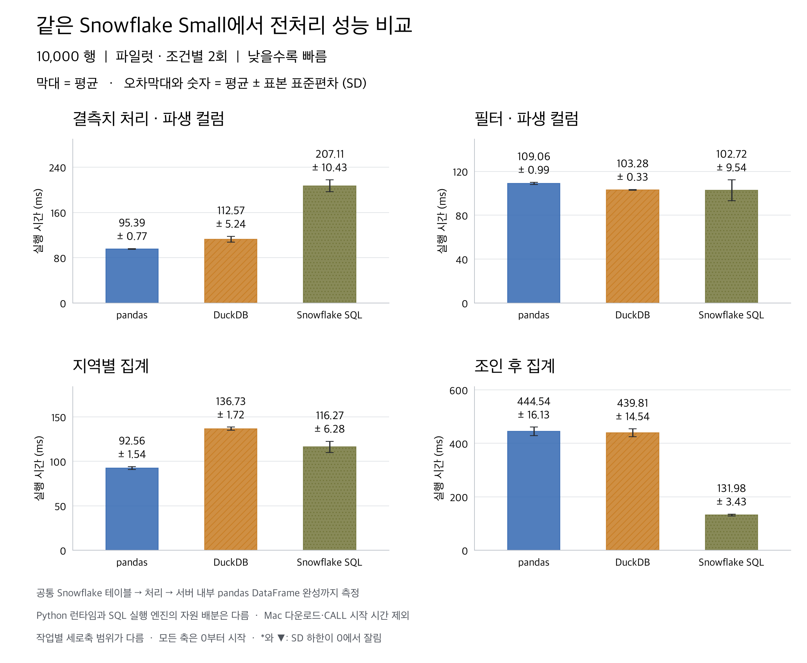
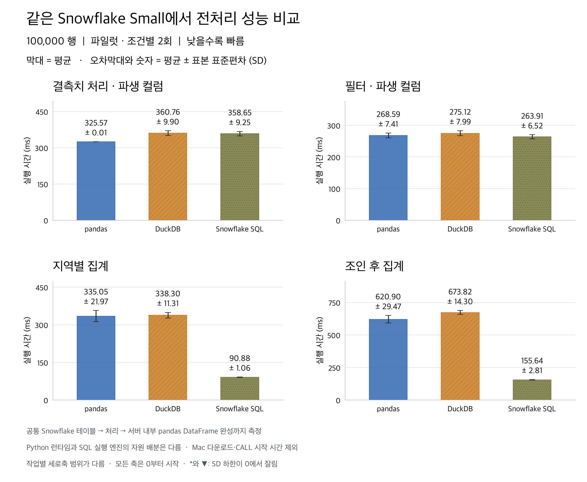
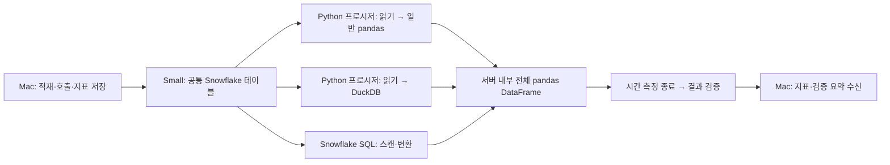

# 같은 Snowflake Small에서 pandas · DuckDB · SQL 비교 — 파일럿

100,000행에서 관측한 평균 기준 결과다. 같은 warehouse의 서로 다른 실행 경로를 비교하며, 아래 순위는 유의성 검정 결과가 아니다.

- 결측치 처리 · 파생 컬럼: pandas 평균 325.57 ms, 다음 경로 Snowflake SQL 대비 1.10배 짧은 시간.
- 필터 · 파생 컬럼: Snowflake SQL 평균 263.91 ms, 다음 경로 pandas 대비 1.02배 짧은 시간.
- 지역별 집계: Snowflake SQL 평균 90.88 ms, 다음 경로 pandas 대비 3.69배 짧은 시간.
- 조인 후 집계: Snowflake SQL 평균 155.64 ms, 다음 경로 pandas 대비 3.99배 짧은 시간.

총 **72회**, **36개 조건 × 2회**를 완료했다. 모든 반복의 전체 결과 fingerprint가 공통 기준값과 일치한다. 파일럿은 기능 검증이며 엔진 선택의 최종 근거로 사용하지 않는다.

## 평균과 표준편차

같은 색과 무늬를 유지한 세로 막대다. 모든 세로축은 0부터 시작하지만 작업별 범위는 다르다. 음수인 SD 하한은 0에서 자르고 표시한다.

### 1,000행

| 작업 | pandas (ms) | DuckDB (ms) | Snowflake SQL (ms) |
|---|---:|---:|---:|
| 결측치 처리 · 파생 컬럼 | 103.46 ± 4.47 | 100.95 ± 7.24 | 102.87 ± 7.42 |
| 필터 · 파생 컬럼 | 90.86 ± 7.49 | 148.96 ± 23.24 | 93.90 ± 5.88 |
| 지역별 집계 | 88.54 ± 2.63 | 113.94 ± 12.42 | 110.72 ± 4.66 |
| 조인 후 집계 | 405.28 ± 17.27 | 393.33 ± 4.61 | 145.42 ± 10.45 |

### 10,000행

| 작업 | pandas (ms) | DuckDB (ms) | Snowflake SQL (ms) |
|---|---:|---:|---:|
| 결측치 처리 · 파생 컬럼 | 95.39 ± 0.77 | 112.57 ± 5.24 | 207.11 ± 10.43 |
| 필터 · 파생 컬럼 | 109.06 ± 0.99 | 103.28 ± 0.33 | 102.72 ± 9.54 |
| 지역별 집계 | 92.56 ± 1.54 | 136.73 ± 1.72 | 116.27 ± 6.28 |
| 조인 후 집계 | 444.54 ± 16.13 | 439.81 ± 14.54 | 131.98 ± 3.43 |

### 100,000행

| 작업 | pandas (ms) | DuckDB (ms) | Snowflake SQL (ms) |
|---|---:|---:|---:|
| 결측치 처리 · 파생 컬럼 | 325.57 ± 0.01 | 360.76 ± 9.90 | 358.65 ± 9.25 |
| 필터 · 파생 컬럼 | 268.59 ± 7.41 | 275.12 ± 7.99 | 263.91 ± 6.52 |
| 지역별 집계 | 335.05 ± 21.97 | 338.30 ± 11.31 | 90.88 ± 1.06 |
| 조인 후 집계 | 620.90 ± 29.47 | 673.82 ± 14.30 | 155.64 ± 2.81 |

## 측정 경계와 환경

| 항목 | 설정 |
|---|---|
| 실행 시각 (UTC) | 2026-09-09T02:03:11.349233+00:00 ~ 2026-09-09T02:06:06.445628+00:00 |
| warehouse | FRAME_BENCH_SMALL / Small / STANDARD |
| 반복 설계 | 1묶음 × 조건당 2회; 각 CALL의 검증된 예열 1회 제외; 묶음 내 조건 순서 무작위 |
| 공통 시작·종료 | 이미 적재된 동일 테이블 → Python 프로시저 내부의 전체 pandas DataFrame |
| pandas·DuckDB 입력 | 필요한 컬럼 SELECT와 DataFrame 읽기·형 변환 포함. 필터 작업은 같은 조건을 두 경로 모두 SQL에 pushdown |
| SQL 입력 | SQL에서 스캔·연산을 함께 수행. 별도 input_ms는 측정 불가하여 null |
| 제외 | 최초 업로드/COPY, 연결, 프로시저 시작·CALL 왕복, 예열, GC, 검증 해시, query history 조회, 연결 해제 |
| 결과 캐시 | USE_CACHED_RESULT=false; 데이터·메타데이터 캐시는 초기화하지 않음 |
| DuckDB | 4 threads / memory_limit=8GB; 연결·등록 시간 포함 |
| Python 런타임 | Linux-4.4.0-aarch64-with-glibc2.35; Python 3.12.13 | packaged by conda-forge | (main, Mar  5 2026, 16:41:49) [GCC 14.3.0] |
| 런타임에서 보이는 자원 | CPU 8개, RAM 12.0 GiB; 엔진별 독점 할당량을 의미하지 않음 |
| 패키지 | duckdb 1.5.5, numpy 2.5.3, pandas 2.3.3, psutil 7.2.2, pyarrow 23.0.1, snowflake-snowpark-python 1.54.0 |

## 해석 범위

실행 위치와 warehouse 크기는 맞췄다. 일반 pandas와 DuckDB는 Python 프로시저의 메모리에서 계산하고, Snowflake SQL은 warehouse의 SQL 실행 엔진에서 계산한다. 따라서 같은 CPU·RAM을 독점하는 엔진 실험은 아니다. pandas API를 SQL로 번역하는 Snowpark pandas도 사용하지 않았다.

pandas·DuckDB의 총 시간에는 원본 컬럼을 Python으로 읽는 비용이 포함된다. 집계 결과만 가져오는 SQL은 데이터 이동량 자체를 줄일 수 있다. 이 차이는 Snowflake 안에서 데이터를 처리하는 경로 선택에는 유용하지만 순수 계산 속도 차이로 해석하면 안 된다. 입력·설정·연산 시간은 summary.csv의 input_mean_ms / setup_mean_ms / compute_mean_ms에서 따로 확인한다.

이전 실험은 로컬 Mac의 pandas·DuckDB와 원격 X-Small SQL의 Mac 다운로드까지 비교했다. 이번 실험은 실행 환경과 시간 측정 경계가 모두 달라서 이전 수치와 직접 개선 배율을 계산하지 않는다. 단일 요청, 합성 수치형 데이터, 선택한 크기·4개 작업의 결과이며 동시성·비용 효율·전체 제품 성능의 순위가 아니다.

## 검증과 재현

- 72개 fingerprint·반복 번호·묶음·시간 합계 검증, 36쌍 평균/SD를 statistics와 pandas로 교차 확인.
- 측정에 연결된 child query history: 84/84개 확보. 누락 0개는 서버 세부 시간의 미확보이며 직접 측정 시간과 구분한다.
- 런타임 버전·warehouse·결과 캐시 설정을 모든 CALL에서 확인. 소스 사본 SHA-256을 검증했다.
- [원시 측정](measurements.jsonl), [요약 CSV](summary.csv), [실행 명세](manifest.json), [호출·런타임](calls.json), [QA](qa.json), [실행한 프로시저](procedure.py).
- 실행: `uv run --no-sync python main.py warehouse-frames` (기능 검증은 `--pilot`). macOS Keychain의 benchmark 비밀번호 사용.

Snowflake 공식 문서: [Python 프로시저의 단일 노드 실행](https://docs.snowflake.com/en/developer-guide/snowpark/python/python-snowpark-training-ml), [Python 프로시저 제약](https://docs.snowflake.com/en/developer-guide/stored-procedure/python/procedure-python-limitations), [Snowpark pandas](https://docs.snowflake.com/en/developer-guide/snowpark/python/pandas-on-snowflake).
