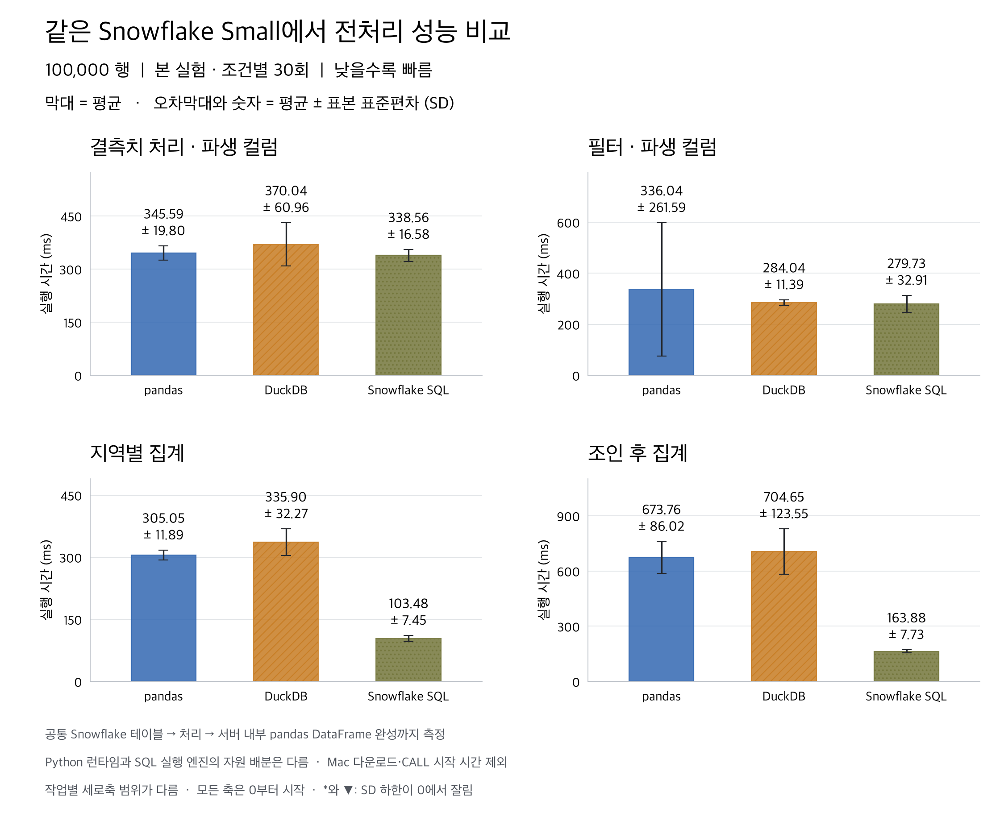
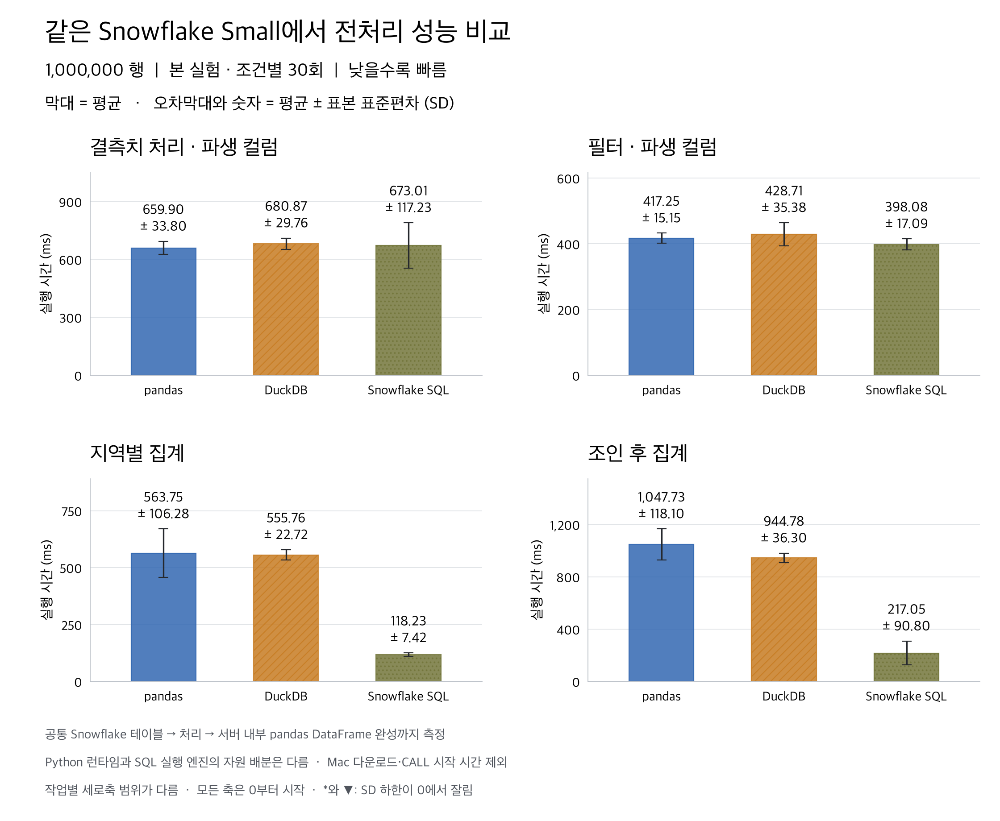
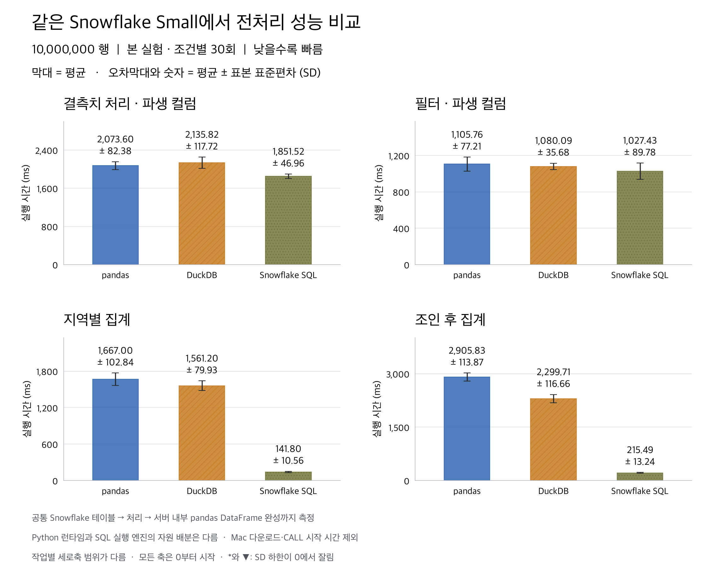
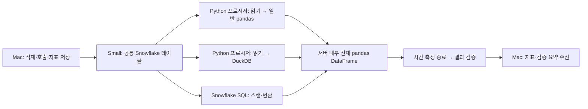

# 같은 Snowflake Small에서 pandas · DuckDB · SQL 비교 — 본 실험

**데이터가 Snowflake 테이블에 있을 때, 집계는 native SQL 경로가 크게 유리했다.** 1,000만 행에서 지역 집계는 Snowflake SQL **141.80 ± 10.56 ms**, DuckDB **1,561.20 ± 79.93 ms**였고, 조인 후 집계는 각각 **215.49 ± 13.24 ms**, **2,299.71 ± 116.66 ms**였다. DuckDB 평균 / SQL 평균은 각각 **11.01배·10.67배**다.

이 차이는 순수 계산 성능만을 뜻하지 않는다. pandas·DuckDB는 원본 컬럼을 Python으로 읽고, SQL은 warehouse에서 집계를 마친 작은 결과만 Python으로 가져온다. 아래 시간 분해에서 입력 읽기·형 변환의 비중을 확인할 수 있다.

단순 가공은 차이가 훨씬 작았다. 1,000만 행 필터의 평균은 SQL 1,027.43 ms, DuckDB 1,080.09 ms로 약 52.66 ms 차이였으며 6개 묶음 중 2개에서는 DuckDB 평균이 더 짧았다. 100만 행 결측치 처리도 pandas 659.90 ± 33.80 ms, SQL 673.01 ± 117.23 ms로 가까웠다. 이 경우 평균 순위를 일관된 우위나 통계적 유의성으로 해석하지 않는다.

총 **1,080회**, **36개 조건 × 30회**를 완료했다. 모든 반복의 전체 결과 fingerprint가 공통 기준값과 일치한다. 평균 ± 표본 표준편차(SD, n−1)는 반복 간 변동성을 나타내며 신뢰구간이 아니다.

## 평균과 표준편차

같은 색과 무늬를 유지한 세로 막대다. 모든 세로축은 0부터 시작하지만 작업별 범위는 다르다. 음수인 SD 하한은 0에서 자르고 표시한다.

### 100,000행

| 작업 | pandas (ms) | DuckDB (ms) | Snowflake SQL (ms) |
|---|---:|---:|---:|
| 결측치 처리 · 파생 컬럼 | 345.59 ± 19.80 | 370.04 ± 60.96 | 338.56 ± 16.58 |
| 필터 · 파생 컬럼 | 336.04 ± 261.59 | 284.04 ± 11.39 | 279.73 ± 32.91 |
| 지역별 집계 | 305.05 ± 11.89 | 335.90 ± 32.27 | 103.48 ± 7.45 |
| 조인 후 집계 | 673.76 ± 86.02 | 704.65 ± 123.55 | 163.88 ± 7.73 |

### 1,000,000행

| 작업 | pandas (ms) | DuckDB (ms) | Snowflake SQL (ms) |
|---|---:|---:|---:|
| 결측치 처리 · 파생 컬럼 | 659.90 ± 33.80 | 680.87 ± 29.76 | 673.01 ± 117.23 |
| 필터 · 파생 컬럼 | 417.25 ± 15.15 | 428.71 ± 35.38 | 398.08 ± 17.09 |
| 지역별 집계 | 563.75 ± 106.28 | 555.76 ± 22.72 | 118.23 ± 7.42 |
| 조인 후 집계 | 1,047.73 ± 118.10 | 944.78 ± 36.30 | 217.05 ± 90.80 |

### 10,000,000행

| 작업 | pandas (ms) | DuckDB (ms) | Snowflake SQL (ms) |
|---|---:|---:|---:|
| 결측치 처리 · 파생 컬럼 | 2,073.60 ± 82.38 | 2,135.82 ± 117.72 | 1,851.52 ± 46.96 |
| 필터 · 파생 컬럼 | 1,105.76 ± 77.21 | 1,080.09 ± 35.68 | 1,027.43 ± 89.78 |
| 지역별 집계 | 1,667.00 ± 102.84 | 1,561.20 ± 79.93 | 141.80 ± 10.56 |
| 조인 후 집계 | 2,905.83 ± 113.87 | 2,299.71 ± 116.66 | 215.49 ± 13.24 |

## 1,000만 행에서 시간이 쓰인 곳

각 셀은 조건별 30회의 평균 ± 표본 SD(ms)다. 입력에는 SELECT 실행·Python DataFrame 읽기·형 변환이 포함되므로 순수 네트워크 시간으로 해석하지 않는다. 전체 평균은 구성요소 평균의 합이지만, 구성요소 SD를 더해 전체 SD를 구할 수는 없다.

| 작업 | 엔진 | 입력 읽기·형 변환 | 연결·등록 | 연산·결과 정규화 |
|---|---|---:|---:|---:|
| 결측치 처리 · 파생 컬럼 | pandas | 1,936.60 ± 70.38 | 해당 없음 | 137.00 ± 27.73 |
| 결측치 처리 · 파생 컬럼 | DuckDB | 1,986.92 ± 85.88 | 13.31 ± 0.41 | 135.60 ± 64.18 |
| 필터 · 파생 컬럼 | pandas | 1,049.56 ± 77.03 | 해당 없음 | 56.20 ± 3.07 |
| 필터 · 파생 컬럼 | DuckDB | 1,038.20 ± 36.38 | 13.52 ± 0.58 | 28.38 ± 11.69 |
| 지역별 집계 | pandas | 1,517.81 ± 88.36 | 해당 없음 | 149.19 ± 28.22 |
| 지역별 집계 | DuckDB | 1,505.38 ± 79.65 | 13.13 ± 0.50 | 42.69 ± 0.42 |
| 조인 후 집계 | pandas | 2,120.62 ± 86.53 | 해당 없음 | 785.20 ± 93.76 |
| 조인 후 집계 | DuckDB | 2,155.23 ± 114.40 | 14.48 ± 0.67 | 130.00 ± 9.72 |

DuckDB 지역 집계의 입력 읽기·형 변환은 전체 평균의 **96.4%**, 조인 집계는 **93.7%**였다. 입력을 읽은 뒤의 연산·결과 정규화는 각각 42.69 ms와 130.00 ms였다. SQL은 스캔·계산이 결합되어 있어 입력 시간을 따로 0으로 표시하거나 이 두 값과 직접 비교하지 않는다.

10만 행 pandas 필터에서는 최댓값 1,636.49 ms가 관측되어 평균 336.04 ms와 SD 261.59 ms가 중앙값 271.84 ms보다 크게 흔들렸다. 느린 반복을 임의로 제거하지 않았다.

## 측정 경계와 환경

| 항목 | 설정 |
|---|---|
| 실행 시각 (UTC) | 2026-09-09T02:06:41.286658+00:00 ~ 2026-09-09T02:38:56.110448+00:00 |
| 실행 시각 (KST) | 2026-09-09 11:06:41 ~ 11:38:56 (준비 포함) |
| warehouse | FRAME_BENCH_SMALL / Small / STANDARD / AWS 서울 / 단일 클러스터 / 자동 중지 60초 |
| 반복 설계 | 6묶음 × 조건당 5회; 각 CALL의 검증된 예열 1회 제외; 묶음 내 조건 순서 무작위 |
| 공통 시작·종료 | 이미 적재된 동일 테이블 → Python 프로시저 내부의 전체 pandas DataFrame |
| pandas·DuckDB 입력 | 필요한 컬럼 SELECT와 DataFrame 읽기·형 변환 포함. 필터 작업은 같은 조건을 두 경로 모두 SQL에 pushdown |
| SQL 입력 | SQL에서 스캔·연산을 함께 수행. 별도 input_ms는 측정 불가하여 null |
| 제외 | 최초 업로드/COPY, 연결, 프로시저 시작·CALL 왕복, 예열, GC, 검증 해시, query history 조회, 연결 해제 |
| 결과 캐시 | USE_CACHED_RESULT=false; 데이터·메타데이터 캐시는 초기화하지 않음 |
| DuckDB | 4 threads / memory_limit=8GB; 연결·등록 시간 포함 |
| Python 런타임 | Linux-4.4.0-aarch64-with-glibc2.35; Python 3.12.13 (conda-forge) |
| 런타임에서 보이는 자원 | CPU 8개, RAM 12.0 GiB; 엔진별 독점 할당량을 의미하지 않음 |
| 패키지 | duckdb 1.5.5, numpy 2.5.3, pandas 2.3.3, psutil 7.2.2, pyarrow 23.0.1, snowflake-snowpark-python 1.54.0 |

## 해석 범위

실행 위치와 warehouse 크기는 맞췄다. 일반 pandas와 DuckDB는 Python 프로시저의 메모리에서 계산하고, Snowflake SQL은 warehouse의 SQL 실행 엔진에서 계산한다. 따라서 같은 CPU·RAM을 독점하는 엔진 실험은 아니다. pandas API를 SQL로 번역하는 Snowpark pandas도 사용하지 않았다.

pandas·DuckDB의 총 시간에는 원본 컬럼을 Python으로 읽는 비용이 포함된다. 집계 결과만 가져오는 SQL은 데이터 이동량 자체를 줄일 수 있다. 이 차이는 Snowflake 안에서 데이터를 처리하는 경로 선택에는 유용하지만 순수 계산 속도 차이로 해석하면 안 된다. 입력·설정·연산 시간은 summary.csv의 input_mean_ms / setup_mean_ms / compute_mean_ms에서 따로 확인한다.

이전 실험은 로컬 Mac의 pandas·DuckDB와 원격 X-Small SQL의 Mac 다운로드까지 비교했다. 이번 실험은 실행 환경과 시간 측정 경계가 모두 달라서 이전 수치와 직접 개선 배율을 계산하지 않는다. 단일 요청, 합성 수치형 데이터, 선택한 크기·4개 작업의 결과이며 동시성·비용 효율·전체 제품 성능의 순위가 아니다.

## 검증과 재현

- 1,080개 fingerprint·반복 번호·묶음·시간 합계 검증, 36쌍 평균/SD를 statistics와 pandas로 교차 확인.
- 측정에 연결된 child query history: 고유 query ID 1,260/1,260개 모두 확보. 조회 오류·누락은 0개다.
- 216개 CALL의 런타임 버전·warehouse·결과 캐시 설정을 확인했다. 원시 CSV와 JSONL 일치, 측정 소스 사본 SHA-256 14개와 입력 파일 SHA-256 6개도 검증했다.
- 크기별 세로 막대 PNG 3개의 숫자·단위·0 기준 축·평균/SD 표기를 직접 확인했다. 별표·아래쪽 표식은 음수 SD 하한이 생길 때만 표시되며 이번 세 그림에는 해당 조건이 없다.
- [독립 검증 스크립트](verify_results.py)와 [1,000만 행 시간 분해](components-10000000.csv)를 보존한다. 완전한 원격 결과 본문은 보관하지 않으며, 매 반복에 저장한 전체 결과 fingerprint와 기준값의 일치를 검증했다.
- [원시 측정](measurements.jsonl), [요약 CSV](summary.csv), [실행 명세](manifest.json), [호출·런타임](calls.json), [QA](qa.json), [실행한 프로시저](procedure.py).
- 실행: `uv run --no-sync python main.py warehouse-frames` (기능 검증은 `--pilot`). macOS Keychain의 benchmark 비밀번호 사용.

Snowflake 공식 문서: [Python 프로시저의 단일 노드 실행](https://docs.snowflake.com/en/developer-guide/snowpark/python/python-snowpark-training-ml), [Python 프로시저 제약](https://docs.snowflake.com/en/developer-guide/stored-procedure/python/procedure-python-limitations), [Snowpark pandas](https://docs.snowflake.com/en/developer-guide/snowpark/python/pandas-on-snowflake).

## 10억 행 후속 실험

사용자가 요청한 10억 행 원본 Parquet 생성·행 수 검증은 완료했다. 이번 1,080회 결과는 최대 1,000만 행이며 10억 행 측정값을 포함하지 않는다. 전체 DataFrame 유지와 배치 처리의 측정 의미가 달라 처리 방식 선택을 기다리고 있으며, 10억 행 Snowflake 적재·반복 측정은 아직 수행하지 않았다.
