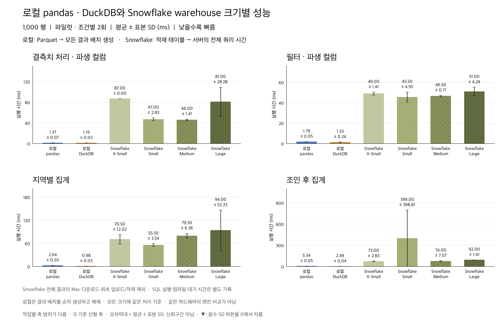
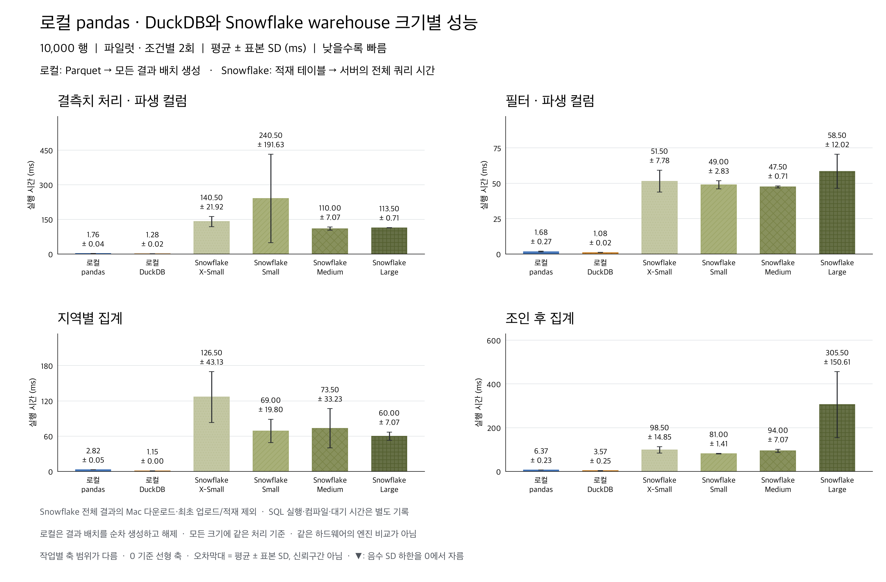
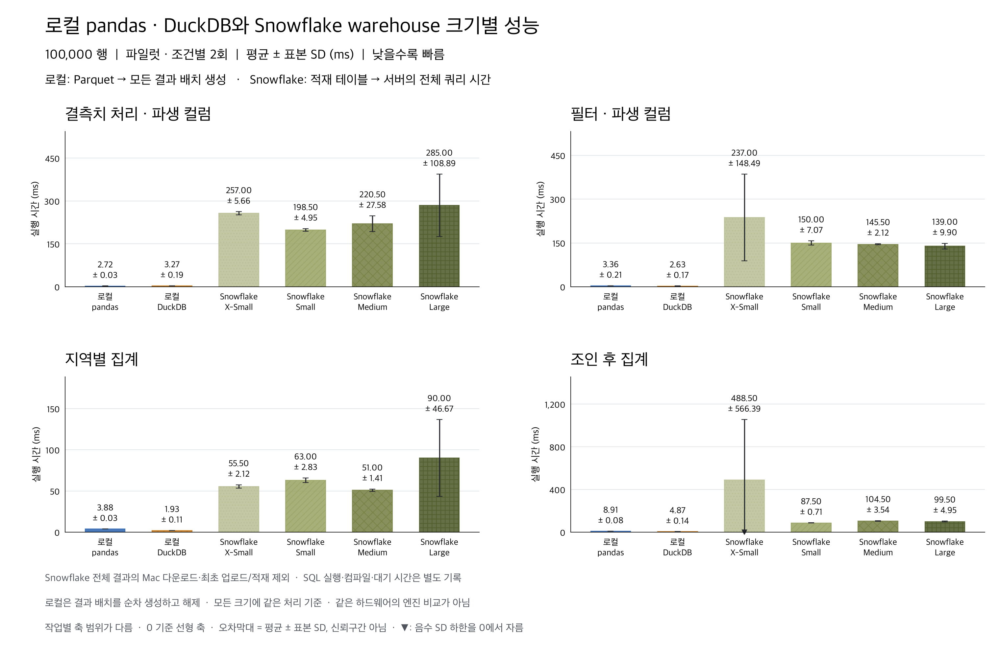
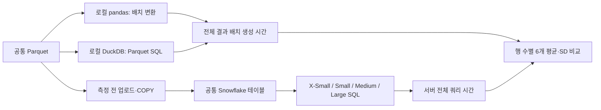

# 로컬 pandas·DuckDB와 Snowflake 4개 warehouse 크기 비교

**72개 조건 × 2회 = 144회**를 완료했다. 데이터 크기마다 로컬 pandas·DuckDB 및 Snowflake X-Small·Small·Medium·Large의 6개 실행 경로를 비교한다.

주 지표는 각 환경에서 입력을 읽고 결과 생성을 완료하는 시간이다. 로컬은 Parquet를 읽어 전체 결과를 pandas 배치로 순차 생성한다. Snowflake는 적재 테이블의 SQL이 끝났을 때 query history의 total_elapsed_time을 사용하며 서버 실행·컴파일·대기를 포함한다. Snowflake의 전체 결과를 Mac으로 다운로드하지 않는다. 같은 CPU·RAM이나 같은 입력 저장 형식의 순수 엔진 비교는 아니다.

모든 크기에 배치 처리 기준을 적용해 큰 결과 전체를 메모리에 누적하지 않는다. pandas는 Parquet 배치별 변환 후 집계의 부분 합을 합치며, DuckDB는 Parquet 직접 SQL 결과를 Arrow reader로 읽는다. 결과 행 수와 모든 컬럼을 사용하는 두 모듈러 체크섬은 각 묶음 예열에서 확인하고, 시간 측정 반복은 결과 행 수를 확인한다. 체크섬·예열·최초 적재는 주 측정 밖이다. 체크섬은 비암호화 검증이며 완전한 원격 결과 본문은 보관하지 않는다.

## 행 수별 평균 ± 표본 표준편차

SD는 반복 변동성이며 신뢰구간이 아니다. 모든 축은 0에서 시작하며 패널별 범위가 다르다.

### 1,000행

| 작업 | pandas | DuckDB | SF X-Small | SF Small | SF Medium | SF Large |
|---|---:|---:|---:|---:|---:|---:|
| 결측치 처리 · 파생 컬럼 | 1.37 ± 0.07 | 1.19 ± 0.03 | 87.00 ± 0.00 | 47.00 ± 2.83 | 46.00 ± 1.41 | 81.00 ± 28.28 |
| 필터 · 파생 컬럼 | 1.79 ± 0.05 | 1.33 ± 0.24 | 49.00 ± 1.41 | 45.50 ± 4.95 | 46.50 ± 0.71 | 51.00 ± 4.24 |
| 지역별 집계 | 2.64 ± 0.20 | 0.98 ± 0.03 | 70.50 ± 12.02 | 55.50 ± 3.54 | 79.50 ± 6.36 | 94.00 ± 52.33 |
| 조인 후 집계 | 5.34 ± 0.05 | 2.49 ± 0.04 | 73.00 ± 2.83 | 399.00 ± 398.81 | 74.00 ± 7.07 | 92.00 ± 1.41 |

### 10,000행

| 작업 | pandas | DuckDB | SF X-Small | SF Small | SF Medium | SF Large |
|---|---:|---:|---:|---:|---:|---:|
| 결측치 처리 · 파생 컬럼 | 1.76 ± 0.04 | 1.28 ± 0.02 | 140.50 ± 21.92 | 240.50 ± 191.63 | 110.00 ± 7.07 | 113.50 ± 0.71 |
| 필터 · 파생 컬럼 | 1.68 ± 0.27 | 1.08 ± 0.02 | 51.50 ± 7.78 | 49.00 ± 2.83 | 47.50 ± 0.71 | 58.50 ± 12.02 |
| 지역별 집계 | 2.82 ± 0.05 | 1.15 ± 0.00 | 126.50 ± 43.13 | 69.00 ± 19.80 | 73.50 ± 33.23 | 60.00 ± 7.07 |
| 조인 후 집계 | 6.37 ± 0.23 | 3.57 ± 0.25 | 98.50 ± 14.85 | 81.00 ± 1.41 | 94.00 ± 7.07 | 305.50 ± 150.61 |

### 100,000행

| 작업 | pandas | DuckDB | SF X-Small | SF Small | SF Medium | SF Large |
|---|---:|---:|---:|---:|---:|---:|
| 결측치 처리 · 파생 컬럼 | 2.72 ± 0.03 | 3.27 ± 0.19 | 257.00 ± 5.66 | 198.50 ± 4.95 | 220.50 ± 27.58 | 285.00 ± 108.89 |
| 필터 · 파생 컬럼 | 3.36 ± 0.21 | 2.63 ± 0.17 | 237.00 ± 148.49 | 150.00 ± 7.07 | 145.50 ± 2.12 | 139.00 ± 9.90 |
| 지역별 집계 | 3.88 ± 0.03 | 1.93 ± 0.11 | 55.50 ± 2.12 | 63.00 ± 2.83 | 51.00 ± 1.41 | 90.00 ± 46.67 |
| 조인 후 집계 | 8.91 ± 0.08 | 4.87 ± 0.14 | 488.50 ± 566.39 | 87.50 ± 0.71 | 104.50 ± 3.54 | 99.50 ± 4.95 |

## 조건과 해석 범위

- 실행 시각(UTC): 2026-09-09T04:49:33.710803+00:00 ~ 2026-09-09T04:51:28.067211+00:00
- 반복: 1개 묶음, 묶음별 경로 순서 및 경로 내 크기·작업 순서 무작위. 한 번에 한 경로만 측정.
- 로컬: macOS-26.6.2-arm64-arm-64bit-Mach-O, 논리 CPU 14개, RAM 48.0GiB. DuckDB/Arrow 스레드 4개, DuckDB 내부 메모리 8GB, 입력/출력 배치 최대 250,000행.
- Snowflake: 네 전용 Standard warehouse, 단일 클러스터·자동 중지 60초·결과 재사용 캐시 해제. 경로 묶음이 끝나면 해당 전용 warehouse를 중지한다. 각 작업의 실제 SQL을 한 번 예열하지만 모든 데이터 캐시가 같은 상태임을 보장하지 않는다.
- pandas는 컬럼 선택·필터 pushdown을 적용한다. DuckDB는 Parquet 직접 SQL을 사용하므로 입력 스캔과 계산 시간을 임의로 분리하지 않는다.
- Snowflake의 client_execute_roundtrip_ms는 호출·응답 관측값이며 전체 결과 다운로드 시간이 아니다. 서버 지표들과 범위가 겹쳐 더해서 전체 시간을 만들지 않는다.
- 합성 수치형 8개 컬럼과 계정 10만 행, seed 20260907의 네 작업이다. 이전 20개 컬럼·계정 100만 행의 4개 DB 실험과 다른 데이터이며, 이번 수치를 그 순위에 합치지 않는다.
- 작은 입력에서는 고정 준비 비용이 비중을 차지할 수 있다. 큰 warehouse가 항상 빨라지는지, 평균 차이가 SD에 비해 충분히 큰지는 실제 크기·작업별 수치로 판단한다. 비용이나 동시성의 종합 순위는 측정하지 않았다.

## 원자료와 검증

[원시 측정](measurements.jsonl) · [평균/SD CSV](summary.csv) · [Snowflake 시간 구성요소](snowflake-components.csv) · [실행 명세](manifest.json) · [묶음별 전체 결과 검증](block-validations.json) · [공통 기준값](validation-reference.json) · [QA](qa.json)

재현: `uv run --no-sync python main.py warehouse-sweep` (`--pilot`은 기능 검증). 키체인 인증을 재사용한다. 원자료와 측정 소스 사본은 이 실행 폴더에 보존한다.

공식 문서: [Snowflake warehouse 개요](https://docs.snowflake.com/en/user-guide/warehouses-overview), [DuckDB Arrow 결과 배치](https://duckdb.org/docs/current/guides/python/export_arrow).
