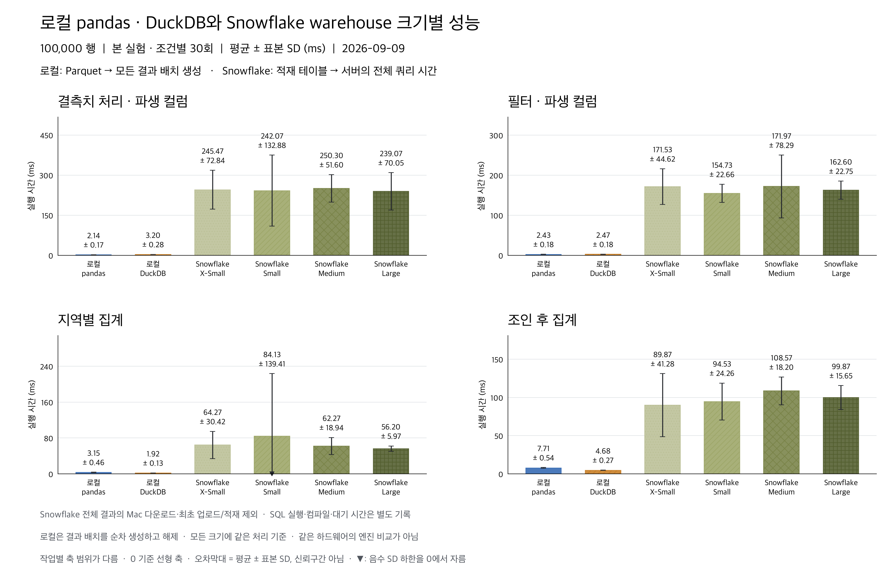
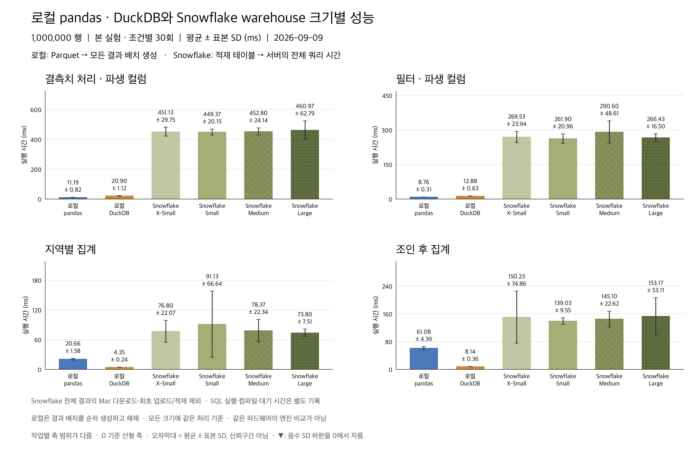
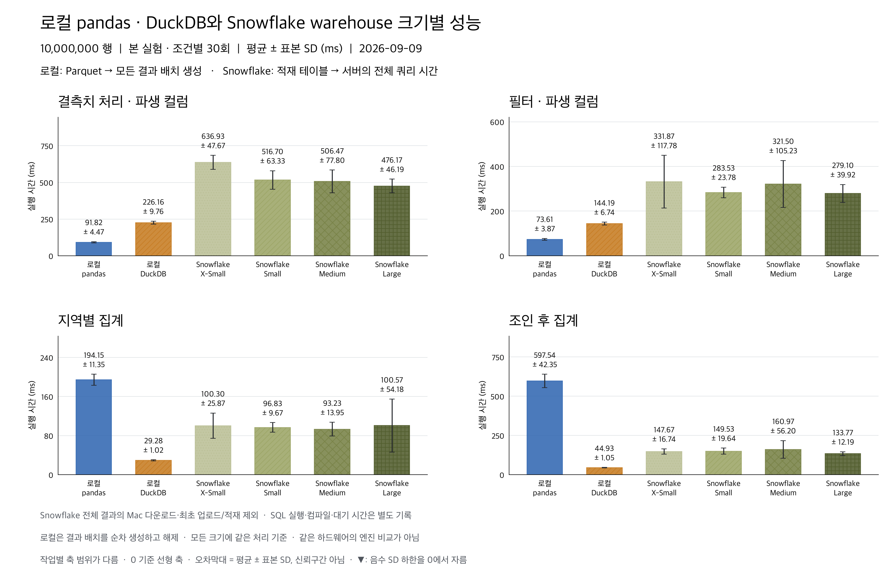
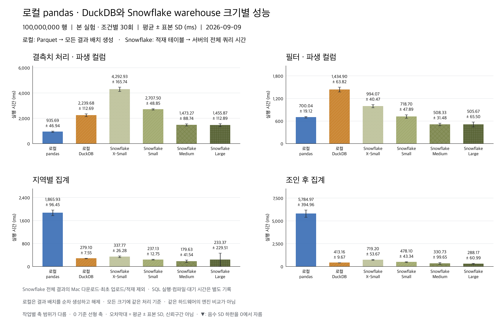
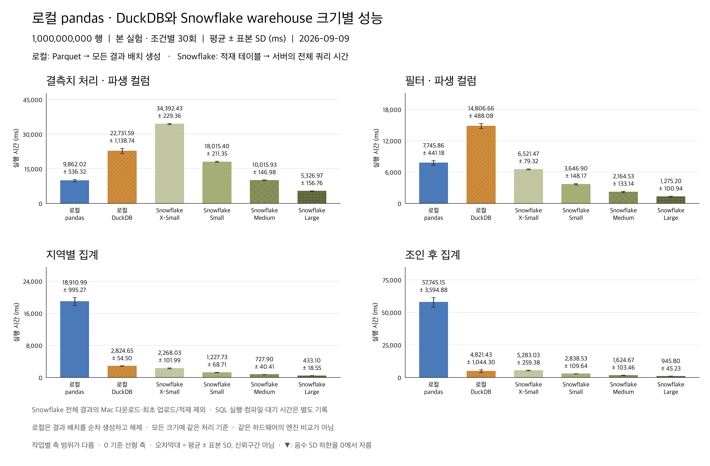
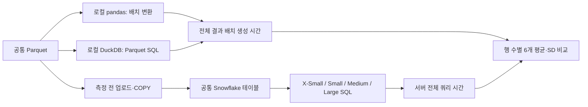

# 로컬 pandas·DuckDB와 Snowflake 4개 warehouse 크기 비교

**120개 조건 × 30회 = 3,600회**를 완료했다. 데이터 크기마다 로컬 pandas·DuckDB 및 Snowflake X-Small·Small·Medium·Large의 6개 실행 경로를 비교한다.

**10억 행에서는 Snowflake Large가 네 작업 모두 가장 짧은 평균 시간을 기록했다.** 평균 ± 표본 표준편차는 결측치 처리·파생 컬럼 **5.327 ± 0.157초**, 필터·파생 컬럼 **1.275 ± 0.101초**, 지역 집계 **0.433 ± 0.019초**, 조인 후 집계 **0.946 ± 0.045초**다. 6개 묶음의 평균을 각각 비교해도 네 작업 모두 Large가 가장 빨랐다.

10만~1,000만 행에서는 단순 가공 두 작업은 로컬 pandas, 집계 두 작업은 로컬 DuckDB의 평균이 가장 짧았다. 1억 행부터는 작업에 따라 Snowflake가 앞서기 시작했다. 다만 **서로 다른 환경의 처리 경로 비교**이므로 엔진 자체의 우열이나 같은 비용에서의 성능으로 해석할 수 없다.

측정은 **2026-09-09 13:59:18–17:29:04 KST**에 진행했으며, 준비·검증을 포함한 실행 전체 시간은 약 3시간 30분이다. 사후 통계·입력·차트 검수 및 본문 갱신일은 **2026-09-10 KST**다.

## 무엇을 시간으로 비교했는가

주 지표는 각 환경에서 입력을 읽고 결과 생성을 완료하는 시간이며 낮을수록 빠르다. 로컬은 Parquet를 읽어 전체 결과를 pandas 배치로 순차 생성한다. Snowflake는 적재 테이블의 SQL이 끝났을 때 query history의 total_elapsed_time을 사용하며 서버 실행·컴파일·대기를 포함한다. Snowflake의 전체 결과를 Mac으로 다운로드하지 않는다. 로컬 프로세스 시작·라이브러리 로딩·DuckDB 연결 생성과 종료, Snowflake 연결은 제외한다. 같은 CPU·RAM이나 같은 입력 저장 형식의 순수 엔진 비교는 아니다.

모든 크기에 배치 처리 기준을 적용해 큰 결과 전체를 메모리에 누적하지 않는다. pandas는 Parquet 배치별 변환 후 집계의 부분 합을 합치며, DuckDB는 Parquet 직접 SQL 결과를 Arrow reader로 읽는다. 결과 행 수와 모든 컬럼을 사용하는 두 모듈러 체크섬은 각 묶음 예열에서 확인하고, 시간 측정 반복은 결과 행 수를 확인한다. 체크섬·예열·최초 적재는 주 측정 밖이다. 체크섬은 비암호화 검증이며 완전한 원격 결과 본문은 보관하지 않는다.

## 행 수별 평균 ± 표본 표준편차

표와 그림의 시간 단위는 **밀리초(ms)**이며 낮을수록 빠르다. 각 막대는 30회 평균, 오차막대는 **표본 SD(ddof=1)**다. SD는 반복 변동성이며 신뢰구간이 아니다. 모든 축은 0에서 시작하며 패널별 범위가 다르다. 평균−SD가 0보다 작은 경우 하한을 0에서 자르고 ▼로 표시한다. 6개 묶음의 연속 반복이므로 30개 표본을 서로 완전히 독립인 실험으로 가정하지 않는다.

### 100,000행

작은 입력에서는 로컬이 모든 작업에서 앞섰다. 단순 가공은 pandas, 집계는 DuckDB의 평균이 짧았지만, 필터의 pandas 2.43ms와 DuckDB 2.47ms 차이는 각각의 SD 0.18ms보다 작다. 이 조건에서 필터의 확실한 승자를 정할 근거는 부족하다. Snowflake 확대 효과도 일관되지 않았다.

| 작업 | pandas | DuckDB | SF X-Small | SF Small | SF Medium | SF Large |
|---|---:|---:|---:|---:|---:|---:|
| 결측치 처리 · 파생 컬럼 | 2.14 ± 0.17 | 3.20 ± 0.28 | 245.47 ± 72.84 | 242.07 ± 132.88 | 250.30 ± 51.60 | 239.07 ± 70.05 |
| 필터 · 파생 컬럼 | 2.43 ± 0.18 | 2.47 ± 0.18 | 171.53 ± 44.62 | 154.73 ± 22.66 | 171.97 ± 78.29 | 162.60 ± 22.75 |
| 지역별 집계 | 3.15 ± 0.46 | 1.92 ± 0.13 | 64.27 ± 30.42 | 84.13 ± 139.41 | 62.27 ± 18.94 | 56.20 ± 5.97 |
| 조인 후 집계 | 7.71 ± 0.54 | 4.68 ± 0.27 | 89.87 ± 41.28 | 94.53 ± 24.26 | 108.57 ± 18.20 | 99.87 ± 15.65 |

### 1,000,000행

단순 가공은 pandas 11.19ms·8.76ms, 집계는 DuckDB 4.35ms·8.14ms로 가장 짧았다. Snowflake 결측치 처리 평균은 네 크기 모두 약 449~461ms여서 warehouse 확대에 따른 뚜렷한 시간 단축은 관측되지 않았다.

| 작업 | pandas | DuckDB | SF X-Small | SF Small | SF Medium | SF Large |
|---|---:|---:|---:|---:|---:|---:|
| 결측치 처리 · 파생 컬럼 | 11.19 ± 0.82 | 20.90 ± 1.12 | 451.13 ± 29.75 | 449.37 ± 20.15 | 452.80 ± 24.14 | 460.97 ± 62.79 |
| 필터 · 파생 컬럼 | 8.76 ± 0.31 | 12.88 ± 0.63 | 269.53 ± 23.94 | 261.90 ± 20.96 | 290.60 ± 48.61 | 266.43 ± 16.50 |
| 지역별 집계 | 20.66 ± 1.58 | 4.35 ± 0.24 | 76.80 ± 22.07 | 91.13 ± 66.64 | 78.37 ± 22.34 | 73.80 ± 7.51 |
| 조인 후 집계 | 61.08 ± 4.39 | 8.14 ± 0.36 | 150.23 ± 74.86 | 139.03 ± 9.55 | 145.10 ± 22.62 | 153.17 ± 53.11 |

### 10,000,000행

여전히 단순 가공은 pandas, 집계는 DuckDB가 가장 빨랐다. 같은 로컬 경로끼리 보면 지역 집계는 pandas 194.15ms 대 DuckDB 29.28ms, 조인 후 집계는 597.54ms 대 44.93ms다. Snowflake 내부에서는 작업별 확대 효과가 달라, 결측치 처리는 X-Small 636.93ms에서 Large 476.17ms로 줄었지만 지역 집계는 네 크기가 약 93~101ms였다.

| 작업 | pandas | DuckDB | SF X-Small | SF Small | SF Medium | SF Large |
|---|---:|---:|---:|---:|---:|---:|
| 결측치 처리 · 파생 컬럼 | 91.82 ± 4.47 | 226.16 ± 9.76 | 636.93 ± 47.67 | 516.70 ± 63.33 | 506.47 ± 77.80 | 476.17 ± 46.19 |
| 필터 · 파생 컬럼 | 73.61 ± 3.87 | 144.19 ± 6.74 | 331.87 ± 117.78 | 283.53 ± 23.78 | 321.50 ± 105.23 | 279.10 ± 39.92 |
| 지역별 집계 | 194.15 ± 11.35 | 29.28 ± 1.02 | 100.30 ± 25.87 | 96.83 ± 9.67 | 93.23 ± 13.95 | 100.57 ± 54.18 |
| 조인 후 집계 | 597.54 ± 42.35 | 44.93 ± 1.05 | 147.67 ± 16.74 | 149.53 ± 19.64 | 160.97 ± 56.20 | 133.77 ± 12.19 |

### 100,000,000행

작업별 결과가 갈라졌다. 결측치 처리는 pandas가 935.69ms로 가장 짧았다. 필터는 Snowflake Medium 508.33ms와 Large 505.67ms로 비슷했다. 지역 집계는 Medium의 평균이 가장 짧았고, Large는 233.37 ± 229.51ms로 큰 편차를 보였다. 조인 후 집계는 Large의 평균이 가장 짧았다. 따라서 warehouse가 클수록 항상 빨랐다고 요약할 수 없다.

| 작업 | pandas | DuckDB | SF X-Small | SF Small | SF Medium | SF Large |
|---|---:|---:|---:|---:|---:|---:|
| 결측치 처리 · 파생 컬럼 | 935.69 ± 46.94 | 2,239.68 ± 112.69 | 4,292.93 ± 165.74 | 2,707.50 ± 48.85 | 1,473.27 ± 88.74 | 1,455.87 ± 112.89 |
| 필터 · 파생 컬럼 | 700.04 ± 19.12 | 1,434.90 ± 63.82 | 994.07 ± 40.47 | 718.70 ± 47.89 | 508.33 ± 31.48 | 505.67 ± 65.50 |
| 지역별 집계 | 1,865.93 ± 96.45 | 279.10 ± 7.55 | 337.77 ± 26.28 | 237.13 ± 12.75 | 179.63 ± 41.54 | 233.37 ± 229.51 |
| 조인 후 집계 | 5,784.97 ± 394.96 | 413.16 ± 9.67 | 719.20 ± 53.67 | 478.10 ± 43.34 | 330.73 ± 99.65 | 288.17 ± 60.99 |

### 1,000,000,000행

Large가 네 작업 모두 가장 빨랐다. 로컬끼리 비교하면 pandas는 단순 가공 두 작업에서, DuckDB는 집계 두 작업에서 더 짧은 평균을 기록했다. 결측치 처리의 pandas 9.862초와 Snowflake Medium 10.016초 차이는 약 1.6%로 pandas의 SD 0.536초보다 작다. 조인 후 집계의 DuckDB는 4.821 ± 1.044초로 변동이 커서, X-Small 5.283 ± 0.259초보다 항상 빠르다고 할 수 없다.

| 작업 | pandas | DuckDB | SF X-Small | SF Small | SF Medium | SF Large |
|---|---:|---:|---:|---:|---:|---:|
| 결측치 처리 · 파생 컬럼 | 9,862.02 ± 536.32 | 22,731.59 ± 1,138.74 | 34,392.43 ± 229.36 | 18,015.40 ± 211.35 | 10,015.93 ± 146.98 | 5,326.97 ± 156.76 |
| 필터 · 파생 컬럼 | 7,745.86 ± 441.18 | 14,806.66 ± 488.08 | 6,521.47 ± 79.32 | 3,646.90 ± 148.17 | 2,164.53 ± 133.14 | 1,275.20 ± 100.94 |
| 지역별 집계 | 18,910.99 ± 995.27 | 2,824.65 ± 54.50 | 2,268.03 ± 101.99 | 1,227.73 ± 68.71 | 727.90 ± 40.41 | 433.10 ± 18.55 |
| 조인 후 집계 | 57,745.15 ± 3,594.88 | 4,821.43 ± 1,044.30 | 5,283.03 ± 259.38 | 2,838.53 ± 109.64 | 1,624.67 ± 103.46 | 945.80 ± 45.23 |

## 10억 행에서 warehouse 확대 효과가 뚜렷했다

아래 배율은 **같은 작업의 X-Small 평균 ÷ 해당 warehouse 평균**이다. 단위 없는 평균 시간의 비율이며, 비용 효율이나 통계적 신뢰구간을 뜻하지 않는다.

| 작업 | Small | Medium | Large |
|---|---:|---:|---:|
| 결측치 처리 · 파생 컬럼 | 1.91배 | 3.43배 | 6.46배 |
| 필터 · 파생 컬럼 | 1.79배 | 3.01배 | 5.11배 |
| 지역별 집계 | 1.85배 | 3.12배 | 5.24배 |
| 조인 후 집계 | 1.86배 | 3.25배 | 5.59배 |

이번 10억 행 조건에서 Large는 X-Small보다 평균 처리 시간이 5.11~6.46배 짧았다. 서버 기록 2,400개에서 provisioning·overload 대기는 모두 0ms였다. Large의 네 작업 컴파일 평균은 약 40~64ms였으므로, 이 크기에서 관측한 서버 시간의 대부분은 실행 시간이다. 이는 측정된 시간 분해이며, 크기 확대에 따른 내부 CPU·I/O 기여도를 따로 식별한 결과는 아니다.

반면 10만~1,000만 행에서는 확대 효과가 작거나 평균 순서가 바뀌었다. 작은 작업의 고정 비용이 확대 효과를 제한했을 가능성이 있지만, 이 실험만으로 모든 지연의 원인을 확정할 수 없다. 로컬은 1억→10억 행으로 입력을 10배 늘렸을 때 평균 시간이 작업별 약 10.0~11.7배 늘었다. 다음 크기의 시간을 예측한 수치는 아니다.

## 평균만으로 순위를 확정하기 어려운 조건

- **10만 행 · Small 지역 집계:** 평균 84.13ms, SD 139.41ms, 중앙값 55.50ms, 최대 818ms다. SD가 평균보다 커서 그림의 하한 표식이 필요하다. 오래 걸린 관측을 제외하지 않았다.
- **1억 행 · Large 지역 집계:** 평균 233.37ms, SD 229.51ms지만 중앙값은 149.50ms다. 묶음별 평균은 325.6, 301.6, 353.8, 134.0, 151.0, 134.2ms였다. 일부 느린 반복이 전체 평균을 높였으며 그 원인은 저장된 지표만으로 확정하지 않았다.
- **10억 행 · DuckDB 조인 후 집계:** 중앙값 4.192초, 범위 4.089~6.618초다. 묶음별 평균은 6.531, 4.142, 4.103, 5.778, 4.102, 4.273초였다. 같은 묶음의 X-Small과 비교하면 6개 중 2개 묶음에서 DuckDB가 더 느렸다.

30회 반복은 이번 실행 안에서의 변동을 보여 준다. 다른 날짜·동시 부하·캐시 상태까지 대표하는 신뢰구간이나 유의성 검정은 제시하지 않는다. 가까운 평균은 안정적인 성능 차이라고 단정하지 않는다.

## 조건과 해석 범위

- 실행 시각(UTC): 2026-09-09T04:59:18.099933+00:00 ~ 2026-09-09T08:29:04.660053+00:00
- 반복: 6개 묶음, 묶음별 경로 순서 및 경로 내 크기·작업 순서 무작위. 한 번에 한 경로만 측정.
- 로컬: macOS-26.6.2-arm64-arm-64bit-Mach-O, 논리 CPU 14개, RAM 48.0GiB. DuckDB/Arrow 스레드 4개, DuckDB 내부 메모리 8GB, 입력/출력 배치 최대 250,000행.
- Snowflake: 실행 당시 설정을 확인한 네 전용 Standard Gen2 warehouse, 단일 클러스터·자동 중지 60초·결과 재사용 캐시 해제. 경로 묶음이 끝나면 해당 전용 warehouse를 중지한다. 각 작업의 실제 SQL을 한 번 예열하지만 모든 데이터 캐시가 같은 상태임을 보장하지 않는다.
- 로컬 버전: Python 3.13.5, pandas 2.3.3, DuckDB 1.5.5, PyArrow 23.0.1, NumPy 2.5.3. Snowflake Connector 4.7.3, 서버 버전 10.32.102, AWS 서울 리전(AWS_AP_NORTHEAST_2).
- pandas는 컬럼 선택·필터 pushdown을 적용한다. DuckDB는 Parquet 직접 SQL을 사용하므로 입력 스캔과 계산 시간을 임의로 분리하지 않는다.
- Snowflake의 client_execute_roundtrip_ms는 호출·응답 관측값이며 전체 결과 다운로드 시간이 아니다. 서버 지표들과 범위가 겹쳐 더해서 전체 시간을 만들지 않는다.
- 합성 수치형 8개 컬럼과 계정 10만 행, seed 20260907의 네 작업이다. 이전 20개 컬럼·계정 100만 행의 4개 DB 실험과 다른 데이터이며, 이번 수치를 그 순위에 합치지 않는다.
- 작은 입력에서는 고정 준비 비용이 비중을 차지할 수 있다. 큰 warehouse가 항상 빨라지는지, 평균 차이가 SD에 비해 충분히 큰지는 실제 크기·작업별 수치로 판단한다. 비용이나 동시성의 종합 순위는 측정하지 않았다.

### 공통 입력과 출력의 크기

공통 입력은 seed 20260907로 생성한 수치형 8개 컬럼의 합성 데이터다. 지역 50개와 계정 10만 개를 사용하며, 각 작업은 필요한 3~4개 컬럼만 읽는다. 10억 행의 원본 Parquet는 **19,083,998,521 bytes(약 19.08GB)**, 8개 컬럼의 논리 크기는 64GB다. 매 쿼리가 이 8개 컬럼을 전부 스캔한다고 가정하지 않는다. 같은 원본을 Snowflake 임시 테이블로 사전 적재하고 네 warehouse가 같은 테이블을 사용했다. 1억·10억 행의 업로드에는 각각 10개·100개로 나눈 적재 파일을 사용했다.

| 작업 | 연산 정의 | 10억 행 입력의 결과 |
|---|---|---|
| 결측치 처리 · 파생 컬럼 | 할인 결측을 0으로 채우고 금액×수량×(100−할인율)을 100으로 정수 나눗셈 | 10억 행 × 2개 정수 컬럼, 논리 16GB |
| 필터 · 파생 컬럼 | 지역 ID < 10, 금액 ≥ 1,000 필터 후 금액×수량 | 197,996,556행 × 3개 정수 컬럼, 논리 약 4.75GB |
| 지역별 집계 | 지역별 금액 합·수량 합·행 수 | 50행 × 4개 정수 컬럼 |
| 조인 후 집계 | 계정 10만 행과 내부 조인 후 지역·계정 등급별 금액 합·행 수 | 200행 × 4개 정수 컬럼 |

이 출력 크기 차이 때문에 네 작업을 하나의 평균으로 합치지 않았다. 로컬은 전체 출력을 배치 단위로 생성·해제하지만, Snowflake는 서버 결과 생성까지만 측정한다. **원격 결과 전체를 로컬 pandas에서 사용하려는 경우에는 다운로드·변환 시간까지 포함하는 별도 비교가 필요하다.** 과거 Small 내부 전체 DataFrame 실험과 로컬/원격 다운로드 실험의 수치를 이번 결과에 합치지 않는다.

전용 warehouse는 `FRAME_SWEEP_XSMALL`, `FRAME_SWEEP_SMALL`, `FRAME_SWEEP_MEDIUM`, `FRAME_SWEEP_LARGE`다. [실행 명세](manifest.json)의 `snowflake_session.warehouse=FRAME_BENCH_SMALL`은 최초 연결 시점 값이며, [보존된 실행 코드](source/benchmarks/sweep_benchmark.py)는 경로마다 `USE WAREHOUSE`를 호출한다. 실제 크기·세대·자동 중지 설정은 명세의 `warehouses`에 별도로 기록했다.

## 이번 결과를 적용할 때

로컬에 Parquet가 있고 출력도 pandas 배치로 사용할 목적이라면, 이번 관측에서는 단순 가공의 pandas와 집계의 DuckDB가 후보가 된다. Snowflake에 데이터가 이미 있고 결과를 플랫폼에서 사용할 목적이라면, 10억 행 작업의 지연을 줄이는 데 Large가 효과적이었다. 실제 warehouse 선택에는 허용 지연과 credit 사용량을 함께 확인해야 하지만, 이번 실험은 비용을 측정하지 않았다.

후속 검증에서 남은 질문은 ① 같은 결과를 소비자까지 전달하면 순위가 유지되는지, ② 실제 데이터의 편향·문자열·더 큰 조인 테이블에서도 같은 경향인지, ③ 다른 날짜와 동시 부하에서도 확대 효과가 재현되는지다. 이 질문들은 이번 결과에 대한 추가 검증 항목이며, 새 원격 실험을 수행한 결과가 아니다.

## 원자료와 검증

[원시 측정](measurements.jsonl) · [평균/SD CSV](summary.csv) · [Snowflake 시간 구성요소](snowflake-components.csv) · [실행 명세](manifest.json) · [묶음별 전체 결과 검증](block-validations.json) · [공통 기준값](validation-reference.json) · [QA](qa.json)

사후 검수는 [통계 독립 검증](independent-audit.json), [입력·소스 검증](provenance-audit.json), [차트 검수](visual-review.json), [최종 본문 대조](report-audit.json), [QA](qa.json)에 기록했다. [통계 검증기](verify_results.py)는 원자료의 누락·중복과 통계를, [입력 검증기](verify_provenance.py)는 소스 20개·원본 10개·적재 분할 파일 110개의 SHA-256 및 저장된 적재 결과를 확인한다. 파일 해시와 Parquet footer 검사는 전체 입력 값을 재생성해 검산한 것과 다르다.

전체 출력의 행 수와 두 체크섬은 **720개 묶음 예열**을 공통 기준값 20개에 대조한다. 시간 측정 3,600회는 **출력 행 수**를 대조한다. 체크섬은 모든 결과 컬럼으로 만든 행 해시와 제곱 해시의 합이며 비암호화 검증이므로 충돌 가능성이 있다. 이 범위를 넘어 모든 반복의 전체 값 일치를 증명했다고 해석하지 않는다.

저장된 수치만 재검증: `uv run --no-sync python results/warehouse-sweep/run-20260909T045918099704Z/verify_results.py`. 입력 해시 재검증은 같은 폴더의 `verify_provenance.py`로 실행하며 약 40GB 이상을 다시 읽는다. [본문 검증기](verify_report.py)는 표의 평균/SD·배율·링크와 핵심 순위를 확인한다. 이 검증기들은 Snowflake 측정을 다시 수행하지 않는다.

새 측정 재현: `uv run --no-sync python main.py warehouse-sweep` (`--pilot`은 기능 검증). 키체인 인증을 재사용한다. 원자료와 측정 소스 사본은 이 실행 폴더에 보존한다.

공식 문서: [Snowflake warehouse 개요](https://docs.snowflake.com/en/user-guide/warehouses-overview), [DuckDB Arrow 결과 배치](https://duckdb.org/docs/current/guides/python/export_arrow).
